# Merise par la pratique

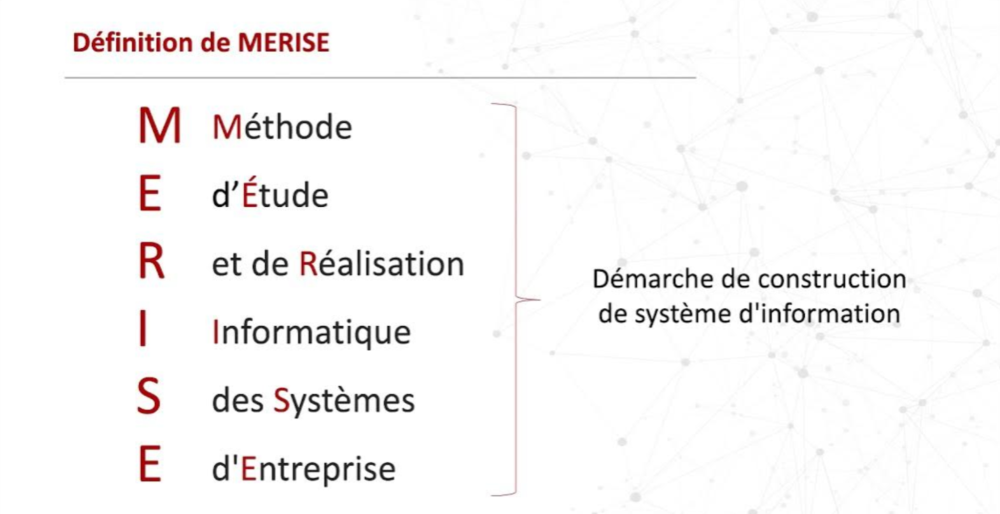

### Auteur : [**Paterne G. G.**](https://www.linkedin.com/in/gnpinformatique/)

Formateur développeur PHP/Symfony & Rust

----------------

<!-- TOC -->
* [Merise par la pratique](#merise-par-la-pratique)
  * [Introduction à Merise](#introduction-à-merise)
    * [Historique de Merise](#historique-de-merise)
    * [Les différents concepts de la méthode](#les-différents-concepts-de-la-méthode)
    * [Les avantages de la méthode](#les-avantages-de-la-méthode)
    * [Comparaison avec d'autres méthodes de modélisation](#comparaison-avec-dautres-méthodes-de-modélisation)
  * [Modélisation conceptuelle avec Merise](#modélisation-conceptuelle-avec-merise)
    * [Découpage du système en entités](#découpage-du-système-en-entités)
    * [Identification des besoins et objectifs](#identification-des-besoins-et-objectifs)
    * [Création de diagrammes entité-association](#création-de-diagrammes-entité-association)
    * [Normalisation des données](#normalisation-des-données)
    * [Cas pratiques de modélisation](#cas-pratiques-de-modélisation)
  * [Modélisation organisationnelle avec Merise](#modélisation-organisationnelle-avec-merise)
    * [Notions de processus métier](#notions-de-processus-métier)
    * [Elaboration du modèle organisationnel](#elaboration-du-modèle-organisationnel)
    * [Identification des acteurs et des flux d'informations](#identification-des-acteurs-et-des-flux-dinformations)
    * [Utilisation de diagrammes de flux](#utilisation-de-diagrammes-de-flux)
  * [Modélisation logique avec Merise (MLD)](#modélisation-logique-avec-merise-mld)
    * [Conception du modèle logique](#conception-du-modèle-logique)
    * [Normalisation des données](#normalisation-des-données-1)
    * [Traduction du modèle conceptuel en modèle relationnel](#traduction-du-modèle-conceptuel-en-modèle-relationnel)
    * [Optimisation des schémas de base de données](#optimisation-des-schémas-de-base-de-données)
  * [Application de Merise en pratique](#application-de-merise-en-pratique)
    * [Cahier des charges d'un projet](#cahier-des-charges-dun-projet)
    * [Conception et modélisation d'un système complet](#conception-et-modélisation-dun-système-complet)
    * [Mise en œuvre des différentes phases de Merise](#mise-en-œuvre-des-différentes-phases-de-merise)
    * [Tests et optimisations](#tests-et-optimisations)
  * [Approfondissement des cas pratiques](#approfondissement-des-cas-pratiques)
    * [Analyse critique de cas d'études](#analyse-critique-de-cas-détudes)
    * [Identification des problématiques et des solutions](#identification-des-problématiques-et-des-solutions)
    * [Simulation de situations réelles](#simulation-de-situations-réelles)
    * [Comparaison des approches Merise](#comparaison-des-approches-merise)
  * [Utilisation d'outils de modélisation](#utilisation-doutils-de-modélisation)
    * [Présentation des outils de modélisation courants](#présentation-des-outils-de-modélisation-courants)
    * [Maîtrise des fonctionnalités utiles](#maîtrise-des-fonctionnalités-utiles)
    * [Création de différents types de modèles](#création-de-différents-types-de-modèles)
    * [Importation et exportation de modèles](#importation-et-exportation-de-modèles)
  * [Cas pratiques de modélisation avec Merise](#cas-pratiques-de-modélisation-avec-merise)
    * [Exercices pratiques 1 : Modélisation d'un site web de vente en ligne](#exercices-pratiques-1--modélisation-dun-site-web-de-vente-en-ligne)
    * [Analyse des besoins et des objectifs du projet](#analyse-des-besoins-et-des-objectifs-du-projet)
    * [Identification des acteurs et des flux d'informations](#identification-des-acteurs-et-des-flux-dinformations-1)
    * [Création de diagrammes entité-association](#création-de-diagrammes-entité-association-1)
    * [Création de diagrammes de flux](#création-de-diagrammes-de-flux)
    * [Création de schémas relationnels](#création-de-schémas-relationnels)
    * [Exercice pratique 2 : Modélisation d'un réseau social](#exercice-pratique-2--modélisation-dun-réseau-social)
<!-- TOC -->

------
## Introduction à Merise

### Historique de Merise

La méthode Merise est une méthode de modélisation des systèmes d'information qui a été développée en France dans les années 1970. Elle est basée sur des concepts de modélisation de données et de processus métier, et elle est largement utilisée dans le domaine de l'informatique et de la gestion de projets.

### Les différents concepts de la méthode

La méthode Merise repose sur plusieurs concepts clés, tels que la modélisation conceptuelle, organisationnelle et logique des systèmes d'information, la normalisation des données, la définition des processus métier, et l'identification des acteurs et des flux d'informations.
Ces concepts sont détaillés dans les sections suivantes :

### Les avantages de la méthode

La méthode Merise présente de nombreux avantages, notamment en termes de clarté, de cohérence et de qualité des modèles produits. Elle permet de mieux comprendre les besoins et les objectifs d'un projet, de structurer les données et les processus métier, et de faciliter la communication entre les différents acteurs d'un projet.
### Comparaison avec d'autres méthodes de modélisation

La méthode Merise est souvent comparée à d'autres méthodes de modélisation, telles que UML (Unified Modeling Language) ou BPMN (Business Process Model and Notation). Chaque méthode a ses propres avantages et inconvénients, et il est important de choisir la méthode la plus adaptée en fonction des besoins et des contraintes d'un projet.

## Modélisation conceptuelle avec Merise

La modélisation conceptuelle est la première étape de la méthode Merise. Elle consiste à définir les `entités`, les `relations` et les `attributs` d'un système d'information, à partir des besoins et des objectifs du projet.

En pratique, la modélisation conceptuelle se déroule en plusieurs étapes :
- Découpage du système en entités
- Identification des besoins et objectifs
- Création de diagrammes entité-association
- Normalisation des données 

### Découpage du système en entités

Le découpage du système en entités est une étape clé de la modélisation conceptuelle. Il permet d'identifier les différents composants d'un système, et de définir les relations entre ces composants.

### Identification des besoins et objectifs

L'identification des besoins et des objectifs d'un projet est une étape cruciale de la modélisation conceptuelle. Elle permet de définir les fonctionnalités attendues du système, et de s'assurer que le modèle conceptuel répond aux attentes des utilisateurs.

Les besoins d'un projet peuvent être définis en termes de : 
- `Un client doit pouvoir passer une commande en ligne`
- `Un employé doit pouvoir consulter le stock de produits`
- `Un administrateur doit pouvoir gérer les utilisateurs du système`
- `Un client doit pouvoir consulter son historique de commandes`
- `Un employé doit pouvoir générer des rapports sur les ventes`
- `Un administrateur doit pouvoir modifier les paramètres du système`

Les objectifs du projet peuvent être définis en termes de :
- `Fonctionnalités attendues`
- `Contraintes techniques`
- `Délais de réalisation`
- `Budget alloué`
- `Ressources disponibles`
- `Utilisateurs cibles`
- `Environnement de déploiement`
- `Sécurité et confidentialité des données`
- `Maintenance et évolutivité du système`
- `Formation des utilisateurs`
- `Support technique`
- `Communication et documentation`
- `Tests et validations`
- `Migration et intégration avec d'autres systèmes`

### Création de diagrammes entité-association

Les diagrammes entité-association sont un outil de modélisation graphique qui permet de représenter les entités, les relations et les attributs d'un système d'information. Ils sont largement utilisés dans la méthode Merise pour définir la structure conceptuelle d'un projet.

Exemple de diagramme entité-association :

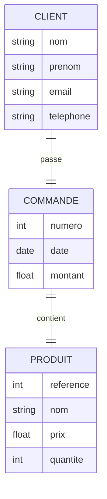
Explication du diagramme :
- `CLIENT` est une entité qui représente un client du système, avec les attributs `nom`, `prenom`, `email` et `telephone`.
- `COMMANDE` est une entité qui représente une commande passée par un client, avec les attributs `numero`, `date` et `montant`.
- `PRODUIT` est une entité qui représente un produit du système, avec les attributs `reference`, `nom`, `prix` et `quantite`.
- `CLIENT` et `COMMANDE` sont en relation `passe`, qui signifie qu'un client peut passer plusieurs commandes.
- `COMMANDE` et `PRODUIT` sont en relation `contient`, qui signifie qu'une commande peut contenir plusieurs produits.
- Les relations sont représentées par des traits entre les entités, avec une étiquette qui précise la nature de la relation.

### Normalisation des données

La normalisation des données est une technique qui permet d'organiser les données d'une base de données de manière à réduire la redondance et les anomalies. Elle consiste à décomposer les tables en entités distinctes, à définir les clés primaires et étrangères, et à respecter les règles de dépendance fonctionnelle.

Les différentes formes normales sont :
- `1NF` : Première forme normale signifie que les données sont `atomiques` et ne contiennent pas de valeurs multiples. Atomique signifie que chaque attribut d'une table contient une seule valeur.
- `2NF` : Deuxième forme normale signifie que toutes les colonnes d'une table dépendent de la clé primaire. En d'autres termes, il n'y a pas de dépendance partielle des colonnes par rapport à la clé primaire.
- `3NF` : Troisième forme normale signifie que toutes les colonnes d'une table dépendent uniquement de la clé primaire, et non pas des autres colonnes. En d'autres termes, il n'y a pas de dépendance transitive entre les colonnes.
- `BCNF` : Forme normale de Boyce-Codd signifie que toutes les dépendances fonctionnelles d'une table sont des dépendances fonctionnelles triviales, c'est-à-dire que la clé primaire détermine toutes les autres colonnes de la table.
- `4NF` : Quatrième forme normale signifie que les multi-valeurs sont évitées, c'est-à-dire que chaque attribut d'une table dépend uniquement de la clé primaire.
- `5NF` : Cinquième forme normale signifie que les dépendances fonctionnelles sont minimales, c'est-à-dire qu'il n'y a pas de dépendance redondante entre les colonnes.
- `6NF` : Sixième forme normale signifie que les dépendances fonctionnelles sont complètement décomposées, c'est-à-dire qu'il n'y a pas de dépendance cyclique entre les colonnes.

1
Exemple de normalisation 3NF :
    


### Cas pratiques de modélisation

Exercice 1 : Modélisation d'une bibliothèque
- Entités : Livre, Auteur, Emprunteur
- Relations : Ecrit, Emprunte
- Attributs : Titre, ISBN, Date de publication, Nom, Prénom, Date de naissance, Adresse, Date d'emprunt, Date de retour
- Diagramme entité-association
- Normalisation 3NF
- Schéma relationnel
    
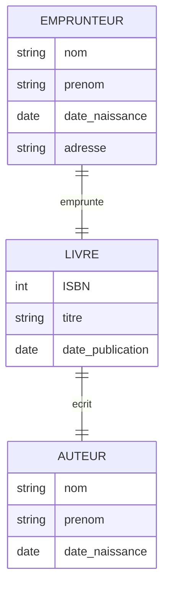

Exercice 2 : Modélisation d'un magasin
- Entités : Produit, Catégorie, Fournisseur, Commande
- Relations : Appartient, Fournit, Contient
- Attributs : Référence, Nom, Prix, Quantité, Nom, Adresse, Téléphone, Date, Montant
- Diagramme entité-association
- Normalisation 3NF

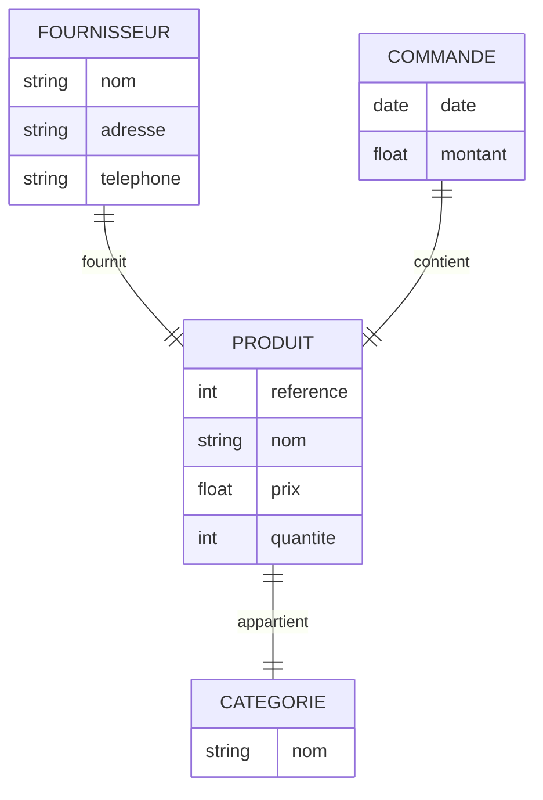

## Modélisation organisationnelle avec Merise

La modélisation organisationnelle est une étape intermédiaire de la méthode Merise. Elle consiste à définir les processus métier, les acteurs et les flux d'informations d'un système d'information, à partir du modèle conceptuel.

### Notions de processus métier

Un processus métier est une séquence d'activités qui permet d'atteindre un objectif spécifique. Il peut être représenté sous forme de diagramme de flux, qui montre les différentes étapes du processus, les acteurs impliqués, les décisions prises, et les flux d'informations échangés.

Exemple de diagramme de flux :

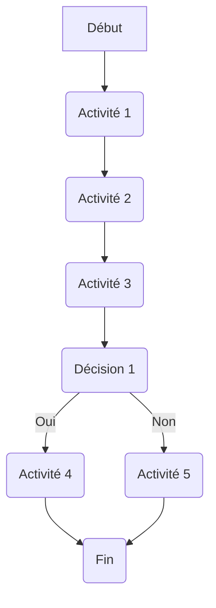

Explication du diagramme :
- `Début` est le point de départ du processus.
- `Activité 1`, `Activité 2` et `Activité 3` sont les différentes étapes du processus.
- `Décision 1` est une décision qui détermine la suite du processus.
- `Activité 4` et `Activité 5` sont les activités qui suivent la décision.
- `Fin` est le point d'arrivée du processus.

Cas pratique : Diagramme de flux d'une commande en ligne

- Début : Un client passe une commande en ligne
- Activité 1 : Le système vérifie la disponibilité des produits
- Activité 2 : Le système envoie un email de confirmation au client
- Activité 3 : Le client paie sa commande en ligne
- Décision 1 : Le paiement est accepté ?
- Oui : Le système envoie un email de confirmation au client
- Non : Le système annule la commande
- Fin : La commande est validée

Diagramme de flux :
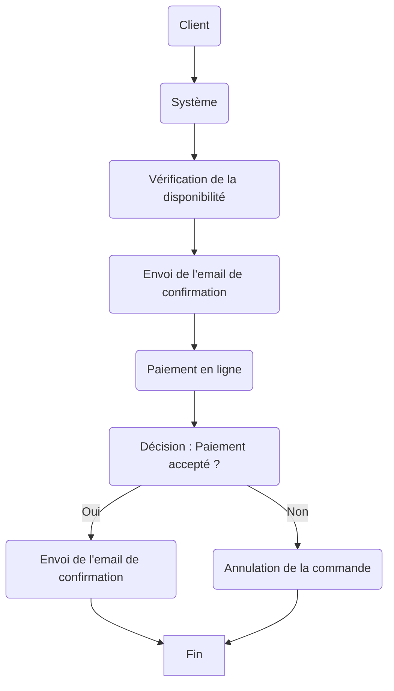

### Elaboration du modèle organisationnel

Le modèle organisationnel est une représentation des processus métier, des acteurs et des flux d'informations d'un système d'information. Il permet de mieux comprendre le fonctionnement du système, d'identifier les points de blocage et d'optimiser les processus.

En pratique, le modèle organisationnel se déroule en plusieurs étapes :
- Identification des acteurs et des flux d'informations
- Utilisation de diagrammes de flux
- Simulation de situations réelles

### Identification des acteurs et des flux d'informations

Les acteurs d'un système sont les personnes ou les entités qui interagissent avec le système, et qui ont un rôle à jouer dans les processus métier. Ils peuvent être des utilisateurs, des clients, des fournisseurs, des partenaires, des concurrents, etc.
Les flux d'informations sont les échanges de données qui se produisent entre les acteurs d'un système, et qui permettent de réaliser les processus métier. Ils peuvent être des `commandes`, des `factures`, des `rapports`, des `emails`, des `notifications`, etc.

### Utilisation de diagrammes de flux

Les diagrammes de flux sont un outil de modélisation graphique qui permet de représenter les processus métier, les acteurs et les flux d'informations d'un système d'information. Ils sont largement utilisés dans la méthode Merise pour définir le modèle organisationnel d'un projet.

Exemple de diagramme de flux :


## Modélisation logique avec Merise (MLD)

La modélisation logique ou (`MLD`) est la dernière étape de la méthode Merise. Elle consiste à traduire le modèle conceptuel en modèle relationnel, à optimiser les schémas de base de données, et à préparer la mise en œuvre du système d'information.

En pratique, la modélisation logique se déroule en plusieurs étapes :
- Conception du modèle logique
- Normalisation des données
- Traduction du modèle conceptuel en modèle relationnel
- Optimisation des schémas de base de données

### Conception du modèle logique

La conception du modèle logique consiste à définir les `tables`, les `colonnes`, les clés `primaires` et `étrangères`, les `index`, les `contraintes`, les `vues`, les procédures `stockées`, les `déclencheurs`, etc. Elle permet de structurer les données d'une base de données de manière à faciliter leur manipulation et leur exploitation.

Exemple de modèle logique :

```sql
CREATE TABLE CLIENT (
    id INT PRIMARY KEY AUTO_INCREMENT,
    nom VARCHAR(50) NOT NULL,
    prenom VARCHAR(50) NOT NULL,
    email VARCHAR(50) UNIQUE NOT NULL,
    telephone VARCHAR(20) UNIQUE NOT NULL
);

CREATE TABLE COMMANDE (
    id INT PRIMARY KEY AUTO_INCREMENT,
    numero INT UNIQUE,
    date DATE ,
    montant FLOAT,
    client_id INT,
    FOREIGN KEY (client_id) REFERENCES CLIENT(id)
);

CREATE TABLE PRODUIT (
    id INT PRIMARY KEY,
    reference INT,
    nom VARCHAR(50),
    prix FLOAT,
    quantite INT
);
```

Explication du modèle :
- `CLIENT` est une table qui contient les informations sur les clients du système.
  - `id` est la clé primaire de la table.
  - `nom`, `prenom`, `email` et `telephone` sont les colonnes de la table.
  - `INTEGER`, `VARCHAR` et `FLOAT` sont les types de données des colonnes.
  - `50` et `20` sont les tailles des colonnes VARCHAR. Par exemple, VARCHAR(50) signifie que la colonne peut contenir jusqu'à 50 caractères. 
  - `PRIMARY KEY` et `FOREIGN KEY` sont les contraintes de clé primaire et étrangère.
  - `AUTO_INCREMENT` signifie que la valeur de la clé primaire est générée automatiquement.
  - `UNIQUE` signifie que la valeur de la colonne doit être unique.
  - `NOT NULL` signifie que la colonne ne peut pas contenir de valeurs nulles.
  - `REFERENCES CLIENT(id)` est la contrainte de `clé étrangère` qui lie la table `CLIENT` à la table `COMMANDE`.

NB: Les contraintes de clé primaire et étrangère garantissent l'intégrité des données et la cohérence des relations entre les tables. Par defaut une colonne contient 255 caractères. Ce qui est suffisant pour la plupart des cas.

### Normalisation des données

La normalisation des données est une technique qui permet d'organiser les données d'une base de données de manière à réduire la redondance et les anomalies. Elle consiste à décomposer les tables en entités distinctes, à définir les clés primaires et étrangères, et à respecter les règles de dépendance fonctionnelle.

### Traduction du modèle conceptuel en modèle relationnel

La traduction du modèle conceptuel en modèle relationnel consiste à définir les tables, les colonnes, les clés primaires et étrangères, les index, les contraintes, les vues, les procédures stockées, les déclencheurs, etc. Elle permet de structurer les données d'une base de données de manière à faciliter leur manipulation et leur exploitation.

Exemple de traduction du modèle conceptuel en modèle relationnel :


### Optimisation des schémas de base de données

L'optimisation des schémas de base de données consiste à améliorer les `performances`, la `fiabilité` et la `sécurité` d'une base de données en réduisant la taille des tables, en indexant les colonnes fréquemment utilisées, en dénormalisant les données, en partitionnant les tables, en optimisant les requêtes, etc.

Exemple d'optimisation des schémas de base de données :

- Utilisation de clés primaires et étrangères pour garantir l'intégrité des données
- Indexation des colonnes fréquemment utilisées pour améliorer les performances
- Partitionnement des tables pour réduire la taille des tables
- Dénormalisation des données pour simplifier les requêtes
- Optimisation des requêtes pour accélérer l'accès aux données
- Sécurisation des données pour protéger la confidentialité des informations
- Sauvegarde et restauration des données pour prévenir les pertes de données

Exemple d'optimisation des schémas de base de données :

```sql
CREATE INDEX idx_client_nom ON CLIENT(nom);
CREATE INDEX idx_produit_reference ON PRODUIT(reference);
CREATE INDEX idx_commande_numero ON COMMANDE(numero);
```

## Application de Merise en pratique

### Cahier des charges d'un projet

Le cahier des charges d'un projet est un document qui définit les besoins, les objectifs, les contraintes et les spécifications d'un projet. Il permet de formaliser les attentes des utilisateurs, de clarifier les responsabilités des acteurs, et de planifier les étapes du projet.

Exemple de cahier des charges d'un projet :

- Objectif : Développer un système de gestion de bibliothèque en ligne
- Besoins : Gestion des livres, des auteurs, des emprunteurs, des commandes
- Contraintes : Budget limité, Délais serrés, Ressources disponibles
- Spécifications : Interface utilisateur conviviale, Fonctionnalités avancées, Sécurité renforcée
- Acteurs : Administrateur, Bibliothécaire, Emprunteur, Développeur
- Livrables : Cahier des charges, Modèles conceptuels, Modèles organisationnels, Modèles logiques
- Planning : Analyse des besoins, Conception du système, Développement des fonctionnalités, Tests et validations, Mise en production
- Budget : 10000 €, Délais : 3 mois, Ressources : 2 développeurs, 1 chef de projet

### Conception et modélisation d'un système complet

La conception et la modélisation d'un système complet sont des étapes clés de la méthode Merise. Elles permettent de définir les entités, les relations, les attributs, les processus métier, les acteurs, les flux d'informations, les tables, les colonnes, les clés primaires et étrangères, etc.

En pratique, la conception et la modélisation d'un système complet se déroulent en plusieurs étapes :
- Analyse des besoins et objectifs du projet
- Modélisation conceptuelle du système
- Modélisation organisationnelle du système
- Modélisation logique du système
- Optimisation des schémas de base de données
- Tests et validations du système
- Mise en production du système

Exemple de conception et de modélisation d'un système complet (Bibliothèque :


### Mise en œuvre des différentes phases de Merise

La mise en œuvre des différentes phases de Merise consiste à appliquer les concepts, les méthodes et les outils de modélisation de la méthode Merise à un projet réel. Elle permet de structurer les données, les processus métier, les acteurs, les flux d'informations, les tables, les colonnes, les clés primaires et étrangères, etc.
### Tests et optimisations

Les tests et les optimisations sont des étapes cruciales de la méthode Merise. Ils permettent de vérifier la qualité, la fiabilité et la performance d'un système d'information, et de corriger les éventuels problèmes, les erreurs et les dysfonctionnements.

En pratique, les tests et les optimisations se déroulent en plusieurs étapes :
- Tests unitaires : Vérification des fonctionnalités de base
- Tests d'intégration : Vérification des interactions entre les composants
- Tests de performance : Vérification des temps de réponse et des charges
- Tests de sécurité : Vérification des vulnérabilités et des failles
- Tests de conformité : Vérification des normes et des standards
- Optimisations : Amélioration des performances et de la qualité
- Validation : Vérification de la conformité aux spécifications
- Mise en production : Déploiement du système en production
- Maintenance : Suivi et évolution du système
- Support : Assistance et dépannage des utilisateurs
- Formation : Formation des utilisateurs et des administrateurs
- Documentation : Rédaction des manuels et des guides

## Approfondissement des cas pratiques

### Analyse critique de cas d'études

L'analyse critique de cas d'études est une étape importante de la méthode Merise. Elle permet d'évaluer les modèles conceptuels, organisationnels et logiques d'un projet, de détecter les erreurs, les incohérences et les lacunes, et de proposer des solutions, des améliorations et des recommandations.

### Identification des problématiques et des solutions

L'identification des problématiques et des solutions est une étape clé de la méthode Merise. Elle permet de résoudre les problèmes, les conflits et les obstacles qui peuvent survenir lors de la conception et de la modélisation d'un système d'information, et de proposer des solutions adaptées aux besoins et aux contraintes du projet.

### Simulation de situations réelles

La simulation de situations réelles est une étape pratique de la méthode Merise. Elle permet de tester les modèles conceptuels, organisationnels et logiques d'un projet dans des conditions proches de la réalité, de vérifier leur pertinence, leur fiabilité et leur performance, et de valider les choix et les décisions pris.

### Comparaison des approches Merise
La comparaison des approches Merise est une étape utile de la méthode Merise. Elle permet de comparer les modèles conceptuels, organisationnels et logiques produits par différentes équipes, de détecter les similitudes, les différences et les complémentarités entre les modèles, et de recommander les meilleures pratiques et les meilleures solutions.

## Utilisation d'outils de modélisation

### Présentation des outils de modélisation courants

Les outils de modélisation sont des logiciels qui permettent de créer, de modifier, de visualiser et d'exporter des modèles conceptuels, organisationnels et logiques. Ils sont largement utilisés dans la méthode Merise pour faciliter la conception et la modélisation des systèmes d'information.

Exemples d'outils de modélisation courants :
- `PowerDesigner` : Logiciel de modélisation de données et de processus métier
- `ER/Studio` : Logiciel de modélisation de bases de données relationnelles
- `Lucidchart` : Logiciel de modélisation en ligne
- `Visio` : Logiciel de modélisation de Microsoft
- `Draw.io` : Logiciel de modélisation open source
- `Astah` : Logiciel de modélisation UML
- `StarUML` : Logiciel de modélisation UML open source
- JMerise : Logiciel de modélisation Merise open source
- `GenMyModel` : Logiciel de modélisation en ligne
- `Creately` : Logiciel de modélisation en ligne
- `Gliffy` : Logiciel de modélisation en ligne
- `PlantUML` : Logiciel de modélisation en ligne

### Maîtrise des fonctionnalités utiles

Les fonctionnalités utiles des outils de modélisation sont les fonctionnalités qui permettent de créer, de modifier, de visualiser et d'exporter des modèles conceptuels, organisationnels et logiques. Elles sont essentielles pour faciliter la conception et la modélisation des systèmes d'information, et pour optimiser les processus de développement et de déploiement des projets.

### Création de différents types de modèles

La création de différents types de modèles est une étape pratique de la méthode Merise. Elle permet de créer des modèles conceptuels, organisationnels et logiques, de les relier entre eux, de les enrichir avec des informations complémentaires, et de les exporter dans différents formats pour les partager avec les différents acteurs d'un projet.

Exemples de modèles à créer :
- Modèles conceptuels : Diagrammes entité-association, Diagrammes de classes, Diagrammes d'objets
- Modèles organisationnels : Diagrammes de flux, Diagrammes de cas d'utilisation, Diagrammes de séquence
- Modèles logiques : Schémas relationnels, Schémas dimensionnels, Schémas en étoile
- Modèles de processus : Diagrammes de flux, Diagrammes de Gantt, Diagrammes de PERT
- Modèles de données : Diagrammes de classes, Diagrammes d'objets, Diagrammes de composants
- Modèles de déploiement : Diagrammes de déploiement, Diagrammes de composants, Diagrammes de packages
- Modèles de tests : Cas de tests, Scénarios de tests, Plans de tests
- Modèles de documentation : Manuels d'utilisation, Guides de référence, Tutoriels
- Modèles de suivi : Tableaux de bord, Rapports d'activité, Graphiques de performance
- Modèles de support : FAQ, Forums, Tickets

### Importation et exportation de modèles

L'importation et l'exportation de modèles sont des fonctionnalités utiles des outils de modélisation. Elles permettent de récupérer des modèles existants, de les modifier, de les enrichir, de les partager avec d'autres utilisateurs, de les exporter dans différents formats, et de les réutiliser dans d'autres projets.

Exemples d'importation et d'exportation de modèles :
- Importation de modèles existants : Fichiers XML, Fichiers JSON, Fichiers CSV
- Exportation de modèles modifiés : Fichiers PDF, Fichiers PNG, Fichiers SVG
- Partage de modèles avec d'autres utilisateurs : Fichiers ZIP, Fichiers RAR, Fichiers TAR

-------

## Cas pratiques de modélisation avec Merise

### Exercices pratiques 1 : Modélisation d'un site web de vente en ligne

Enononcé :
Vous êtes chargé de concevoir et de modéliser un système d'information pour une entreprise de vente en ligne de produits électroniques. L'entreprise souhaite développer un site web pour vendre ses produits, gérer les commandes, suivre les stocks, analyser les ventes, etc.

Vous devrez analyser les besoins et les objectifs du projet, identifier les acteurs et les flux d'informations, créer des diagrammes entité-association, des diagrammes de flux, des schémas relationnels, etc.

Vous devrez concevoir et modéliser le système d'information en utilisant la méthode Merise, en respectant les bonnes pratiques, les normes et les standards de modélisation, et en proposant des solutions adaptées aux besoins et aux contraintes du projet.

Vous devrez tester et valider le système d'information, présenter les résultats, débriefer les acteurs, recommander des améliorations et préparer la mise en production du système.

Enfin, vous devrez rédiger un rapport de projet qui présente les différentes étapes de la méthode Merise, les modèles conceptuels, organisationnels et logiques produits, les tests et validations réalisés, les résultats obtenus, les recommandations formulées, etc.

### Analyse des besoins et des objectifs du projet

- Objectif : Développer un site web de vente en ligne de produits électroniques
- Besoins : Gestion des produits, des commandes, des clients, des stocks, des ventes, pour les administrateurs, les clients, les fournisseurs, les partenaires, la livraison, le paiement, etc.

### Identification des acteurs et des flux d'informations

- Acteurs : Administrateur, Client, Fournisseur, Partenaire, Livreur, Banque, 
- Flux d'informations : Commande, Facture, Paiement, Livraison, Stock, Vente, Promotion, Publicité, etc.

### Création de diagrammes entité-association

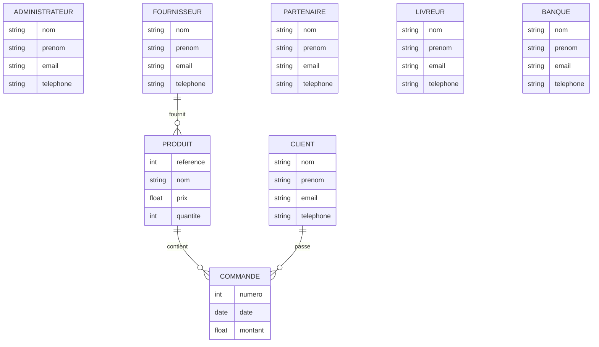

### Création de diagrammes de flux

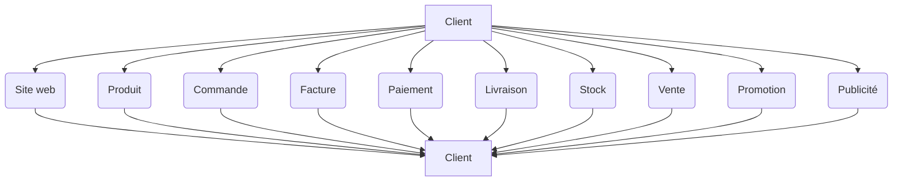

### Création de schémas relationnels

```sql
CREATE TABLE PRODUIT (
    reference INT PRIMARY KEY,
    nom VARCHAR(50) NOT NULL,
    prix FLOAT NOT NULL,
    quantite INT NOT NULL
);

CREATE TABLE COMMANDE (
    numero INT PRIMARY KEY,
    date DATE NOT NULL,
    montant FLOAT NOT NULL,
    client_id INT,
    FOREIGN KEY (client_id) REFERENCES CLIENT(id)
);

CREATE TABLE CLIENT (
    id INT PRIMARY KEY AUTO_INCREMENT,
    nom VARCHAR(50) NOT NULL,
    prenom VARCHAR(50) NOT NULL,
    email VARCHAR(50) UNIQUE NOT NULL,
    telephone VARCHAR(20) UNIQUE NOT NULL
);

CREATE TABLE ADMINISTRATEUR (
    id INT PRIMARY KEY AUTO_INCREMENT,
    nom VARCHAR(50) NOT NULL,
    prenom VARCHAR(50) NOT NULL,
    email VARCHAR(50) UNIQUE NOT NULL,
    telephone VARCHAR(20) UNIQUE NOT NULL
);

CREATE TABLE FOURNISSEUR (
    id INT PRIMARY KEY AUTO_INCREMENT,
    nom VARCHAR(50) NOT NULL,
    prenom VARCHAR(50) NOT NULL,
    email VARCHAR(50) UNIQUE NOT NULL,
    telephone VARCHAR(20) UNIQUE NOT NULL
);

CREATE TABLE PARTENAIRE (
    id INT PRIMARY KEY AUTO_INCREMENT,
    nom VARCHAR(50) NOT NULL,
    prenom VARCHAR(50) NOT NULL,
    email VARCHAR(50) UNIQUE NOT NULL,
    telephone VARCHAR(20) UNIQUE NOT NULL
);

CREATE TABLE LIVREUR (
    id INT PRIMARY KEY AUTO_INCREMENT,
    nom VARCHAR(50) NOT NULL,
    prenom VARCHAR(50) NOT NULL,
    email VARCHAR(50) UNIQUE NOT NULL,
    telephone VARCHAR(20) UNIQUE NOT NULL
);

CREATE TABLE BANQUE (
    id INT PRIMARY KEY AUTO_INCREMENT,
    nom VARCHAR(50) NOT NULL,
    prenom VARCHAR(50) NOT NULL,
    email VARCHAR(50) UNIQUE NOT NULL,
    telephone VARCHAR(20) UNIQUE NOT NULL
);
```

Modèle Physique de Données (MPD)

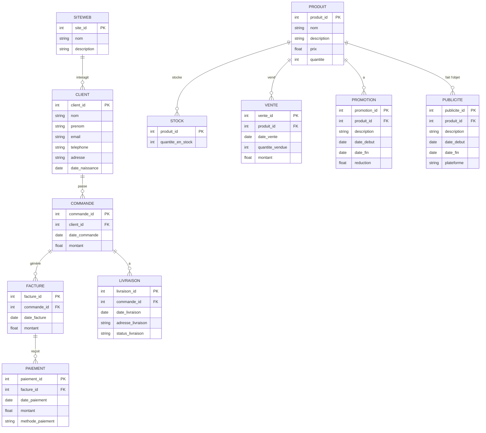

-------

### Exercice pratique 2 : Modélisation d'un réseau social

Vous êtes chargé de concevoir et de modéliser un système d'information pour une plateforme sociale de type Facebook. La plateforme permet aux utilisateurs de se connecter, d'interagir et de partager du contenu. Voici les principales fonctionnalités et les entités impliquées :

Utilisateur : Chaque utilisateur a un profil contenant des informations personnelles telles que le nom, le prénom, l'email, le téléphone, l'adresse et la date de naissance.

Groupe : Les utilisateurs peuvent appartenir à des groupes, qui sont définis par un nom et une description.

Page : Les utilisateurs peuvent suivre des pages, lesquelles ont également un nom et une description.

Message : Les utilisateurs peuvent envoyer des messages, lesquels contiennent du texte et une date d'envoi.

Photo : Les utilisateurs peuvent partager des photos, chaque photo ayant un nom et une description.

Vidéo : Les utilisateurs peuvent également partager des vidéos, chaque vidéo ayant un nom et une description.

Événement : Les utilisateurs peuvent participer à des événements, lesquels sont définis par un nom, une description et une date.

Publicité : Les utilisateurs peuvent cliquer sur des publicités, chaque publicité ayant un nom, une description et une date.

Les relations entre ces entités sont les suivantes :

Un utilisateur peut appartenir à plusieurs groupes et un groupe peut avoir plusieurs utilisateurs.
Un utilisateur peut suivre plusieurs pages et une page peut avoir plusieurs utilisateurs qui la suivent.
Un utilisateur peut envoyer plusieurs messages.
Un utilisateur peut partager plusieurs photos et vidéos.
Un utilisateur peut participer à plusieurs événements.
Un utilisateur peut cliquer sur plusieurs publicités.

Diagramme entité-association (Facebook) : MCD

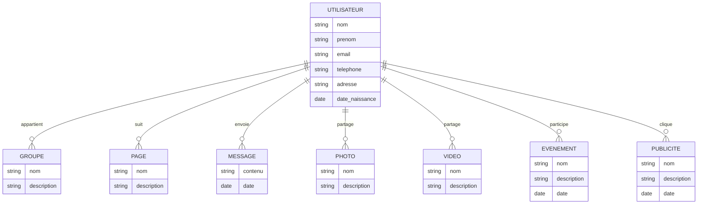

Diagramme de flux (Facebook) :

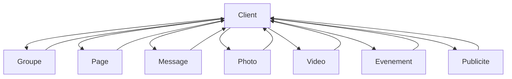

Schémas relationnels (Facebook) : MLD

```sql
CREATE TABLE UTILISATEUR (
    id INT PRIMARY KEY AUTO_INCREMENT,
    nom VARCHAR(50) NOT NULL,
    prenom VARCHAR(50) NOT NULL,
    email VARCHAR(50) UNIQUE NOT NULL,
    telephone VARCHAR(20) UNIQUE NOT NULL,
    adresse VARCHAR(255),
    date_naissance DATE
);

CREATE TABLE GROUPE (
    id INT PRIMARY KEY AUTO_INCREMENT,
    nom VARCHAR(50) NOT NULL,
    description TEXT
);

CREATE TABLE PAGE (
    id INT PRIMARY KEY AUTO_INCREMENT,
    nom VARCHAR(50) NOT NULL,
    description TEXT
);

CREATE TABLE MESSAGE (
    id INT PRIMARY KEY AUTO_INCREMENT,
    contenu TEXT,
    date DATE,
    utilisateur_id INT,
    FOREIGN KEY (utilisateur_id) REFERENCES UTILISATEUR(id)
);

CREATE TABLE PHOTO (
    id INT PRIMARY KEY AUTO_INCREMENT,
    nom VARCHAR(50) NOT NULL,
    description TEXT,
    utilisateur_id INT,
    FOREIGN KEY (utilisateur_id) REFERENCES UTILISATEUR(id)
);

CREATE TABLE VIDEO (
    id INT PRIMARY KEY AUTO_INCREMENT,
    nom VARCHAR(50) NOT NULL,
    description TEXT,
    utilisateur_id INT,
    FOREIGN KEY (utilisateur_id) REFERENCES UTILISATEUR(id)
);

CREATE TABLE EVENEMENT (
    id INT PRIMARY KEY AUTO_INCREMENT,
    nom VARCHAR(50) NOT NULL,
    description TEXT,
    date DATE,
    utilisateur_id INT,
    FOREIGN KEY (utilisateur_id) REFERENCES UTILISATEUR(id)
);

CREATE TABLE PUBLICITE (
    id INT PRIMARY KEY AUTO_INCREMENT,
    nom VARCHAR(50) NOT NULL,
    description TEXT,
    date DATE,
    utilisateur_id INT,
    FOREIGN KEY (utilisateur_id) REFERENCES UTILISATEUR(id)
);
```

Modèle Logique de Données (MLD)


Modèle Physique de Données (MPD)

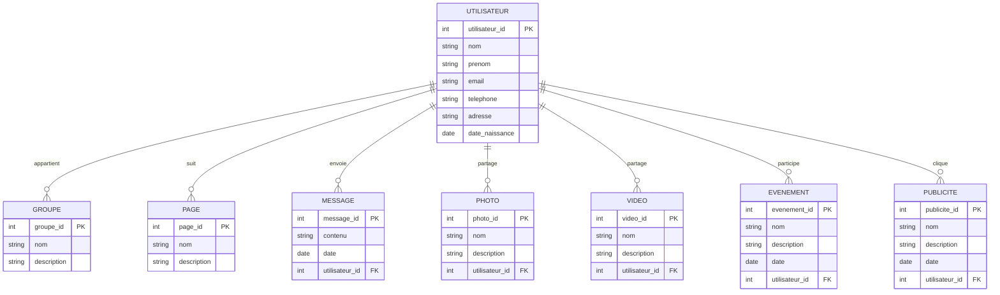

Récommandation : [Mermaid](https://mermaid-js.github.io/mermaid/#/) pour la génération des diagrammes.
