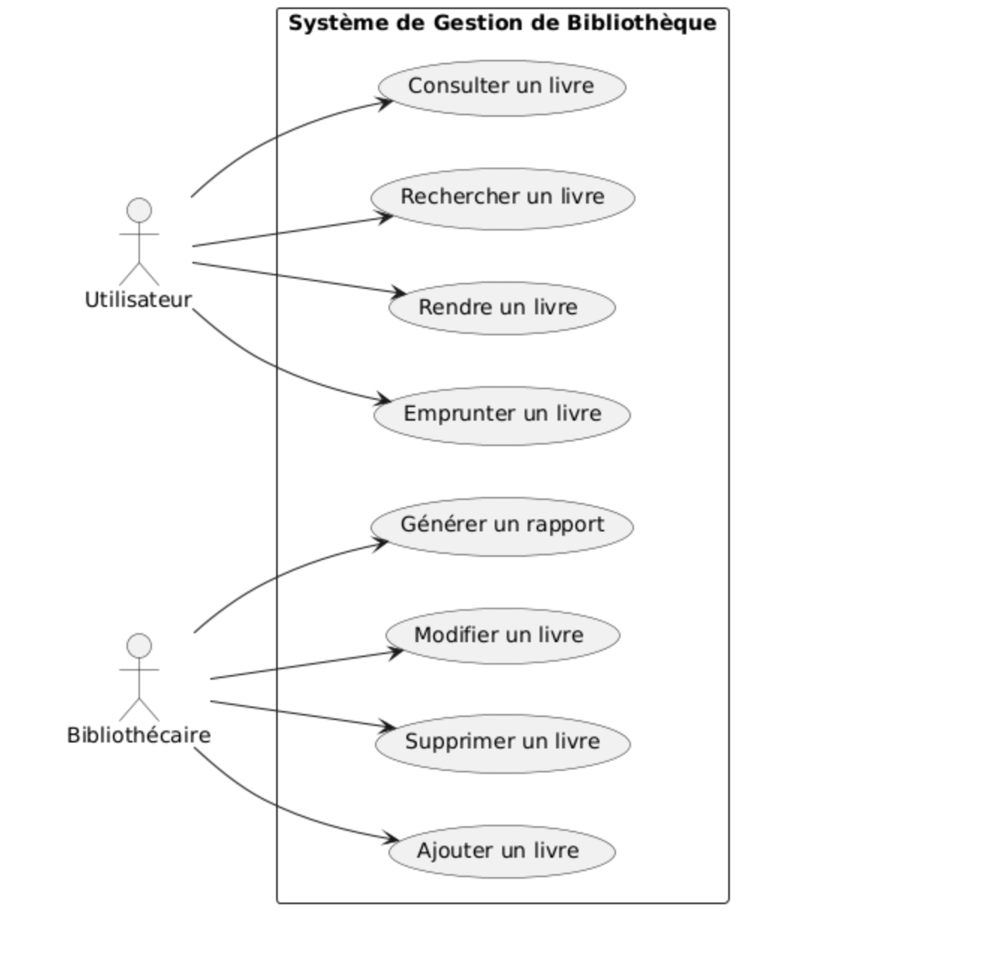

# Formation Maîtrisez UML : Apprendre UML par la pratique.


Auteur : Paterne G. G. Formateur en développement web : PHP/ Symfony & Rust

[Github](https://github.com/) - [LinkedIn](https://www.linkedin.com/in/gnpinformatique/)


----

<!-- TOC -->
* [Formation Maîtrisez UML : Apprendre UML par la pratique.](#formation-maîtrisez-uml--apprendre-uml-par-la-pratique)
  * [Introduction à UML](#introduction-à-uml)
    * [Présentation de l'UML](#présentation-de-luml)
    * [Historique de l'UML](#historique-de-luml)
    * [Objectifs de l'UML](#objectifs-de-luml)
    * [Diagramme de cas d'utilisation](#diagramme-de-cas-dutilisation)
    * [Diagramme de classes](#diagramme-de-classes)
    * [Diagramme de séquence](#diagramme-de-séquence)
  * [Modélisation Avancée : Approfondissement des techniques de modélisation UML.](#modélisation-avancée--approfondissement-des-techniques-de-modélisation-uml)
    * [Diagramme d'activités](#diagramme-dactivités)
    * [Diagramme de composants](#diagramme-de-composants)
    * [Diagramme de déploiement](#diagramme-de-déploiement)
    * [Diagramme d'états](#diagramme-détats)
  * [Notations et Conventions : Maîtriser la syntaxe et les règles de l'UML.](#notations-et-conventions--maîtriser-la-syntaxe-et-les-règles-de-luml)
    * [Notations UML](#notations-uml)
    * [Conventions de modélisation](#conventions-de-modélisation)
    * [Sémantique des diagrammes](#sémantique-des-diagrammes)
    * [Lisibilité des diagrammes](#lisibilité-des-diagrammes)
    * [Gestion des stéréotypes](#gestion-des-stéréotypes)
    * [Utilisation des balises](#utilisation-des-balises)
  * [Diagrammes de Communication : Comprendre et créer des diagrammes de communication.](#diagrammes-de-communication--comprendre-et-créer-des-diagrammes-de-communication)
    * [Diagramme de séquence et de collaboration](#diagramme-de-séquence-et-de-collaboration)
    * [Modélisation des interactions](#modélisation-des-interactions)
    * [Utilisation des messages](#utilisation-des-messages)
  * [Utilisation dans les Projets Réels : Application pratique de l'UML dans des projets concrets.](#utilisation-dans-les-projets-réels--application-pratique-de-luml-dans-des-projets-concrets)
    * [Intégration d'UML dans le cycle de développement](#intégration-duml-dans-le-cycle-de-développement)
    * [Documentation des modèles](#documentation-des-modèles)
    * [Collaboration avec les équipes](#collaboration-avec-les-équipes)
    * [Validation et test des modèles](#validation-et-test-des-modèles)
  * [Conception Orientée Objet : Appliquer les principes de la conception orientée objet avec UML.](#conception-orientée-objet--appliquer-les-principes-de-la-conception-orientée-objet-avec-uml)
    * [Encapsulation et abstractions](#encapsulation-et-abstractions)
    * [Héritage et polymorphisme](#héritage-et-polymorphisme)
    * [Association et agrégation](#association-et-agrégation)
    * [Modélisation des classes et des objets](#modélisation-des-classes-et-des-objets)
  * [Analyse des Besoins : Utiliser l'UML pour analyser et documenter les besoins. Ce module dure 7 heures.](#analyse-des-besoins--utiliser-luml-pour-analyser-et-documenter-les-besoins-ce-module-dure-7-heures)
    * [Identification des besoins](#identification-des-besoins)
    * [Définition des cas d'utilisation](#définition-des-cas-dutilisation)
    * [Priorisation des exigences](#priorisation-des-exigences)
    * [Modélisation des besoins](#modélisation-des-besoins)
  * [Migration vers UML : Transitionner vers l'utilisation efficace de l'UML.](#migration-vers-uml--transitionner-vers-lutilisation-efficace-de-luml)
    * [Analyse de code existant](#analyse-de-code-existant)
    * [Refactoring vers l'UML](#refactoring-vers-luml)
    * [Formation des équipes](#formation-des-équipes)
  * [Optimisation des Modèles : Améliorer la qualité et la lisibilité des modèles UML.](#optimisation-des-modèles--améliorer-la-qualité-et-la-lisibilité-des-modèles-uml)
    * [Révision et rétro-ingénierie](#révision-et-rétro-ingénierie)
    * [Élimination des redondances](#élimination-des-redondances)
    * [Simplification des diagrammes](#simplification-des-diagrammes)
    * [Documentation claire](#documentation-claire)
    * [Exercices pratiques](#exercices-pratiques)
  * [Validation et Vérification : Assurer la qualité et la pertinence des modèles UML.](#validation-et-vérification--assurer-la-qualité-et-la-pertinence-des-modèles-uml)
    * [Vérification des règles de modélisation](#vérification-des-règles-de-modélisation)
    * [Validation des exigences](#validation-des-exigences)
    * [Revues de modèles](#revues-de-modèles)
    * [Tests d'intégration](#tests-dintégration)
  * [Utilisation Avancée des Outils UML : Explorer les fonctionnalités avancées des outils de modélisation UML.](#utilisation-avancée-des-outils-uml--explorer-les-fonctionnalités-avancées-des-outils-de-modélisation-uml)
    * [Génération de code à partir de modèles](#génération-de-code-à-partir-de-modèles)
  * [Conclusion](#conclusion)
<!-- TOC -->

----
## Introduction à UML

### Présentation de l'UML
UML (Unified Modeling Language) est un langage de modélisation graphique utilisé pour concevoir des systèmes logiciels. Il permet de représenter visuellement les différents aspects d'un système, tels que sa structure, son comportement et ses interactions. L'UML est largement utilisé dans l'industrie du logiciel pour documenter et communiquer sur les projets de développement.

### Historique de l'UML

L'UML a été développé dans les années 1990 par un groupe de chercheurs en informatique, dont Grady Booch, Ivar Jacobson et James Rumbaugh. Il a été adopté comme norme par l'OMG (Object Management Group) en 1997. Depuis lors, l'UML est devenu un standard de facto pour la modélisation des systèmes logiciels.

### Objectifs de l'UML

Les principaux objectifs de l'UML sont les suivants :
- Fournir un langage de modélisation standard pour les systèmes logiciels.
- Permettre la communication efficace entre les différents acteurs d'un projet.
- Faciliter la conception, la documentation et la maintenance des systèmes logiciels.
- Promouvoir les bonnes pratiques de conception orientée objet.
- Encourager la réutilisation et la modularité des composants logiciels.
- Améliorer la qualité et la fiabilité des logiciels développés.
- Faciliter l'automatisation de la génération de code à partir des modèles.
- Favoriser l'interopérabilité entre les outils de modélisation et de développement.

### Diagramme de cas d'utilisation

Le diagramme de cas d'utilisation est l'un des diagrammes les plus couramment utilisés en UML. Il permet de représenter les interactions entre les acteurs et le système, en mettant en évidence les fonctionnalités offertes par le système. Les cas d'utilisation sont des scénarios d'utilisation du système, qui décrivent les actions effectuées par les acteurs pour atteindre un objectif spécifique.

Prenons l'exemple d'un système de gestion de bibliothèque. Les acteurs du système sont les utilisateurs (étudiants, enseignants, bibliothécaires) et le système lui-même. Les cas d'utilisation du système peuvent être les suivants :
- `Emprunter un livre` : un utilisateur peut emprunter un livre en saisissant son identifiant et le code du livre.
- `Rendre un livre` : un utilisateur peut rendre un livre emprunté en le déposant dans la boîte de retour.
- `Rechercher un livre` : un utilisateur peut rechercher un livre dans le catalogue en saisissant son titre ou son auteur.
- `Ajouter un livre` : un bibliothécaire peut ajouter un nouveau livre au catalogue en saisissant ses informations.
- `Supprimer un livre` : un bibliothécaire peut supprimer un livre du catalogue en saisissant son identifiant.
- `Générer un rapport` : un bibliothécaire peut générer un rapport sur les livres empruntés et rendus.
- `Modifier un livre` : un bibliothécaire peut modifier les informations d'un livre existant dans le catalogue.
- `Consulter un livre` : un utilisateur peut consulter les détails d'un livre (titre, auteur, édition, etc.).

Exemple de diagramme de cas d'utilisation pour le système de gestion de bibliothèque :



### Diagramme de classes

Le diagramme de classes est un autre diagramme important en UML, qui permet de représenter la structure statique d'un système logiciel. Il décrit les classes, les attributs, les opérations et les relations entre les classes. Les classes sont des modèles de données qui regroupent des attributs et des opérations liés à un concept spécifique.

Prenons l'exemple d'une classe `Livre` dans le système de gestion de bibliothèque. Cette classe peut avoir les attributs suivants :
- `titre` : le titre du livre.
- `auteur` : l'auteur du livre.
- `edition` : l'édition du livre.
- `isbn` : le numéro ISBN du livre.
- `exemplaires` : le nombre d'exemplaires disponibles du livre.
- `emprunts` : la liste des emprunts en cours du livre.
- `disponibilité` : l'état de disponibilité du livre.
- `date_ajout` : la date d'ajout du livre au catalogue.
- `date_modif` : la date de dernière modification du livre.
- `categorie` : la catégorie du livre (roman, science-fiction, histoire, etc.).
- `langue` : la langue du livre.
- `format` : le format du livre (papier, numérique, audio, etc.).
- `prix` : le prix du livre.
- `resume` : le résumé du livre.
- `commentaires` : les commentaires des lecteurs sur le livre.
- `note` : la note moyenne attribuée au livre.
- `image` : l'image de couverture du livre.

Exemple de diagramme de classes pour le système de gestion de bibliothèque :


Expliquons les relations entre les classes :
- Un `Livre` peut avoir plusieurs `Emprunts` (0..*), car plusieurs utilisateurs peuvent emprunter le même livre.
- Un `Livre` peut recevoir plusieurs `Commentaires` (0..*), car plusieurs utilisateurs peuvent commenter le même livre.
- Un `Emprunt` concerne un seul `Utilisateur`, car un utilisateur peut emprunter plusieurs livres.
- Un `Commentaire` est écrit par un seul `Utilisateur`, car un utilisateur peut laisser plusieurs commentaires sur différents livres.
- Les classes `Emprunt` et `Commentaire` contiennent des attributs supplémentaires pour enregistrer les informations spécifiques à chaque emprunt et commentaire.
- La classe `Utilisateur` contient les informations de base sur les utilisateurs du système.
- Les classes `Emprunt` et `Commentaire` sont des classes associatives qui représentent les relations entre les classes `Livre` et `Utilisateur`.
- Les cardinalités des relations entre les classes sont indiquées par des multiplicités (0..*, 1..*, etc.).

### Diagramme de séquence

Le diagramme de séquence est un autre diagramme important en UML, qui permet de représenter les interactions entre les objets d'un système logiciel. Il décrit la séquence d'appels de méthodes entre les objets, en mettant en évidence l'ordre d'exécution des opérations. Les objets sont représentés par des boîtes, et les messages entre les objets sont représentés par des flèches.

Prenons l'exemple d'un scénario d'emprunt d'un livre dans le système de gestion de bibliothèque. Voici la séquence d'actions entre les objets `Utilisateur`, `Livre` et `Bibliothèque` :
1. L'utilisateur sélectionne le livre à emprunter dans le catalogue.
2. L'utilisateur saisit son identifiant et le code du livre.
3. La bibliothèque vérifie la disponibilité du livre.
4. La bibliothèque enregistre l'emprunt du livre pour l'utilisateur.
5. La bibliothèque met à jour le nombre d'exemplaires disponibles du livre.
6. La bibliothèque envoie un message de confirmation à l'utilisateur.
7. L'utilisateur reçoit le livre emprunté.
8. La bibliothèque enregistre la date de l'emprunt dans le système.
9. La bibliothèque envoie un rappel à l'utilisateur pour le retour du livre.
10. L'utilisateur retourne le livre à la bibliothèque.
11. La bibliothèque enregistre le retour du livre dans le système.

Exemple de diagramme de séquence pour le scénario d'emprunt d'un livre :


## Modélisation Avancée : Approfondissement des techniques de modélisation UML.

Les techniques de modélisation avancée en UML permettent de représenter des aspects plus complexes des systèmes logiciels, tels que les interactions entre les composants, les états des objets, les déploiements sur des plateformes spécifiques, etc. Ces techniques sont utiles pour modéliser des systèmes plus sophistiqués et pour communiquer efficacement sur des aspects spécifiques du système.
Les diagrammes avancés en UML incluent les diagrammes de séquence, de collaboration, d'activités, de composants, de déploiement, d'états, etc. Chaque type de diagramme permet de représenter un aspect particulier du système, en mettant en évidence les interactions, les structures, les comportements, etc.

### Diagramme d'activités

Le diagramme d'activités est un diagramme de modélisation comportementale en UML, qui permet de représenter le flux de contrôle d'un processus ou d'un algorithme. Il est utilisé pour décrire les étapes d'un processus, les décisions prises, les boucles d'itération, etc. Les activités sont représentées par des actions, des transitions, des décisions, des boucles, etc.

Prenons l'exemple d'un processus de réservation en ligne dans un système de réservation de billets d'avion. Voici les étapes du processus :
1. L'utilisateur se connecte au site de réservation.
2. L'utilisateur saisit les informations du vol souhaité.
3. Le système recherche les vols disponibles.
4. Le système affiche les vols disponibles à l'utilisateur.
5. L'utilisateur sélectionne un vol.
6. Le système vérifie la disponibilité des places.
7. Le système affiche les places disponibles à l'utilisateur.
8. L'utilisateur sélectionne une place.
9. Le système vérifie la disponibilité de la place.
10. Le système affiche le récapitulatif de la réservation à l'utilisateur.
11. L'utilisateur confirme la réservation.
12. Le système enregistre la réservation dans la base de données.
13. Le système envoie un email de confirmation à l'utilisateur.
14. Le processus de réservation est terminé.

Exemple de diagramme d'activités pour le processus de réservation en ligne :


### Diagramme de composants

Le diagramme de composants est un diagramme de modélisation structurelle en UML, qui permet de représenter les composants logiciels d'un système et leurs relations. Il est utilisé pour décrire l'architecture logicielle d'un système, en mettant en évidence les dépendances entre les composants, les interfaces exposées, les dépendances de déploiement, etc. Les composants sont des unités logicielles indépendantes qui encapsulent des fonctionnalités spécifiques.

Prenons l'exemple d'un système de gestion de bibliothèque. Voici les composants logiciels du système :
- `Bibliothèque` : le composant principal qui gère l'ensemble du système.
- `Catalogue` : le composant qui gère le catalogue des livres disponibles.
- `Emprunts` : le composant qui gère les emprunts des livres par les utilisateurs.
- `Utilisateurs` : le composant qui gère les utilisateurs du système.
- `Commentaires` : le composant qui gère les commentaires des utilisateurs sur les livres.
- `Rapports` : le composant qui génère des rapports sur les activités du système.
- `Notifications` : le composant qui envoie des notifications aux utilisateurs.
- `Authentification` : le composant qui gère l'authentification des utilisateurs.
- `Stockage` : le composant qui gère le stockage des données du système.
- `Interface` : le composant qui gère l'interface utilisateur du système.

Exemple de diagramme de composants pour le système de gestion de bibliothèque :


### Diagramme de déploiement

Le diagramme de déploiement est un autre diagramme de modélisation structurelle en UML, qui permet de représenter la configuration matérielle d'un système logiciel. Il est utilisé pour décrire les nœuds matériels sur lesquels les composants logiciels sont déployés, les connexions entre les nœuds, les protocoles de communication, etc. Les nœuds sont des entités matérielles, telles que des serveurs, des ordinateurs, des périphériques, etc.

Prenons l'exemple d'un système de gestion de bibliothèque. Voici les nœuds matériels du système :
- `Serveur` : le serveur principal qui héberge l'application de gestion de bibliothèque.
- `Base de données` : la base de données qui stocke les informations sur les livres, les utilisateurs, les emprunts, etc.
- `Serveur de fichiers` : le serveur qui stocke les fichiers multimédias des livres (images, vidéos, etc.).
- `Serveur de messagerie` : le serveur qui envoie des emails de notification aux utilisateurs.
- `Poste de travail` : le poste de travail des bibliothécaires pour gérer le système.

Exemple de diagramme de déploiement pour le système de gestion de bibliothèque :


### Diagramme d'états

Le diagramme d'états est un diagramme de modélisation comportementale en UML, qui permet de représenter les états d'un objet et les transitions entre ces états. Il est utilisé pour décrire le cycle de vie d'un objet, les événements qui déclenchent les transitions, les actions associées à chaque état, etc. Les états sont des conditions dans lesquelles un objet peut se trouver à un moment donné.

Prenons l'exemple d'un livre dans le système de gestion de bibliothèque. Voici les états possibles d'un livre :
- `Disponible` : le livre est disponible pour l'emprunt.
- `Emprunté` : le livre a été emprunté par un utilisateur.
- `Réservé` : le livre a été réservé par un utilisateur.
- `En attente` : le livre est en attente de traitement par un bibliothécaire.
- `Indisponible` : le livre n'est pas disponible pour l'emprunt.
- `Archivé` : le livre a été retiré du catalogue.
- `Endommagé` : le livre est endommagé et ne peut pas être emprunté.
- `Perdu` : le livre est perdu et doit être remplacé.

Exemple de diagramme d'états pour le livre dans le système de gestion de bibliothèque :


## Notations et Conventions : Maîtriser la syntaxe et les règles de l'UML.

### Notations UML

L'UML utilise des notations graphiques standardisées pour représenter les différents éléments des modèles. Voici quelques-unes des notations les plus couramment utilisées en UML :
- Les classes sont représentées par des rectangles avec trois compartiments : le nom de la classe, les attributs et les opérations. Exemple : `Livre {titre, auteur, isbn}`.

- Les associations entre les classes sont représentées par des lignes avec des flèches, qui indiquent les relations entre les classes. Exemple : 

- Les agrégations et les compositions sont représentées par des losanges creux et pleins, qui indiquent les relations de tout ou partie entre les classes.

- Les généralisations et les réalisations sont représentées par des flèches avec des pointes creuses et pleines, qui indiquent les relations d'héritage entre les classes.

- Les dépendances sont représentées par des lignes en pointillés, qui indiquent les relations de dépendance entre les classes.

- Les messages entre les objets sont représentés par des flèches avec des numéros, qui indiquent les séquences d'appels de méthodes entre les objets.

- Les états des objets sont représentés par des rectangles avec des noms, qui indiquent les différents états possibles des objets.

- Les transitions entre les états sont représentées par des flèches avec des noms, qui indiquent les événements qui déclenchent les transitions.

- Les décisions sont représentées par des losanges avec des noms, qui indiquent les conditions à évaluer dans le processus.


- Les boucles sont représentées par des flèches avec des noms, qui indiquent les itérations à effectuer dans le processus.
```mermaid
graph TD
    subgraph Left
        A[Se connecter au site de réservation]
        C[Rechercher les vols disponibles]
        E[Sélectionner un vol]
        G[Afficher les places disponibles]
        I[Vérifier la disponibilité de la place]
        K[Confirmer la réservation]
        M[Envoyer un email de confirmation]
    end
    subgraph Right
        B[Saisir les informations du vol]
        D[Afficher les vols disponibles]
        F[Vérifier la disponibilité des places]
        H[Sélectionner une place]
        J[Afficher le récapitulatif de la réservation]
        L[Enregistrer la réservation]
        N[Terminer le processus de réservation]
    end

    A --> B
    B --> C
    C --> D
    D --> E
    E --> F
    F --> G
    G --> H
    H --> I
    I --> J
    J --> K
    K --> L
    L --> M
    M --> N

%% Ajout des boucles
    C --> |Rechercher à nouveau| C
    G --> |Afficher à nouveau| G
    J --> |Vérifier les informations| B

    style A fill:blue,stroke:white,stroke-width:2px
    style B fill:blue,stroke:white,stroke-width:2px
    style C fill:blue,stroke:white,stroke-width:2px
    style D fill:blue,stroke:white,stroke-width:2px
    style E fill:blue,stroke:white,stroke-width:2px
    style F fill:blue,stroke:white,stroke-width:2px
    style G fill:blue,stroke:white,stroke-width:2px
    style H fill:blue,stroke:white,stroke-width:2px
    style I fill:blue,stroke:white,stroke-width:2px
    style J fill:blue,stroke:white,stroke-width:2px
    style K fill:blue,stroke:white,stroke-width:2px
    style L fill:blue,stroke:white,stroke-width:2px
    style M fill:blue,stroke:white,stroke-width:2px
    style N fill:blue,stroke:white,stroke-width:2px
 ```


- Les composants sont représentés par des rectangles avec des noms, qui indiquent les unités logicielles du système.
```mermaid
graph TD
    A[Interface] --> B[Bibliothèque]
    B --> C[Catalogue]
    B --> D[Emprunts]
    B --> E[Utilisateurs]
    B --> F[Commentaires]
    B --> G[Rapports]
    B --> H[Notifications]
    B --> I[Authentification]
    B --> J[Stockage]

    style A fill:blue,stroke:white,stroke-width:2px
    style B fill:blue,stroke:white,stroke-width:2px
    style C fill:blue,stroke:white,stroke-width:2px
    style D fill:blue,stroke:white,stroke-width:2px
    style E fill:blue,stroke:white,stroke-width:2px
    style F fill:blue,stroke:white,stroke-width:2px
    style G fill:blue,stroke:white,stroke-width:2px
    style H fill:blue,stroke:white,stroke-width:2px
    style I fill:blue,stroke:white,stroke-width:2px
    style J fill:blue,stroke:white,stroke-width:2px
```
- Les nœuds sont représentés par des rectangles avec des noms, qui indiquent les entités matérielles du système.

- Etc...

### Conventions de modélisation

La convention de modélisation en UML consiste à suivre des règles et des bonnes pratiques pour créer des modèles clairs, cohérents et compréhensibles. Voici quelques-unes des conventions de modélisation les plus couramment utilisées en UML.

### Sémantique des diagrammes

Les diagrammes en UML doivent être sémantiquement corrects, c'est-à-dire qu'ils doivent refléter fidèlement la réalité du système modélisé. Les éléments des diagrammes doivent être cohérents et logiques, et les relations entre les éléments doivent être correctement représentées.

### Lisibilité des diagrammes

Les diagrammes en UML doivent être lisibles et compréhensibles, c'est-à-dire qu'ils doivent être clairs, bien structurés et faciles à interpréter. Les éléments des diagrammes doivent être correctement alignés, espacés et formatés, et les relations entre les éléments doivent être facilement identifiables.

### Gestion des stéréotypes

Les stéréotypes en UML permettent de personnaliser les éléments des modèles en leur attribuant des propriétés spécifiques. Il est important de gérer les stéréotypes de manière cohérente et de les utiliser de manière appropriée pour enrichir les modèles sans les alourdir.


### Utilisation des balises

Les balises en UML permettent d'ajouter des informations supplémentaires aux éléments des modèles, telles que des notes, des contraintes, des commentaires, etc. Il est important d'utiliser les balises de manière judicieuse pour documenter les modèles et faciliter leur compréhension.

## Diagrammes de Communication : Comprendre et créer des diagrammes de communication.

Le diagramme de communication est un autre diagramme important en UML, qui permet de représenter les interactions entre les objets d'un système logiciel. Il est utilisé pour décrire les échanges de messages entre les objets, en mettant en évidence les séquences d'envoi et de réception des messages. Les objets sont représentés par des boîtes, et les messages entre les objets sont représentés par des flèches.

Prenons l'exemple d'un scénario de réservation en ligne dans un système de réservation de billets d'avion. Voici les interactions entre les objets `Utilisateur`, `Système de Réservation`, `Vol`, `Place` et `Email` :


### Diagramme de séquence et de collaboration

Le diagramme de séquence et le diagramme de collaboration sont deux types de diagrammes en UML qui permettent de représenter les interactions entre les objets d'un système logiciel. Le diagramme de séquence est utilisé pour décrire les séquences d'appels de méthodes entre les objets, tandis que le diagramme de collaboration est utilisé pour décrire les collaborations entre les objets.

Prenons l'exemple d'un scénario de réservation en ligne dans un système de réservation de billets d'avion. Voici les interactions entre les objets `Utilisateur`, `Système de Réservation`, `Vol`, `Place` et `Email` :

Diagramme de séquence

Diagramme de collaboration
```mermaid
classDiagram
    class Utilisateur {
        +se_connecter()
        +saisir_informations_vol()
        +sélectionner_vol()
        +sélectionner_place()
        +confirmer_réservation()
    }

    class Système_de_Réservation {
        +rechercher_vols_disponibles()
        +vérifier_disponibilité_places()
        +vérifier_disponibilité_place()
        +envoyer_email_confirmation()
    }

    class Vol {
        +rechercher()
    }

    class Place {
        +vérifier_disponibilité()
    }

    class Email {
        +envoyer()
    }

    Utilisateur --> Système_de_Réservation : utilise
    Système_de_Réservation --> Vol : interroge
    Système_de_Réservation --> Place : interroge
    Système_de_Réservation --> Email : envoie
```
### Modélisation des interactions

La modélisation des interactions entre les objets d'un système logiciel est essentielle pour comprendre et documenter les flux de contrôle et de données. Les diagrammes de séquence et de collaboration en UML permettent de représenter ces interactions de manière claire et structurée, en mettant en évidence les séquences d'appels de méthodes, les collaborations entre les objets, les échanges de messages, etc.

### Utilisation des messages

Les messages entre les objets dans les diagrammes de séquence et de collaboration en UML sont représentés par des flèches avec des numéros, qui indiquent les séquences d'envoi et de réception des messages. Les messages peuvent être synchrones (bloquants) ou asynchrones (non bloquants), et peuvent contenir des paramètres, des retours, des exceptions, etc.

## Utilisation dans les Projets Réels : Application pratique de l'UML dans des projets concrets.

### Intégration d'UML dans le cycle de développement

```mermaid
graph TD
    A[Analyse des besoins] --> B[Conception des modèles]
    B --> C[Implémentation du code]
    C --> D[Test et validation]
    D --> E[Déploiement en production]
    E --> F[Suivi et maintenance]

    style A fill:blue,stroke:white,stroke-width:2px
    style B fill:blue,stroke:white,stroke-width:2px
    style C fill:blue,stroke:white,stroke-width:2px
    style D fill:blue,stroke:white,stroke-width:2px
    style E fill:blue,stroke:white,stroke-width:2px
    style F fill:blue,stroke:white,stroke-width:2px
```

### Documentation des modèles

```mermaid
graph TD
    A[Diagramme de classes] --> B[Diagramme de séquence]
    B --> C[Diagramme de collaboration]
    C --> D[Diagramme d'activités]
    D --> E[Diagramme de composants]
    E --> F[Diagramme de déploiement]
    F --> G[Diagramme d'états]
    G --> H[Diagramme de communication]

    style A fill:blue,stroke:white,stroke-width:2px
    style B fill:blue,stroke:white,stroke-width:2px
    style C fill:blue,stroke:white,stroke-width:2px
    style D fill:blue,stroke:white,stroke-width:2px
    style E fill:blue,stroke:white,stroke-width:2px
    style F fill:blue,stroke:white,stroke-width:2px
    style G fill:blue,stroke:white,stroke-width:2px
    style H fill:blue,stroke:white,stroke-width:2px
```

### Collaboration avec les équipes

```mermaid

graph TD
    A[Équipe de développement] --> B[Équipe de test]
    B --> C[Équipe de déploiement]
    C --> D[Équipe de support]
    D --> E[Équipe de maintenance]

    style A fill:blue,stroke:white,stroke-width:2px
    style B fill:blue,stroke:white,stroke-width:2px
    style C fill:blue,stroke:white,stroke-width:2px
    style D fill:blue,stroke:white,stroke-width:2px
    style E fill:blue,stroke:white,stroke-width:2px
```

### Validation et test des modèles
    
```mermaid
graph TD
    A[Vérification des règles de modélisation] --> B[Validation des exigences]
    B --> C[Revues de modèles]
    C --> D[Tests d'intégration]
    D --> E[Tests de validation]

    style A fill:blue,stroke:white,stroke-width:2px
    style B fill:blue,stroke:white,stroke-width:2px
    style C fill:blue,stroke:white,stroke-width:2px
    style D fill:blue,stroke:white,stroke-width:2px
    style E fill:blue,stroke:white,stroke-width:2px
```

## Conception Orientée Objet : Appliquer les principes de la conception orientée objet avec UML.

### Encapsulation et abstractions

L'encapsulation et l'abstraction sont deux principes fondamentaux de la conception orientée objet, qui permettent de regrouper les données et les comportements associés dans des classes, et de cacher les détails d'implémentation derrière des interfaces. L'encapsulation consiste à encapsuler les données et les méthodes dans des classes, en définissant des attributs privés et des méthodes publiques pour accéder et modifier les données. L'abstraction consiste à définir des interfaces et des classes abstraites pour représenter les concepts généraux et les comportements communs, en cachant les détails d'implémentation derrière des interfaces.

L'enccapsulation  
```mermaid
classDiagram
    class Livre {
        -String titre
        -String auteur
        -String isbn
        +afficher()
        +emprunter()
        +retourner()
    }
    
    class Emprunt {
        -Date date_emprunt
        -Date date_retour
        -Utilisateur utilisateur
        +enregistrer()
        +mettre_a_jour()
    }
    
    class Utilisateur {
        -String nom
        -String prenom
        -String email
        +s'inscrire()
        +se_connecter()
        +emprunter_livre()
        +retourner_livre()
    }
    
    class Commentaire {
        -String texte
        -Utilisateur utilisateur
        +ajouter()
        +supprimer()
    }
    
    Livre --> Emprunt : a
    
    style Livre fill:blue,stroke:white,stroke-width:2px
    style Emprunt fill:blue,stroke:white,stroke-width:2px
    style Utilisateur fill:blue,stroke:white,stroke-width:2px
    style Commentaire fill:blue,stroke:white,stroke-width:2px
```

L'abstraction

L'abstraction consiste à définir des interfaces et des classes abstraites pour représenter les concepts généraux et les comportements communs, en cachant les détails d'implémentation derrière des interfaces.
```mermaid
classDiagram
    class Forme {
        +calculer_surface()
        +calculer_perimetre()
    }
    
    class Rectangle {
        -longueur
        -largeur
        +calculer_surface()
        +calculer_perimetre()
    }
    
    class Cercle {
        -rayon
        +calculer_surface()
        +calculer_perimetre()
    }
    
    class Triangle {
        -base
        -hauteur
        +calculer_surface()
        +calculer_perimetre()
    }
    
    Forme <|-- Rectangle
    Forme <|-- Cercle
    Forme <|-- Triangle
    
    style Forme fill:blue,stroke:white,stroke-width:2px
    style Rectangle fill:blue,stroke:white,stroke-width:2px
    style Cercle fill:blue,stroke:white,stroke-width:2px
    style Triangle fill:blue,stroke:white,stroke-width:2px
```
### Héritage et polymorphisme

L'héritage et le polymorphisme sont deux autres principes fondamentaux de la conception orientée objet, qui permettent de définir des relations de généralisation et de spécialisation entre les classes, et de traiter les objets de manière générique en utilisant des interfaces et des classes abstraites. L'héritage consiste à définir des classes dérivées à partir de classes de base, en héritant de leurs attributs et méthodes, et en ajoutant des attributs et méthodes spécifiques. Le polymorphisme consiste à traiter les objets de manière générique en utilisant des interfaces et des classes abstraites, en permettant de manipuler des objets de différentes classes de manière uniforme.

L'héritage
```mermaid
classDiagram
    class Animal {
        +manger()
        +dormir()
    }
    
    class Chien {
        +aboyer()
    }
    
    class Chat {
        +ronronner()
    }
    
    class Oiseau {
        +chanter()
    }
    
    Chien --|> Animal
    Chat --|> Animal
    Oiseau --|> Animal
    
    style Animal fill:blue,stroke:white,stroke-width:2px
    style Chien fill:blue,stroke:white,stroke-width:2px
    style Chat fill:blue,stroke:white,stroke-width:2px
    style Oiseau fill:blue,stroke:white,stroke-width:2px
```

Le polymorphisme
```mermaid
classDiagram
    class Forme {
        +calculer_surface()
        +calculer_perimetre()
    }
    
    class Rectangle {
        +calculer_surface()
        +calculer_perimetre()
    }
    
    class Cercle {
        +calculer_surface()
        +calculer_perimetre()
    }
    
    class Triangle {
        +calculer_surface()
        +calculer_perimetre()
    }
    
    Forme <|-- Rectangle
    Forme <|-- Cercle
    Forme <|-- Triangle
    
    style Forme fill:blue,stroke:white,stroke-width:2px
    style Rectangle fill:blue,stroke:white,stroke-width:2px
    style Cercle fill:blue,stroke:white,stroke-width:2px
    style Triangle fill:blue,stroke:white,stroke-width:2px
```

### Association et agrégation

L'association et l'agrégation sont deux autres concepts importants de la conception orientée objet, qui permettent de définir des relations entre les objets et de modéliser les dépendances entre les objets. L'association est une relation binaire entre deux classes, qui indique qu'un objet d'une classe est lié à un ou plusieurs objets d'une autre classe. L'agrégation est une relation de tout ou partie entre deux classes, qui indique qu'un objet d'une classe est composé de zéro ou plusieurs objets d'une autre classe.

```mermaid
classDiagram
    class Livre {
        +String titre
        +String auteur
        +String isbn
    }

    class Emprunt {
        +Date date_emprunt
        +Date date_retour
        +Utilisateur utilisateur
    }

    class Commentaire {
        +String texte
        +Utilisateur utilisateur
    }

    class Utilisateur {
        +String nom
        +String prenom
        +String email
    }
    
    Utilisateur --> "0..*" Commentaire : écrit
    Livre --> "0..*" Emprunt : a
    
    style Livre fill:blue,stroke:white,stroke-width:2px
    style Emprunt fill:blue,stroke:white,stroke-width:2px
    style Commentaire fill:blue,stroke:white,stroke-width:2px
    style Utilisateur fill:blue,stroke:white,stroke-width:2px
```
### Modélisation des classes et des objets

La modélisation des classes et des objets en UML permet de définir les attributs, les méthodes et les relations entre les classes, en utilisant des diagrammes de classes, des diagrammes d'objets, des diagrammes de séquence, etc. Les classes représentent les concepts généraux du système, tandis que les objets représentent les instances spécifiques des classes.

Classes 
```mermaid
classDiagram
    class Livre {
        +String titre
        +String auteur
        +String isbn
    }

    class Emprunt {
        +Date date_emprunt
        +Date date_retour
        +Utilisateur utilisateur
    }

    class Commentaire {
        +String texte
        +Utilisateur utilisateur
    }

    class Utilisateur {
        +String nom
        +String prenom
        +String email
    }
    
    Utilisateur --> "0..*" Commentaire : écrit
    Livre --> "0..*" Emprunt : a
    
    style Livre fill:blue,stroke:white,stroke-width:2px
    style Emprunt fill:blue,stroke:white,stroke-width:2px
    style Commentaire fill:blue,stroke:white,stroke-width:2px
    style Utilisateur fill:blue,stroke:white,stroke-width:2px
```

Objets
```mermaid
classDiagram
    class Livre {
        +String titre
        +String auteur
        +String isbn
    }

    class Emprunt {
        +Date date_emprunt
        +Date date_retour
        +Utilisateur utilisateur
    }

    class Commentaire {
        +String texte
        +Utilisateur utilisateur
    }

    class Utilisateur   
    Livre --> Emprunt : a
    
```

## Analyse des Besoins : Utiliser l'UML pour analyser et documenter les besoins. Ce module dure 7 heures.


### Identification des besoins

L'identification des besoins est la première étape de l'analyse des besoins, qui consiste à recueillir, analyser et documenter les besoins des utilisateurs, des clients et des parties prenantes. Les besoins peuvent être fonctionnels (ce que le système doit faire) ou non fonctionnels (comment le système doit le faire), et peuvent être exprimés sous forme de cas d'utilisation, de scénarios, de diagrammes, etc.

### Définition des cas d'utilisation

La définition des cas d'utilisation est une technique d'analyse des besoins qui permet de décrire les interactions entre les acteurs et le système, en identifiant les fonctionnalités et les scénarios d'utilisation du système. Les cas d'utilisation sont représentés par des diagrammes de cas d'utilisation, qui montrent les acteurs, les cas d'utilisation, les relations entre les cas d'utilisation, etc.

```mermaid
classDiagram
    class Utilisateur {
        +s'inscrire()
        +se_connecter()
        +rechercher_livre()
        +emprunter_livre()
        +retourner_livre()
    }

    class Bibliothécaire {
        +ajouter_livre()
        +supprimer_livre()
        +modifier_livre()
        +rechercher_livre()
        +emprunter_livre()
        +retourner_livre()
    }

    class Système {
        +authentifier_utilisateur()
        +rechercher_livre()
        +enregistrer_emprunt()
        +mettre_a_jour_emprunt()
    }

    Utilisateur --> Système : utilise
    Bibliothécaire --> Système : utilise
```
### Priorisation des exigences

La priorisation des exigences est une étape importante de l'analyse des besoins, qui consiste à évaluer et à classer les exigences en fonction de leur importance, de leur urgence et de leur impact sur le système. Les exigences peuvent être classées en exigences fonctionnelles, exigences non fonctionnelles, exigences techniques, etc.

```mermaid
classDiagram
    class Exigence {
        +String description
        +int priorité
        +int urgence
        +int impact
    }

    class Exigence_Fonctionnelle {
        +String description
        +int priorité
        +int urgence
        +int impact
    }

    class Exigence_Non_Fonctionnelle {
        +String description
        +int priorité
        +int urgence
        +int impact
    }

    class Exigence_Technique {
        +String description
        +int priorité
        +int urgence
        +int impact
    }

    Exigence <|-- Exigence_Fonctionnelle
    Exigence <|-- Exigence_Non_Fonctionnelle
    Exigence <|-- Exigence_Technique
```

### Modélisation des besoins

La modélisation des besoins en UML permet de représenter les besoins des utilisateurs, des clients et des parties prenantes sous forme de diagrammes, de modèles, de spécifications, etc. Les besoins peuvent être exprimés sous forme de cas d'utilisation, de scénarios, de diagrammes, de modèles, etc.

```mermaid
classDiagram
    class Utilisateur {
        +s'inscrire()
        +se_connecter()
        +rechercher_livre()
        +emprunter_livre()
        +retourner_livre()
    }

    class Bibliothécaire {
        +ajouter_livre()
        +supprimer_livre()
        +modifier_livre()
        +rechercher_livre()
        +emprunter_livre()
        +retourner_livre()
    }

    class Système {
        +authentifier_utilisateur()
        +rechercher_livre()
        +enregistrer_emprunt()
        +mettre_a_jour_emprunt()
    }

    Utilisateur --> Système : utilise
    Bibliothécaire --> Système : utilise
```

## Migration vers UML : Transitionner vers l'utilisation efficace de l'UML.

La migration vers l'utilisation efficace de l'UML nécessite une compréhension approfondie des concepts, des notations, des outils et des bonnes pratiques de modélisation en UML. Il est important de suivre un processus structuré pour migrer vers l'utilisation efficace de l'UML, en identifiant les besoins, en définissant les exigences, en modélisant les besoins, en validant les modèles, etc.

```mermaid
classDiagram
    class Processus {
        +Identifier les besoins
        +Définir les exigences
        +Modéliser les besoins
        +Valider les modèles
        +Optimiser les modèles
        +Vérifier les modèles
        +Utiliser les outils UML
    }

    class Outils {
        +Créer des diagrammes
        +Générer du code
        +Collaborer en équipe
        +Gérer les versions
        +Intégrer avec les IDE
    }

    Processus --> Outils : utilise
```

### Analyse de code existant

L'analyse du code existant est une étape importante de la migration vers l'utilisation efficace de l'UML, qui consiste à examiner, à évaluer et à documenter le code source existant, en identifiant les classes, les objets, les méthodes, les attributs, les relations, etc. L'analyse du code existant permet de comprendre le fonctionnement du système, de détecter les erreurs, les redondances, les incohérences, les inefficacités, etc.

```mermaid
classDiagram
    class Code {
        +Classes
        +Objets
        +Méthodes
        +Attributs
        +Relations
    }

    class Analyse {
        +Examiner
        +Évaluer
        +Documenter
    }

    Code --> Analyse : utilise
```

### Refactoring vers l'UML

Le refactoring vers l'UML est une étape importante de la migration vers l'utilisation efficace de l'UML, qui consiste à réorganiser, à simplifier, à améliorer et à documenter le code source existant en utilisant des diagrammes UML, des modèles UML, des spécifications UML, etc. Le refactoring vers l'UML permet de clarifier, de structurer, de optimiser, de valider, de vérifier, de documenter, etc.

```mermaid
classDiagram
    class Code {
        +Classes
        +Objets
        +Méthodes
        +Attributs
        +Relations
    }

    class UML {
        +Diagrammes
        +Modèles
        +Spécifications
    }

    class Refactoring {
        +Réorganiser
        +Simplifier
        +Améliorer
        +Documenter
    }

    Code --> Refactoring : utilise
    Refactoring --> UML : utilise
```

### Formation des équipes

La formation des équipes est une étape importante de la migration vers l'utilisation efficace de l'UML, qui consiste à former, à sensibiliser, à accompagner, à encadrer, à superviser, à évaluer, etc. les équipes de développement, de test, de déploiement, de support, de maintenance, etc. à l'utilisation des concepts, des notations, des outils, des bonnes pratiques de modélisation en UML.

```mermaid
classDiagram
    class Équipes {
        +Développement
        +Test
        +Déploiement
        +Support
        +Maintenance
    }

    class Formation {
        +Sensibiliser
        +Accompagner
        +Encadrer
        +Superviser
        +Évaluer
    }

    Équipes --> Formation : utilise
```

## Optimisation des Modèles : Améliorer la qualité et la lisibilité des modèles UML.

### Révision et rétro-ingénierie

La révision et la rétro-ingénierie des modèles UML sont des étapes importantes de l'optimisation des modèles UML, qui consistent à examiner, à évaluer, à valider, à vérifier, à simplifier, à clarifier, à améliorer, à documenter, etc. les modèles UML existants, en identifiant les erreurs, les redondances, les incohérences, les inefficacités, etc.

```mermaid
classDiagram
    class Modèles {
        +Diagrammes
        +Modèles
        +Spécifications
    }

    class Révision {
        +Examiner
        +Évaluer
        +Valider
        +Vérifier
    }

    class Rétro-ingénierie {
        +Simplifier
        +Clarifier
        +Améliorer
        +Documenter
    }

    Modèles --> Révision : utilise
    Modèles --> Rétro-ingénierie : utilise
```

### Élimination des redondances

L'élimination des redondances est une étape importante de l'optimisation des modèles UML, qui consiste à supprimer, à réduire, à simplifier, à fusionner, à regrouper, à factoriser, à normaliser, etc. les éléments redondants, inutiles, superflus, incohérents, inefficaces, etc. des modèles UML, en identifiant les classes, les objets, les méthodes, les attributs, les relations, etc.

```mermaid
classDiagram
    class Modèles {
        +Diagrammes
        +Modèles
        +Spécifications
    }

    class Redondances {
        +Classes
        +Objets
        +Méthodes
        +Attributs
        +Relations
    }

    class Élimination {
        +Supprimer
        +Réduire
        +Simplifier
        +Fusionner
        +Regrouper
        +Factoriser
        +Normaliser
    }

    Modèles --> Redondances : utilise
    Redondances --> Élimination : utilise
```

### Simplification des diagrammes

La simplification des diagrammes est une étape importante de l'optimisation des modèles UML, qui consiste à clarifier, à structurer, à organiser, à hiérarchiser, à formater, à annoter, à commenter, à documenter, etc. les diagrammes UML, en utilisant des notations, des conventions, des styles, des couleurs, des formes, des tailles, des alignements, des espacements, etc.

```mermaid
classDiagram
    class Diagrammes {
        +Diagrammes de classes
        +Diagrammes de séquence
        +Diagrammes de collaboration
        +Diagrammes d'activités
        +Diagrammes de composants
        +Diagrammes de déploiement
        +Diagrammes d'états
        +Diagrammes de communication
    }

    class Simplification {
        +Clarifier
        +Structurer
        +Organiser
        +Hiérarchiser
        +Formater
        +Annoter
        +Commenter
        +Documenter
    }

    Diagrammes --> Simplification : utilise
```

### Documentation claire

La documentation claire est une étape importante de l'optimisation des modèles UML, qui consiste à documenter, à expliquer, à justifier, à argumenter, à commenter, à annoter, à spécifier, à valider, à vérifier, etc. les modèles UML, en utilisant des descriptions, des notes, des contraintes, des commentaires, des spécifications, des exigences, etc.

```mermaid
classDiagram
    class Modèles {
        +Diagrammes
        +Modèles
        +Spécifications
    }

    class Documentation {
        +Documenter
        +Expliquer
        +Justifier
        +Argumenter
        +Commenter
        +Annoter
        +Spécifier
        +Valider
        +Vérifier
    }

    Modèles --> Documentation : utilise
```
### Exercices pratiques

## Validation et Vérification : Assurer la qualité et la pertinence des modèles UML.

### Vérification des règles de modélisation

La vérification des règles de modélisation est une étape importante de la validation des modèles UML, qui consiste à vérifier, à valider, à contrôler, à tester, à analyser, à inspecter, à auditer, à certifier, à homologuer, à approuver, etc. les modèles UML, en utilisant des règles, des normes, des conventions, des bonnes pratiques, des outils, des méthodes, des techniques, etc.

```mermaid
classDiagram
    class Modèles {
        +Diagrammes
        +Modèles
        +Spécifications
    }

    class Règles {
        +Normes
        +Conventions
        +Bonnes pratiques
        +Outils
        +Méthodes
        +Techniques
    }

    class Vérification {
        +Vérifier
        +Valider
        +Contrôler
        +Tester
        +Analyser
        +Inspecter
        +Auditer
        +Certifier
        +Homologuer
        +Approuver
    }

    Modèles --> Règles : utilise
    Modèles --> Vérification : utilise
```
### Validation des exigences

La validation des exigences est une étape importante de la validation des modèles UML, qui consiste à valider, à vérifier, à tester, à analyser, à inspecter, à auditer, à certifier, à homologuer, à approuver, etc. les exigences des utilisateurs, des clients, des parties prenantes, etc. en utilisant des scénarios, des cas d'utilisation, des diagrammes, des modèles, des spécifications, etc.

```mermaid
classDiagram
    class Exigences {
        +Fonctionnelles
        +Non fonctionnelles
        +Techniques
    }

    class Validation {
        +Valider
        +Vérifier
        +Tester
        +Analyser
        +Inspecter
        +Auditer
        +Certifier
        +Homologuer
        +Approuver
    }

    Exigences --> Validation : utilise
```

### Revues de modèles

Les revues de modèles sont une étape importante de la validation des modèles UML, qui consiste à examiner, à évaluer, à valider, à vérifier, à tester, à analyser, à inspecter, à auditer, à certifier, à homologuer, à approuver, etc. les modèles UML, en utilisant des revues, des inspections, des audits, des tests, des analyses, des vérifications, etc.

```mermaid
classDiagram
    class Modèles {
        +Diagrammes
        +Modèles
        +Spécifications
    }

    class Revues {
        +Examens
        +Évaluations
        +Validations
        +Vérifications
        +Tests
        +Analyses
        +Inspections
        +Audits
        +Certifications
        +Homologations
        +Approbations
    }

    Modèles --> Revues : utilise
```
### Tests d'intégration

Les tests d'intégration sont une étape importante de la validation des modèles UML, qui consiste à tester, à valider, à vérifier, à analyser, à inspecter, à auditer, à certifier, à homologuer, à approuver, etc. les modèles UML, en utilisant des tests, des scénarios, des cas d'utilisation, des diagrammes, des modèles, des spécifications, etc.

```mermaid
classDiagram
    class Modèles {
        +Diagrammes
        +Modèles
        +Spécifications
    }

    class Tests {
        +Valider
        +Vérifier
        +Tester
        +Analyser
        +Inspecter
        +Auditer
        +Certifier
        +Homologuer
        +Approuver
    }

    Modèles --> Tests : utilise
```

## Utilisation Avancée des Outils UML : Explorer les fonctionnalités avancées des outils de modélisation UML.

### Génération de code à partir de modèles

La génération de code à partir de modèles est une fonctionnalité avancée des outils de modélisation UML, qui permet de convertir, de traduire, de transformer, de compiler, de générer, de produire, de créer, etc. des modèles UML en code source, en utilisant des templates, des scripts, des règles, des mappings, des transformations, etc.

```sql
CREATE TABLE Livre (
    id INT PRIMARY KEY,
    titre VARCHAR(255),
    auteur VARCHAR(255),
    isbn VARCHAR(13)
);

CREATE TABLE Emprunt (
    id INT PRIMARY KEY,
    date_emprunt DATE,
    date_retour DATE,
    utilisateur_id INT,
    FOREIGN KEY (utilisateur_id) REFERENCES Utilisateur(id)
);

CREATE TABLE Commentaire (
    id INT PRIMARY KEY,
    texte TEXT,
    utilisateur_id INT,
    FOREIGN KEY (utilisateur_id) REFERENCES Utilisateur(id)
);

CREATE TABLE Utilisateur (
    id INT PRIMARY KEY,
    nom VARCHAR(255),
    prenom VARCHAR(255),
    email VARCHAR(255)
);
```

## Conclusion

L'UML est un langage de modélisation graphique qui permet de représenter les concepts, les structures, les comportements, les interactions, les relations, les dépendances, les contraintes, les exigences, les spécifications, les implémentations, les déploiements, les états, les transitions, les activités, les composants, les objets, les classes, les packages, les diagrammes, les modèles, etc. des systèmes logiciels, matériels, réseaux, etc. L'UML est composé de plusieurs types de diagrammes, de notations, de conventions, de règles, de bonnes pratiques, de standards, de méthodes, de techniques, d'outils, etc. qui permettent de modéliser, de spécifier, de concevoir, de documenter, de valider, de vérifier, de tester, de analyser, de inspecter, de auditer, de certifier, de homologuer, d'approuver, etc. les systèmes logiciels, matériels, réseaux, etc. L'UML est largement utilisé dans l'industrie du logiciel, de l'informatique, des télécommunications, de l'ingénierie, de la gestion, de la finance, de la santé, de l'éducation, de la recherche, etc. pour modéliser, spécifier, concevoir, documenter, valider, vérifier, tester, analyser, inspecter, auditer, certifier, homologuer, approuver, etc. les systèmes logiciels, matériels, réseaux, etc. L'UML est un standard de facto de l'OMG (Object Management Group) qui est utilisé par de nombreux outils de modélisation, de spécification, de conception, de documentation, de validation, de vérification, de test, d'analyse, d'inspection, d'audit, de certification, d'homologation, d'approbation, etc. L'UML est un langage de modélisation graphique qui permet de représenter les concepts, les structures, les comportements, les interactions, les relations, les dépendances, les contraintes, les exigences, les spécifications, les implémentations, les déploiements, les états, les transitions, les activités, les composants, les objets, les classes, les packages, les diagrammes, les modèles, etc. des systèmes logiciels, matériels, réseaux, etc. L'UML est composé de plusieurs types de diagrammes, de notations, de conventions, de règles, de bonnes pratiques, de standards, de méthodes, de techniques, d'outils, etc. qui permettent de modéliser, de spécifier, de concevoir, de documenter, de valider, de vérifier, de tester, de analyser, de inspecter, de auditer, de certifier, de homologuer, d'approuver, etc. les systèmes logiciels, matériels, réseaux, etc. L'UML est largement utilisé dans l'industrie du logiciel, de l'informatique, des télécommunications, de l'ingénierie, de la gestion, de la finance, de la santé, de l'éducation, de la recherche, etc. pour modéliser, spécifier, concevoir, documenter, valider, vérifier, tester, analyser, inspecter, auditer, certifier, homologuer, approuver, etc. les systèmes logiciels, matériels, réseaux, etc. L'UML est un standard de facto de l'OMG (Object Management Group) qui est utilisé par de nombreux outils de modélisation, de spécification, de conception, de documentation, de validation, de vérification, de test, d'analyse, d'inspection, d'audit, de certification, d'homologation, d'approbation, etc. L'UML est un langage de modélisation graphique qui permet de représenter les concepts, les structures, les comportements, les interactions, les relations, les dépendances, les contraintes, les exigences, les spécifications, les implémentations, les déploiements, les états, les transitions, les activités, les composants, les objets, les classes, les packages, les diagrammes, les modèles, etc. des systèmes logiciels, matériels, réseaux etc...


