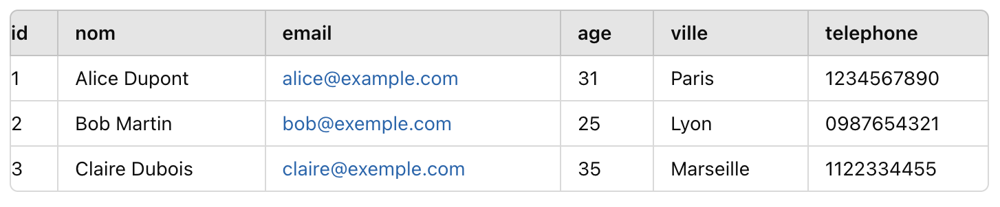
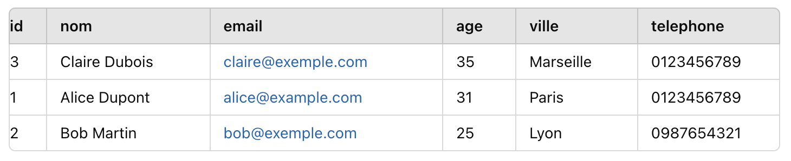
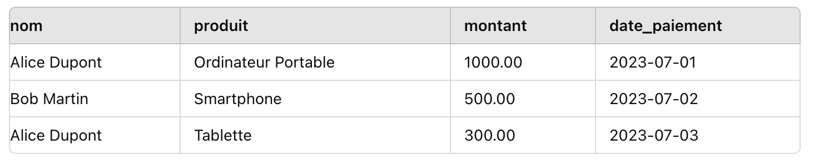
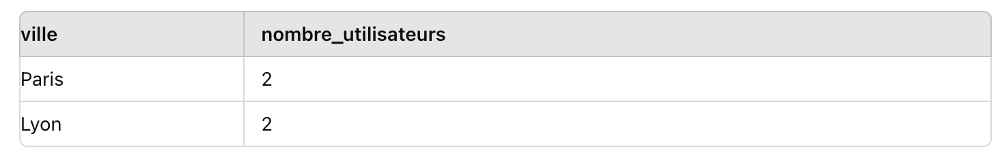
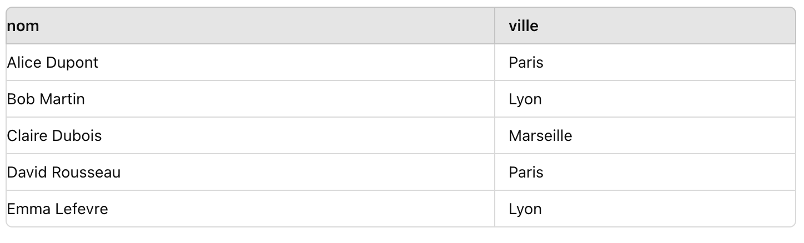

Auteur : Paterne G. G. Formateur en développement web : PHP/ Symfony & Rust

[Github](https://github.com/) - [LinkedIn](https://www.linkedin.com/in/gnpinformatique/)

--- 

<!-- TOC -->
  * [Introduction à SQL](#introduction-à-sql)
    * [Histoire de SQL](#histoire-de-sql)
    * [Principes de base](#principes-de-base)
    * [Avantages de SQL](#avantages-de-sql)
    * [Syntaxe SQL](#syntaxe-sql)
    * [Types de données](#types-de-données)
    * [Opérateurs logiques](#opérateurs-logiques)
  * [Utilisation de SQL en ligne de commande : Apprentissage des commandes de base pour interagir avec une base de données en ligne de commande](#utilisation-de-sql-en-ligne-de-commande--apprentissage-des-commandes-de-base-pour-interagir-avec-une-base-de-données-en-ligne-de-commande)
    * [Pour Windows](#pour-windows)
    * [Sur macOS avec Homebrew](#sur-macos-avec-homebrew)
    * [Pour Linux](#pour-linux)
    * [Connexion à MySQL](#connexion-à-mysql)
    * [Connexion à une base de données](#connexion-à-une-base-de-données)
    * [Utilisation d'une base de données](#utilisation-dune-base-de-données)
    * [Création de tables](#création-de-tables)
    * [Interrogation de données](#interrogation-de-données)
  * [Manipulation de données : Apprentissage des commandes pour manipuler les données dans une base de données](#manipulation-de-données--apprentissage-des-commandes-pour-manipuler-les-données-dans-une-base-de-données)
    * [Insertion de données](#insertion-de-données)
    * [Sélection de données](#sélection-de-données)
    * [Mise à jour de données](#mise-à-jour-de-données)
    * [Suppression de données](#suppression-de-données)
    * [Ajout de colonnes](#ajout-de-colonnes)
    * [Suppression de colonnes](#suppression-de-colonnes)
    * [Troncature de table](#troncature-de-table)
    * [Suppression de table](#suppression-de-table)
    * [Création de contraintes](#création-de-contraintes)
    * [Filtrage de données](#filtrage-de-données)
    * [Tri des résultats](#tri-des-résultats)
  * [Jointures : Compréhension et utilisation des jointures pour combiner des données provenant de différentes tables](#jointures--compréhension-et-utilisation-des-jointures-pour-combiner-des-données-provenant-de-différentes-tables)
    * [Jointures internes : `INNER JOIN`](#jointures-internes--inner-join)
      * [Jointure interne : `INNER JOIN`](#jointure-interne--inner-join)
    * [Jointures externes : `LEFT JOIN`, `RIGHT JOIN`, `FULL JOIN`](#jointures-externes--left-join-right-join-full-join)
      * [Jointure externe à gauche : `LEFT JOIN`](#jointure-externe-à-gauche--left-join)
      * [Jointure externe à droite : `RIGHT JOIN`](#jointure-externe-à-droite--right-join)
      * [Jointure externe complète : `FULL JOIN`](#jointure-externe-complète--full-join)
    * [Jointures croisées : `CROSS JOIN`](#jointures-croisées--cross-join)
    * [Jointures multiples](#jointures-multiples)
      * [Jointure multiple avec `INNER JOIN`](#jointure-multiple-avec-inner-join)
      * [Jointure multiple avec `LEFT JOIN`](#jointure-multiple-avec-left-join)
    * [Utilisation des alias](#utilisation-des-alias)
    * [Reqêtes  avec jointure multiple complexe ou imbriquée utilisant des alias](#reqêtes--avec-jointure-multiple-complexe-ou-imbriquée-utilisant-des-alias)
  * [Fonctions SQL : Exploration des fonctions SQL pour effectuer des calculs et manipulations de données](#fonctions-sql--exploration-des-fonctions-sql-pour-effectuer-des-calculs-et-manipulations-de-données)
    * [Fonctions de chaînes de caractères](#fonctions-de-chaînes-de-caractères)
      * [La fonction `CONCAT` :](#la-fonction-concat-)
      * [La fonction `UPPER` :](#la-fonction-upper-)
      * [La fonction `LOWER` :](#la-fonction-lower-)
      * [La fonction `LENGTH` :](#la-fonction-length-)
      * [La fonction `SUBSTRING` :](#la-fonction-substring-)
      * [La fonction `REPLACE` :](#la-fonction-replace-)
      * [La fonction `TRIM` :](#la-fonction-trim-)
      * [La fonction `LEFT` :](#la-fonction-left-)
      * [La fonction `RIGHT` :](#la-fonction-right-)
      * [La fonction `REVERSE` :](#la-fonction-reverse-)
    * [Fonctions numériques](#fonctions-numériques)
    * [Fonctions de date et heure](#fonctions-de-date-et-heure)
    * [Fonctions conditionnelles](#fonctions-conditionnelles)
    * [Fonctions agrégées](#fonctions-agrégées)
  * [Sous-requêtes : Utilisation des sous-requêtes pour effectuer des requêtes imbriquées et complexes](#sous-requêtes--utilisation-des-sous-requêtes-pour-effectuer-des-requêtes-imbriquées-et-complexes)
    * [Sous-requêtes dans la clause `WHERE`](#sous-requêtes-dans-la-clause-where-)
    * [Sous-requêtes dans la clause FROM](#sous-requêtes-dans-la-clause-from)
    * [Sous-requêtes dans la clause SELECT](#sous-requêtes-dans-la-clause-select)
    * [Sous-requêtes dans la clause HAVING](#sous-requêtes-dans-la-clause-having)
  * [Transactions et verrouillages : Apprentissage des concepts de transactions et de verrouillages pour gérer la cohérence des données](#transactions-et-verrouillages--apprentissage-des-concepts-de-transactions-et-de-verrouillages-pour-gérer-la-cohérence-des-données)
    * [Transactions en SQL](#transactions-en-sql)
      * [Principes des Transactions](#principes-des-transactions)
      * [Commandes de Gestion des Transactions](#commandes-de-gestion-des-transactions)
    * [Verrouillages en SQL](#verrouillages-en-sql)
    * [Gestion des Transactions et Verrouillages](#gestion-des-transactions-et-verrouillages)
      * [Transactions avec Gestion des Verrouillages](#transactions-avec-gestion-des-verrouillages)
  * [Indexation et optimisation : Optimisation des requêtes SQL grâce à l'indexation et d'autres techniques](#indexation-et-optimisation--optimisation-des-requêtes-sql-grâce-à-lindexation-et-dautres-techniques)
    * [Création d'index](#création-dindex)
    * [Types d'index](#types-dindex)
    * [Analyse des performances](#analyse-des-performances)
    * [Optimisation des requêtes](#optimisation-des-requêtes)
      * [Meilleures pratiques](#meilleures-pratiques)
    * [Charge de travail et indexation](#charge-de-travail-et-indexation)
      * [Comprendre la charge de travail](#comprendre-la-charge-de-travail)
      * [Stratégie d'indexation](#stratégie-dindexation)
  * [Gestion des utilisateurs et des droits : Contrôle de l'accès aux données et gestion des utilisateurs dans une base de données](#gestion-des-utilisateurs-et-des-droits--contrôle-de-laccès-aux-données-et-gestion-des-utilisateurs-dans-une-base-de-données)
    * [Création d'utilisateurs](#création-dutilisateurs)
    * [Attribution de droits](#attribution-de-droits)
    * [Révocation de droits](#révocation-de-droits)
    * [Gestion des rôles](#gestion-des-rôles)
    * [Audit des accès](#audit-des-accès)
    * [Sécurité des données](#sécurité-des-données)
  * [Backup et restauration de bases de données : Sauvegarde et restauration des données pour assurer la disponibilité et la sécurité des informations](#backup-et-restauration-de-bases-de-données--sauvegarde-et-restauration-des-données-pour-assurer-la-disponibilité-et-la-sécurité-des-informations)
    * [Stratégies de sauvegarde](#stratégies-de-sauvegarde)
    * [Types de sauvegarde](#types-de-sauvegarde)
    * [Processus de restauration](#processus-de-restauration)
    * [Plan de reprise d'activité (PRA)](#plan-de-reprise-dactivité-pra)
    * [Sécurité des sauvegardes](#sécurité-des-sauvegardes)
  * [Utilisation avancée de SQL : Exploration de fonctionnalités avancées de SQL pour répondre à des besoins spécifiques](#utilisation-avancée-de-sql--exploration-de-fonctionnalités-avancées-de-sql-pour-répondre-à-des-besoins-spécifiques)
    * [Analytique de fenêtres](#analytique-de-fenêtres)
    * [Requêtes récursives](#requêtes-récursives)
    * [DML avancé](#dml-avancé)
    * [Gestion des erreurs](#gestion-des-erreurs)
    * [Conclusion](#conclusion)
  * [Ressources supplémentaires](#ressources-supplémentaires)
    * [Outils SQL](#outils-sql-)
    * [Tutoriels en ligne](#tutoriels-en-ligne)
<!-- TOC -->

--- 

## Introduction à SQL

### Histoire de SQL

SQL (Structured Query Language) est un langage de programmation standardisé pour la gestion des bases de données relationnelles. Il a été développé dans les années 1970 par IBM et est devenu un standard de facto pour l'interrogation, la manipulation et la gestion des données dans les bases de données relationnelles.

### Principes de base

SQL est un langage de requête qui permet de communiquer avec une base de données relationnelle. Il est utilisé pour effectuer des opérations telles que la création, la modification, la suppression et la récupération de données dans une base de données. SQL est un langage déclaratif, ce qui signifie que l'utilisateur spécifie ce qu'il veut obtenir sans avoir à préciser comment le système doit le faire.

### Avantages de SQL

SQL offre de nombreux avantages par rapport à d'autres langages de programmation pour la gestion des bases de données. Il est simple à apprendre et à utiliser, il est normalisé et largement pris en charge par les systèmes de gestion de bases de données (SGBD), il est puissant et flexible pour interroger et manipuler les données, et il est largement utilisé dans l'industrie pour les applications de gestion de données.

### Syntaxe SQL

La syntaxe de SQL est basée sur des instructions et des clauses qui permettent de définir les opérations à effectuer sur les données. Les instructions SQL les plus courantes sont SELECT, INSERT, UPDATE et DELETE, qui permettent respectivement de récupérer, insérer, mettre à jour et supprimer des données dans une base de données.

Exemple de syntaxe SQL pour récupérer des données d'une table :

```sql
SELECT * FROM table_name;
```
Explication de cette syntaxe :

- `SELECT` : instruction pour récupérer des données
- `*` : opérateur pour sélectionner toutes les colonnes
- `FROM` : clause pour spécifier la table à interroger
- `table_name` : nom de la table à interroger

### Types de données

SQL prend en charge différents types de données pour stocker des informations dans une base de données. Les types de données les plus courants sont les types : 
- `INTEGER` : pour les nombres entiers
- `VARCHAR` : pour les chaînes de caractères
- `DATE` : pour les dates
- `BOOLEAN` : pour les valeurs booléennes
- `FLOAT` : pour les nombres à virgule flottante
- `BLOB` : pour les données binaires
- `TEXT` : pour les textes longs
- `ENUM` : pour les valeurs d'une liste prédéfinie
- `DECIMAL` : pour les nombres décimaux
- `CHAR` : pour les chaînes de caractères de longueur fixe
- `TIMESTAMP` : pour les dates et heures
- `TIME` : pour les heures
- `JSON` : pour les données JSON
- etc...

### Opérateurs logiques

SQL utilise des opérateurs logiques pour combiner des conditions dans les requêtes. Les opérateurs logiques les plus courants sont :
- `AND` : pour combiner des conditions avec un ET logique
- `OR` : pour combiner des conditions avec un OU logique
- `NOT` : pour inverser une condition
- `IN` : pour spécifier une liste de valeurs
- `BETWEEN` : pour spécifier une plage de valeurs
- `LIKE` : pour rechercher des motifs de texte
- `IS NULL` : pour vérifier si une valeur est nulle
- `IS NOT NULL` : pour vérifier si une valeur n'est pas nulle
- etc...

## Utilisation de SQL en ligne de commande : Apprentissage des commandes de base pour interagir avec une base de données en ligne de commande

### Pour Windows

Télécharger et installer MySQL Community Server : https://dev.mysql.com/downloads/mysql/ ou installer WampServer : https://www.wampserver.com/, ou XAMPP : https://www.apachefriends.org/index.html

### Sur macOS avec Homebrew

```sql 
brew update
brew install mysql
brew services start mysql
```
### Pour Linux

```sql 
sudo apt update
sudo apt install mysql-server
sudo mysql_secure_installation
```

### Connexion à MySQL
Pour vous connecter à MySQL depuis le terminal, utilisez la commande suivante :

```sql
mysql -u root -p
-- Ou 
mysql -u nom_utilisateur -p
```

### Connexion à une base de données
```sql
CREATE DATABASE nom_de_la_base;
```
### Utilisation d'une base de données
```sql
USE nom_de_la_base;
```
Use est une commande qui permet de sélectionner une base de données spécifique pour travailler avec elle.

### Création de tables
Pour créer une table dans une base de données, utilisez la commande suivante :

```sql
CREATE TABLE utilisateurs (
    colonne1 type_de_donnees,
    colonne2 type_de_donnees,
    colonne3 type_de_donnees,
);
```

### Interrogation de données


## Manipulation de données : Apprentissage des commandes pour manipuler les données dans une base de données

### Insertion de données

Pour insérer des données dans une table, utilisez la commande suivante :

```sql
INSERT INTO utilisateurs (nom, email, age, ville)
VALUES
    ('Alice Dupont', 'alice@example.com', 30, 'Paris'),
    ('Bob Martin', 'bob@exemple.com', 25, 'Lyon'),
    ('Claire Dubois', 'claire@exemple.com', 35, 'Marseille');
```

Tableau des utilisateurs :


### Sélection de données

Pour récupérer des données d'une table, utilisez la commande suivante :

```sql
SELECT * FROM utilisateurs;
```
Cette commande récupère toutes les colonnes et toutes les lignes de la table `utilisateurs`.


### Mise à jour de données

Pour mettre à jour des données dans une table, utilisez la commande suivante :

```sql
UPDATE 
utilisateurs 
SET age = 31 
WHERE nom = 'Alice Dupont';
```

Cette commande met à jour la colonne `age` de la table `utilisateurs` pour l'utilisateur dont le nom est `Alice Dupont` et lui attribue la valeur `31`.


### Suppression de données

Pour supprimer des données d'une table, utilisez la commande suivante :

```sql
DELETE FROM utilisateurs WHERE nom = 'Alice Dupont';
```


- La commande `DELETE` est utilisée pour supprimer des enregistrements spécifiques d'une table.
- Il est essentiel de bien définir la condition `WHERE` pour éviter de supprimer des enregistrements non désirés.
- Toujours vérifier les enregistrements avant de procéder à une suppression pour éviter les pertes de données accidentelles.

### Ajout de colonnes

Pour ajouter une colonne à une table existante, utilisez la commande suivante :

```sql
ALTER TABLE utilisateurs ADD COLUMN telephone VARCHAR(15);
```

Après l'exécution de la commande SQL, la structure de la table utilisateurs serait mise à jour pour inclure la nouvelle colonne telephone :


Explication de cette commande :

- `ALTER TABLE` : instruction pour modifier une table
- `utilisateurs` : nom de la table à modifier
- `ADD COLUMN` : clause pour ajouter une colonne
- `telephone` : nom de la nouvelle colonne
- `VARCHAR(15)` : type de données de la nouvelle colonne

On ajoute des valeurs à la colonne telephone :

```sql
UPDATE utilisateurs SET telephone = '0123456789' WHERE nom = 'Alice Dupont';
UPDATE utilisateurs SET telephone = '0987654321' WHERE nom = 'Bob Martin';
UPDATE utilisateurs SET telephone = '0123456789' WHERE nom = 'Claire Dubois';
```


### Suppression de colonnes

Pour supprimer une colonne d'une table, utilisez la commande suivante :

```sql
ALTER TABLE utilisateurs DROP COLUMN telephone;
```

La commande SQL `ALTER TABLE utilisateurs DROP COLUMN telephone;` permet de supprimer la colonne `telephone` de la table utilisateurs. Voici une explication plus détaillée de la commande :

- `ALTER TABLE utilisateurs` : Indique que nous voulons modifier la structure de la table `utilisateurs`.
- `DROP COLUMN telephone` : Spécifie que nous voulons supprimer la colonne appelée `telephone` de la table.

Exemple Pratique
Supposons que nous ayons la table utilisateurs avec les enregistrements suivants avant la modification :


Après l'exécution de la commande SQL, la structure de la table utilisateurs serait mise à jour pour supprimer la colonne telephone :


### Troncature de table

Pour supprimer toutes les données d'une table sans supprimer la structure de la table, utilisez la commande suivante :

```sql
TRUNCATE TABLE utilisateurs;
```

La table utilisateurs contien les enregistrements suivants avant l'exécution de la commande :


Après l'exécution de la commande SQL, la table utilisateurs serait vide :


- La commande `TRUNCATE TABLE` est utilisée pour supprimer rapidement tous les enregistrements d'une table.
- Contrairement à la commande `DELETE`, `TRUNCATE TABLE` ne génère pas de journaux pour chaque ligne supprimée, ce qui la rend plus rapide pour les grandes tables.
- `TRUNCATE TABLE` réinitialise également les identifiants auto-incrémentés, contrairement à `DELETE`.

**Attention !** Utilisez cette commande avec précaution, car elle ne permet pas de récupération des données supprimées.

### Suppression de table

Pour supprimer une table de la base de données, utilisez la commande suivante :

```sql
DROP TABLE utilisateurs;
```
La commande SQL `DROP TABLE utilisateurs;` permet de supprimer la table `utilisateurs` de la base de données, ainsi que toutes les données qu'elle contient. Voici une explication plus détaillée de la commande :

- `DROP TABLE utilisateurs` : Cette commande supprime complètement la table utilisateurs de la base de données. Cela inclut la suppression de toutes les lignes, de la structure de la table et de toutes les contraintes associées.

Après l'exécution de la commande SQL, la table ~~utilisateurs serait supprimée~~ de la base de données.

- La commande `DROP TABLE` est utilisée pour supprimer complètement une table d'une base de données.
- Utilisez cette commande avec précaution, car une fois exécutée, la suppression est permanente et toutes les données de la table seront perdues.
Si vous avez besoin de conserver la structure de la table mais de supprimer uniquement les données, utilisez plutôt la commande `TRUNCATE TABLE`.

Attention ! Utilisez cette commande avec précaution, car elle ne permet pas de récupération des données supprimées.
Veuiilez à sauvegarder vos données avant de supprimer une table.

### Création de contraintes
### Filtrage de données

Pour filtrer les données récupérées d'une table, utilisez la commande suivante :

```sql
SELECT * FROM utilisateurs WHERE age > 30;
```

La commande SQL `SELECT * FROM utilisateurs WHERE age > 30;` permet de sélectionner et d'afficher tous les enregistrements de la table `utilisateurs` où l'âge est supérieur à `30`. Cependant, si vous avez exécuté la commande DROP TABLE utilisateurs; précédemment, la table utilisateurs n'existe plus et cette commande entraînera une erreur.

Explication de la Commande
- `SELECT * FROM utilisateurs` : Sélectionne toutes les colonnes de la table utilisateurs.
- `WHERE age > 30` : Ajoute une condition pour sélectionner uniquement les enregistrements où la valeur de la colonne `age` est supérieure à `30`.

Le résultat de cette commande serait les enregistrements de la table utilisateurs où l'âge est supérieur à 30.


Explication de cette commande :

- `SELECT` : instruction pour récupérer des données
- `*` : opérateur pour sélectionner toutes les colonnes
- `FROM` : clause pour spécifier la table à interroger
- `utilisateurs` : nom de la table à interroger
- `WHERE` : clause pour spécifier une condition de filtrage
- `age > 30` : condition pour filtrer les données
- `;` : séparateur de requête

### Tri des résultats

Pour trier les résultats d'une requête, utilisez la commande suivante :

```sql
SELECT * FROM utilisateurs ORDER BY age DESC;
```

La commande `SQL SELECT * FROM utilisateurs ORDER BY age DESC;` permet de sélectionner et d'afficher tous les enregistrements de la table `utilisateurs` en les triant par ordre décroissant de la colonne `age`.



Explication de cette commande :

- `SELECT` : instruction pour récupérer des données
- `*` : opérateur pour sélectionner toutes les colonnes
- `FROM` : clause pour spécifier la table à interroger
- `utilisateurs` : nom de la table à interroger
- `ORDER BY` : clause pour spécifier le tri
- `age` : colonne à trier
- `DESC` : ordre de tri décroissant ou `ASC` pour tri croissant
- `;` : séparateur de requête

## Jointures : Compréhension et utilisation des jointures pour combiner des données provenant de différentes tables

Les jointures sont utilisées pour combiner des données provenant de différentes tables dans une base de données relationnelle. Il existe plusieurs types de jointures, notamment les `jointures internes`, les `jointures externes`, les `jointures multiples`, les `jointures croisées`, etc.

### Jointures internes : `INNER JOIN`

Les jointures internes sont utilisées pour combiner des données provenant de deux tables en fonction d'une condition de correspondance entre les colonnes des tables. Voici un exemple de jointure interne :

Syntaxe de la jointure interne :

```sql
SELECT colonne1, colonne2, ...
FROM table1
INNER JOIN table2
ON table1.colonne_commune = table2.colonne_commune;
```

Création de deux tables :
- Table `utilisateurs` :

Création de la Table utilisateurs

La table `utilisateurs` contient les informations de base sur les utilisateurs.
```sql
CREATE TABLE utilisateurs (
    id INT PRIMARY KEY,
    nom VARCHAR(50),
    email VARCHAR(50),
    age INT,
    ville VARCHAR(50),
    telephone VARCHAR(15)
);
```

- id : Identifiant unique pour chaque utilisateur (clé primaire).
- nom : Nom de l'utilisateur.
- email : Adresse email de l'utilisateur.
- age : Âge de l'utilisateur.
- ville : Ville de résidence de l'utilisateur.
- telephone : Numéro de téléphone de l'utilisateur.

Création de la Table commandes
La table commandes enregistre les commandes passées par les utilisateurs. Chaque commande est associée à un utilisateur via une clé étrangère.

```sql
CREATE TABLE commandes (
    id INT PRIMARY KEY,
    utilisateur_id INT,
    produit VARCHAR(50),
    FOREIGN KEY (utilisateur_id) REFERENCES utilisateurs(id)
);
```

- `id` : Identifiant unique pour chaque commande (clé primaire).
- `utilisateur_id` : Identifiant de l'utilisateur qui a passé la commande (clé étrangère référencée à la table utilisateurs).
- `produit` : Nom du produit commandé.

Exemple d'Insertion de Données

Insertion de Données dans la Table `utilisateurs`

```sql
INSERT INTO utilisateurs (id, nom, email, age, ville, telephone)
VALUES
    (1, 'Alice Dupont', 'alice@example.com', 31, 'Paris', '0123456789'),
    (2, 'Bob Martin', 'bob@exemple.com', 25, 'Lyon', '0987654321'),
    (3, 'Claire Dubois', 'claire@exemple.com', 35, 'Marseille', '0123456789');
```

Résultat de la Table utilisateurs


Insertion de Données dans la Table `commandes`
    
```sql
INSERT INTO commandes (id, utilisateur_id, produit)
VALUES
    (1, 1, 'Ordinateur Portable'),
    (2, 2, 'Smartphone'),
    (3, 1, 'Tablette');
```


Affichage des données des tables `utilisateurs` et `commandes` :

#### Jointure interne : `INNER JOIN`
```sql
SELECT utilisateurs.nom, utilisateurs.email, commandes.produit
FROM utilisateurs
INNER JOIN commandes ON utilisateurs.id = commandes.utilisateur_id;
```
Explication de cette commande :

- `SELECT` : instruction pour récupérer des données
- `utilisateurs.nom, commandes.produit` : colonnes à récupérer
- `FROM` : clause pour spécifier les tables à interroger
- `utilisateurs` : première table à interroger
- `INNER JOIN` : type de jointure (jointure interne) signifiant que seules les lignes correspondantes des deux tables seront retournées
- `commandes` : deuxième table à interroger
- `ON` : clause pour spécifier la condition de jointure
- `utilisateurs.id = commandes.utilisateur_id` : condition de jointure basée sur les colonnes `id` de `utilisateurs` et `utilisateur_id` de `commandes`
- `;` : séparateur de requête

Résultat de jointure interne INNER JOIN :


Ces commandes SQL créent deux tables liées par une clé étrangère, permettant de gérer les utilisateurs et leurs commandes de manière relationnelle.

### Jointures externes : `LEFT JOIN`, `RIGHT JOIN`, `FULL JOIN`

Les jointures externes sont utilisées pour combiner des données provenant de deux tables en fonction d'une condition de correspondance entre les colonnes des tables, tout en incluant les lignes qui n'ont pas de correspondance dans l'autre table. Voici un exemple de jointure externe :

#### Jointure externe à gauche : `LEFT JOIN`

Une jointure externe gauche (`LEFT JOIN`) retourne tous les enregistrements de la table de gauche (table1) et les enregistrements correspondants de la table de droite (table2). Les résultats seront NULL pour les enregistrements sans correspondance dans la table de droite.

```sql
SELECT utilisateurs.nom, commandes.produit
FROM utilisateurs
LEFT JOIN commandes ON utilisateurs.id = commandes.utilisateur_id;
```

Explication de cette commande :

- `SELECT` : instruction pour récupérer des données
- `utilisateurs.nom, commandes.produit` : colonnes à récupérer
- `FROM` : clause pour spécifier les tables à interroger
- `utilisateurs` : première table à interroger
- `LEFT JOIN` : type de jointure (jointure externe à gauche) signifiant que toutes les lignes de la première table seront retournées, même si elles n'ont pas de correspondance dans la deuxième table
- `commandes` : deuxième table à interroger
- `ON` : clause pour spécifier la condition de jointure
- `utilisateurs.id = commandes.utilisateur_id` : condition de jointure basée sur les colonnes `id` de `utilisateurs` et `utilisateur_id` de `commandes`
- `;` : séparateur de requête


#### Jointure externe à droite : `RIGHT JOIN`

Une jointure externe droite (`RIGHT JOIN`) retourne tous les enregistrements de la table de droite (table2) et les enregistrements correspondants de la table de gauche (table1). Les résultats seront NULL pour les enregistrements sans correspondance dans la table de gauche.
```sql
SELECT utilisateurs.nom, utilisateurs.email, commandes.produit
FROM utilisateurs
RIGHT JOIN commandes ON utilisateurs.id = commandes.utilisateur_id;
```


Explication de cette commande :

- `SELECT` : instruction pour récupérer des données
- `utilisateurs.nom, utilisateurs.email, commandes.produit` : colonnes à récupérer
- `FROM` : clause pour spécifier les tables à interroger
- `utilisateurs` : première table à interroger
- `RIGHT JOIN` : type de jointure (jointure externe à droite) signifiant que toutes les lignes de la deuxième table seront retournées, même si elles n'ont pas de correspondance dans la première table
- `commandes` : deuxième table à interroger
- `ON` : clause pour spécifier la condition de jointure
- `utilisateurs.id = commandes.utilisateur_id` : condition de jointure basée sur les colonnes `id` de `utilisateurs` et `utilisateur_id` de `commandes`

#### Jointure externe complète : `FULL JOIN`

Une jointure externe complète (`FULL JOIN`) retourne tous les enregistrements lorsqu'il y a une correspondance dans l'une ou l'autre des tables. Les résultats seront NULL pour les enregistrements sans correspondance dans l'une ou l'autre table.


Syntaxe de la jointure externe complète :

```sql
SELECT colonne1, colonne2, ...
FROM table1
FULL JOIN table2
ON table1.colonne_commune = table2.colonne_commune;
```    

(Note : MySQL ne supporte pas FULL JOIN directement, utilisez `UNION` à la place) :

```sql
SELECT utilisateurs.nom, utilisateurs.email, commandes.produit
FROM utilisateurs
LEFT JOIN commandes ON utilisateurs.id = commandes.utilisateur_id
UNION
SELECT utilisateurs.nom, utilisateurs.email, commandes.produit
FROM utilisateurs
RIGHT JOIN commandes ON utilisateurs.id = commandes.utilisateur_id;
```

Explication de cette commande :

- `SELECT` : instruction pour récupérer des données
- `utilisateurs.nom, utilisateurs.email, commandes.produit` : colonnes à récupérer
- `FROM` : clause pour spécifier les tables à interroger
- `utilisateurs` : première table à interroger
- `LEFT JOIN` : type de jointure (jointure externe à gauche) signifiant que toutes les lignes de la première table seront retournées, même si elles n'ont pas de correspondance dans la deuxième table
- `commandes` : deuxième table à interroger
- `ON` : clause pour spécifier la condition de jointure
- `utilisateurs.id = commandes.utilisateur_id` : condition de jointure basée sur les colonnes `id` de `utilisateurs` et `utilisateur_id` de `commandes`
- `UNION` : opérateur pour combiner les résultats de deux requêtes distinctes en un seul ensemble de résultats. (Uniquement pour `MySQL`)
- `RIGHT JOIN` : type de jointure (jointure externe à droite) signifiant que toutes les lignes de la deuxième table seront retournées, même si elles n'ont pas de correspondance dans la première table


### Jointures croisées : `CROSS JOIN`

Les jointures croisées sont utilisées pour combiner toutes les lignes de deux tables sans condition de correspondance entre les colonnes des tables. Voici un exemple de jointure croisée :

Syntaxe de la jointure croisée :

```sql
SELECT colonne1, colonne2, ...
FROM table1
CROSS JOIN table2;
```

Résultat de la jointure croisée :

```sql
SELECT utilisateurs.nom, commandes.produit
FROM utilisateurs
CROSS JOIN commandes;
```

Le résultat de cette commande sera le produit `cartésien` des deux tables, combinant chaque ligne de utilisateurs avec chaque ligne de commandes :


Explications

`CROSS JOIN` ne nécessite aucune condition de jointure.
Le nombre de lignes dans le résultat est égal au produit du nombre de lignes dans les deux tables (nombre de lignes de table1 multiplié par le nombre de lignes de table2).

Conclusion
La jointure croisée (`CROSS JOIN`) est principalement utilisée lorsque vous souhaitez obtenir toutes les combinaisons possibles de deux tables. Cependant, elle peut produire un grand nombre de lignes, donc elle doit être utilisée avec précaution, surtout avec des tables volumineuses.

### Jointures multiples

Les jointures multiples permettent de combiner plus de deux tables en une seule requête SQL. Vous pouvez utiliser différents types de jointures (INNER JOIN, LEFT JOIN, RIGHT JOIN, etc.) pour lier plusieurs tables. Voici un exemple détaillé pour illustrer les jointures multiples.

Exemple Pratique avec Jointures Multiples

Supposons que nous ayons les trois tables suivantes :

- Table `utilisateurs` : Contient les informations de base sur les utilisateurs.


- Table `commandes` : Enregistre les commandes passées par les utilisateurs.


- Table `paiements` : Enregistre les paiements effectués par les utilisateurs.

```sql
CREATE TABLE paiements (
    id INT PRIMARY KEY,
    commande_id INT,
    montant DECIMAL(10, 2),
    date_paiement DATE,
    FOREIGN KEY (commande_id) REFERENCES utilisateurs(id)
);

INSERT INTO paiements (id, utilisateur_id, montant)
VALUES
    (1, 1, 1000.00),
    (2, 2, 500.00),
    (3, 1, 300.00);
```


#### Jointure multiple avec `INNER JOIN`

```sql
SELECT utilisateurs.nom, commandes.produit, paiements.montant, paiements.date_paiement
FROM utilisateurs
INNER JOIN commandes ON utilisateurs.id = commandes.utilisateur_id
INNER JOIN paiements ON commandes.id = paiements.commande_id;
```


Explication de cette commande :

- `SELECT` : instruction pour récupérer des données
- `utilisateurs.nom, commandes.produit, paiements.montant` : colonnes à récupérer
- `FROM` : clause pour spécifier les tables à interroger
- `utilisateurs` : première table à interroger
- `INNER JOIN` : type de jointure (jointure interne) signifiant que seules les lignes correspondantes des deux tables seront retournées
- `commandes` : deuxième table à interroger
- `ON` : clause pour spécifier la condition de jointure
- `utilisateurs.id = commandes.utilisateur_id` : condition de jointure basée sur les colonnes `id` de `utilisateurs` et `utilisateur_id` de `commandes`
- `INNER JOIN` : type de jointure (jointure interne) signifiant que seules les lignes correspondantes des deux tables seront retournées
- `paiements` : troisième table à interroger
- `ON` : clause pour spécifier la condition de jointure
- `utilisateurs.id = paiements.utilisateur_id` : condition de jointure basée sur les colonnes `id` de `utilisateurs` et `utilisateur_id` de `paiements`
- `;` : séparateur de requête

#### Jointure multiple avec `LEFT JOIN`

Pour récupérer tous les utilisateurs et leurs commandes et paiements, y compris les utilisateurs sans commandes ou paiements, nous utilisons `LEFT JOIN`.

```sql
SELECT utilisateurs.nom, commandes.produit, paiements.montant, paiements.date_paiement
FROM utilisateurs
LEFT JOIN commandes ON utilisateurs.id = commandes.utilisateur_id
LEFT JOIN paiements ON commandes.id = paiements.commande_id;
```


Les jointures multiples permettent de combiner des données provenant de plusieurs tables en une seule requête. Cela est particulièrement utile pour récupérer des informations liées dans des bases de données relationnelles. En fonction des besoins, vous pouvez utiliser différentes combinaisons de jointures pour obtenir les résultats souhaités.

### Utilisation des alias

Les alias sont utilisés pour donner un nom alternatif à une table ou à une colonne dans une requête SQL. Voici un exemple d'utilisation d'alias :

Nous voulons récupérer le nom de l'utilisateur et le produit commandé pour chaque commande, en utilisant des alias pour les tables et les colonnes :

```sql
SELECT u.nom AS utilisateur, c.produit AS commande, p.montant AS paiement
FROM utilisateurs u
INNER JOIN commandes c ON u.id = c.utilisateur_id
INNER JOIN paiements p ON c.id = p.commande_id;
```
    
Explication de cette commande :
_ `SELECT` : instruction pour récupérer des données
- `u.nom AS utilisateur, c.produit AS commande, p.montant AS paiement` : colonnes à récupérer avec des alias
- `FROM` : clause pour spécifier les tables à interroger
- `utilisateurs u` : première table à interroger avec un alias `u`
- `INNER JOIN` : type de jointure (jointure interne) signifiant que seules les lignes correspondantes des deux tables seront retournées
- `commandes c` : deuxième table à interroger avec un alias `c`
- `ON` : clause pour spécifier la condition de jointure
- `u.id = c.utilisateur_id` : condition de jointure basée sur les colonnes `id` de `utilisateurs` et `utilisateur_id` de `commandes`
- `paiements p` : troisième table à interroger avec un alias `p`


### Reqêtes  avec jointure multiple complexe ou imbriquée utilisant des alias

Les requêtes multiples complexes ou imbriquées sont utilisées pour effectuer des opérations plus avancées sur les données dans une base de données. Voici un exemple de requête complexe ou imbriquée :

Nous voulons récupérer les informations suivantes pour chaque commande :

- Le nom de l'utilisateur 
- Le produit commandé
- La date de la commande 
- Le montant du paiement  
- La date du paiement

Requête SQL avec jointure multiple complexe

```sql
SELECT
    u.nom AS utilisateur,
    c.produit AS commande,
    c.date_commande AS date_commande,
    p.montant AS montant_paiement,
    p.date_paiement AS date_paiement
FROM
    utilisateurs u
INNER JOIN
    commandes c ON u.id = c.utilisateur_id
INNER JOIN
    paiements p ON c.id = p.commande_id;
```

Explications
- `u` et `c` et `p` : Alias pour les tables `utilisateurs`, `commandes`, et `paiements`, respectivement.
- `u.nom AS utilisateur` : Utilisation d'un alias pour la colonne `nom`, renommée en `utilisateur` dans le résultat.
- `c.produit AS commande` : Utilisation d'un alias pour la colonne `produit`, renommée en `commande` dans le résultat.
- `c.date_commande AS date_commande` : Utilisation d'un alias pour la colonne `date_commande`, renommée en `date_commande` dans le résultat.
- `p.montant AS montant_paiement` : Utilisation d'un alias pour la colonne `montant`, renommée en `montant_paiement` dans le résultat.
- `p.date_paiement AS date_paiement` : Utilisation d'un alias pour la colonne `date_paiement`, renommée en `date_paiement` dans le résultat.

Résultat de la Requête


Cette requête montre comment utiliser des jointures multiples pour combiner des données de plusieurs tables en une seule requête SQL. En utilisant des alias, nous simplifions la requête et la rendons plus lisible. Les jointures multiples sont particulièrement utiles pour récupérer des informations connexes à partir de plusieurs tables de manière efficace et cohérente.

## Fonctions SQL : Exploration des fonctions SQL pour effectuer des calculs et manipulations de données

### Fonctions de chaînes de caractères

Les fonctions de chaînes de caractères sont utilisées pour manipuler des chaînes de caractères dans les requêtes SQL. Voici quelques exemples de fonctions de chaînes de caractères :

- `CONCAT` : pour concaténer des chaînes de caractères
- `UPPER` : pour convertir une chaîne de caractères en majuscules
- `LOWER` : pour convertir une chaîne de caractères en minuscules
- `LENGTH` : pour obtenir la longueur d'une chaîne de caractères
- `SUBSTRING` : pour extraire une sous-chaîne de caractères
- `REPLACE` : pour remplacer des sous-chaînes de caractères
- `TRIM` : pour supprimer les espaces en début et fin de chaîne
- `LEFT` : pour extraire un nombre spécifié de caractères à partir du début de la chaîne
- `RIGHT` : pour extraire un nombre spécifié de caractères à partir de la fin de la chaîne
- `REVERSE` : pour inverser une chaîne de caractères
- etc...

#### La fonction `CONCAT` :

La commande `SQL SELECT CONCAT(nom, ' - ', email) AS details FROM utilisateurs;` permet de combiner les valeurs des colonnes nom et email de la table utilisateurs en une seule chaîne de caractères, séparée par " `-`". Le résultat de cette commande serait une nouvelle colonne appelée details contenant ces chaînes combinées pour chaque enregistrement dans la table utilisateurs.

Supposons que la table utilisateurs contienne les enregistrements suivants :

 

```sql
SELECT CONCAT(nom, ' - ', email) AS details
FROM utilisateurs;
```

Résultat de cette commande :


#### La fonction `UPPER` :

```sql
SELECT UPPER(nom) AS nom_majuscules
FROM utilisateurs;
```

La commande SQL `SELECT UPPER(nom) AS nom_majuscules FROM utilisateurs;` permet de convertir les valeurs de la colonne nom en majuscules pour chaque enregistrement de la table utilisateurs. Le résultat de cette commande serait une nouvelle colonne appelée nom_majuscules contenant les noms en majuscules.


#### La fonction `LOWER` :

```sql
SELECT LOWER(email) AS email_minuscules
FROM utilisateurs;
```
La commande SQL `SELECT LOWER(email) AS email_minuscules FROM utilisateurs;` permet de convertir les valeurs de la colonne email en minuscules pour chaque enregistrement de la table utilisateurs. Le résultat de cette commande serait une nouvelle colonne appelée email_minuscules contenant les adresses e-mail en minuscules.

Supposons que la table utilisateurs contienne les enregistrements suivants :


Le résultat de la commande serait :


La commande `LOWER` convertit les valeurs de la colonne `email` en minuscules et les affiche dans une nouvelle colonne appelée `email_minuscules`.

#### La fonction `LENGTH` :

```sql
SELECT LENGTH(nom) AS longueur_nom
FROM utilisateurs;
```

La commande SQL `SELECT LENGTH(nom) AS longueur_nom FROM utilisateurs;` permet de calculer la longueur des valeurs de la colonne nom pour chaque enregistrement de la table utilisateurs. Le résultat de cette commande serait une nouvelle colonne appelée longueur_nom contenant le nombre de caractères dans chaque nom.

Supposons que la table utilisateurs contienne les enregistrements suivants :


Voici comment les longueurs des noms sont calculées :

- `Alice Dupont` a 11 caractères.
- `Bob Martin`" a 10 caractères.
- `Claire Dubois` a 13 caractères.

La commande LENGTH calcule la longueur de la chaîne de caractères dans la colonne nom et les affiche dans une nouvelle colonne appelée longueur_nom.

#### La fonction `SUBSTRING` :

```sql
SELECT SUBSTRING(nom, 1, 3) AS debut_nom
FROM utilisateurs;
```

La commande SQL `SELECT SUBSTRING(nom, 1, 3) AS debut_nom FROM utilisateurs;` permet d'extraire les trois premiers caractères de la colonne `nom` pour chaque enregistrement de la table `utilisateurs`. Le résultat de cette commande serait une nouvelle colonne appelée `debut_nom` contenant les trois premiers caractères de chaque `nom`.

Supposons que la table utilisateurs contienne les enregistrements suivants :


Voici comment les trois premiers caractères des noms sont extraits :

`Alice Dupont` devient `Ali`.
`Bob Martin` devient `Bob`.
`Claire Dubois` devient `Cla`.
La commande `SUBSTRING` permet d'extraire une sous-chaîne de la colonne `nom`, en commençant au premier caractère et en prenant les trois premiers caractères, et les affiche dans une nouvelle colonne appelée `debut_nom`.

#### La fonction `REPLACE` :

```sql
SELECT REPLACE(email, '@', ' at ') AS email_modifie
FROM utilisateurs;
```

La commande SQL `SELECT REPLACE(email, '@', ' at ') AS email_modifie FROM utilisateurs;` permet de remplacer le caractère `@` dans la colonne `email` par la chaîne de caractères at pour chaque enregistrement de la table `utilisateurs`. Le résultat de cette commande serait une nouvelle colonne appelée `email_modifie` contenant les adresses e-mail modifiées.

Supposons que la table utilisateurs contienne les enregistrements suivants :


Voici comment les adresses e-mail sont modifiées :

- `alice@example.com` devient `alice at example.com`.
- `bob@example.com` devient `bob at example.com`.
- `claire@example.com` devient "`claire at example.com`.
  
- La commande `REPLACE` permet de remplacer toutes les occurrences du caractère `@` par la chaîne at dans la colonne `email`, et les affiche dans une nouvelle colonne appelée `email_modifie`.

#### La fonction `TRIM` :

```sql
SELECT TRIM(nom) AS nom_sans_espaces
FROM utilisateurs;
```
La commande SQL `SELECT TRIM(nom) AS nom_sans_espaces FROM utilisateurs;` permet de supprimer les `espaces blancs` au début et à la fin des valeurs de la colonne `nom` pour chaque enregistrement de la table utilisateurs. Le résultat de cette commande serait une nouvelle colonne appelée `nom_sans_espaces` contenant les noms sans les espaces en début et en fin de chaîne.

Supposons que la table utilisateurs contienne les enregistrements suivants avec des espaces en début et en fin de chaîne dans la colonne nom :


Voici comment les espaces sont supprimés :


#### La fonction `LEFT` :

```sql
SELECT LEFT(nom, 3) AS debut_nom
FROM utilisateurs;
```
La commande SQL SELECT LEFT(nom, 3) AS debut_nom FROM utilisateurs; permet d'extraire les trois premiers caractères de la colonne nom pour chaque enregistrement de la table utilisateurs. Le résultat de cette commande serait une nouvelle colonne appelée debut_nom contenant les trois premiers caractères de chaque nom.


Voici comment les trois premiers caractères des noms sont extraits :

- "Alice Dupont" devient "Ali".
- "Bob Martin" devient "Bob".
- "Claire Dubois" devient "Cla".

La commande `LEFT` permet d'extraire une sous-chaîne de la colonne `nom`, en commençant au premier caractère et en prenant les trois premiers caractères, et les affiche dans une nouvelle colonne appelée `debut_nom`.

#### La fonction `RIGHT` :

```sql
SELECT RIGHT(nom, 3) AS fin_nom
FROM utilisateurs;
```

La commande SQL `SELECT RIGHT(nom, 3) AS fin_nom FROM utilisateurs;` permet d'extraire les trois derniers caractères de la colonne `nom` pour chaque enregistrement de la table `utilisateurs`. Le résultat de cette commande serait une nouvelle colonne appelée `fin_nom` contenant les trois derniers caractères de chaque `nom`.

Voici comment les trois derniers caractères des noms sont extraits :


- `Alice Dupont` devient `ont`.
- `Bob Martin` devient `tin`.
- `Claire Dubois` devient `ois`.

#### La fonction `REVERSE` :

```sql
SELECT REVERSE(nom) AS nom_inverse
FROM utilisateurs;
```

La commande SQL `SELECT REVERSE(nom) AS nom_inverse FROM utilisateurs;` permet d'inverser les caractères de la colonne `nom` pour chaque enregistrement de la table utilisateurs. Le résultat de cette commande serait une nouvelle colonne appelée `nom_inverse` contenant les noms inversés.

Voici comment les noms sont inversés :


- `Alice Dupont` devient `tnopuD ecilA`.
- `Bob Martin` devient `nitraM boB`.
- `Claire Dubois` devient `siobuD erialC

### Fonctions numériques

Les fonctions numériques SQL sont des fonctions intégrées dans SQL qui permettent d'effectuer diverses opérations mathématiques et de manipulation de données numériques. Voici quelques-unes des fonctions numériques les plus couramment utilisées en SQL, avec des exemples pour chaque fonction.

- `ROUND` : pour arrondir un nombre à un nombre spécifié de décimales

Considérons la table paiements. Supposons que nous ayons une table paiements avec les enregistrements suivants :


Nous allons utiliser la commande SQL pour arrondir les valeurs de la colonne montant à deux décimales et afficher le résultat.

```sql
SELECT ROUND(montant, 2) AS montant_arrondi
FROM paiements;
```
Résultat de cette commande : 


- `ABS` : pour obtenir la valeur absolue d'un nombre

```sql
SELECT ABS(montant) AS montant_absolu
FROM paiements;
```

La commande SQL `SELECT ABS(montant) AS montant_absolu FROM paiements;` permet de retourner la valeur absolue de la colonne montant pour chaque enregistrement de la table paiements. Le résultat de cette commande serait une nouvelle colonne appelée montant_absolu contenant les valeurs absolues des montants.

Considérons la table paiements.


- `CEIL` : pour arrondir un nombre à l'entier supérieur


```sql
SELECT CEIL(montant) AS montant_arrondi_sup
FROM paiements;
```

La commande SQL `SELECT CEIL(montant) AS montant_arrondi_sup FROM paiements;` permet d'arrondir les valeurs de la colonne montant à l'entier supérieur pour chaque enregistrement de la table paiements. Le résultat de cette commande serait une nouvelle colonne appelée `montant_arrondi_sup` contenant les montants arrondis à l'entier supérieur.

Résultat de cette commande :


_ `CEIL(montant)` : La fonction `CEIL` arrondit les valeurs de la colonne montant à l'entier supérieur le plus proche.
_ `AS montant_arrondi_sup` : Utilise un alias pour renommer la colonne résultante en `montant_arrondi_sup`.

Cette requête est utile lorsque vous avez besoin d'arrondir les valeurs numériques à l'entier supérieur, par exemple pour des calculs financiers ou des analyses statistiques où les fractions ne sont pas souhaitées.

- `FLOOR` : pour arrondir un nombre à l'entier inférieur

Table paiements avec les enregistrements suivants :


```sql
SELECT FLOOR(montant) AS montant_arrondi_inf
FROM paiements;
```
_ `FLOOR(montant)` : La fonction `FLOOR` arrondit les valeurs de la colonne montant à l'entier inférieur le plus proche.
_ `AS montant_arrondi_inf` : Utilise un alias pour renommer la colonne résultante en `montant_arrondi_inf`.

Résultat de cette commande :


Cette requête est utile lorsque vous avez besoin d'arrondir les valeurs numériques à l'entier inférieur, par exemple pour des calculs financiers ou des analyses statistiques où les fractions ne sont pas souhaitées.

Ils existent d'autres fonctions numériques comme `SQRT`, `POWER`, `MOD`, `RAND`, `SUM`, `AVG`, `MIN`, `MAX`, `COUNT`, etc...
- `SQRT` : pour calculer la racine carrée d'un nombre
- `POWER` : pour calculer la puissance d'un nombre
- `MOD` : pour calculer le reste de la division de deux nombres
- `RAND` : pour générer un nombre aléatoire
- `SUM` : pour calculer la somme des valeurs d'une colonne
- `AVG` : pour calculer la moyenne des valeurs d'une colonne
- `MIN` : pour trouver la valeur minimale d'une colonne
- `MAX` : pour trouver la valeur maximale d'une colonne
- `COUNT` : pour compter le nombre d'enregistrements dans une table
- etc...

### Fonctions de date et heure

Les fonctions de date et heure SQL sont utilisées pour manipuler des valeurs de date et d'heure dans les requêtes SQL. Voici quelques-unes des fonctions de date et heure les plus couramment utilisées en SQL, avec des exemples pour chaque fonction.

- `NOW` : pour obtenir la date et l'heure actuelles

```sql
SELECT NOW() AS date_heure_actuelles;
```
Affichera la date et l'heure actuelles : `2024-07-21 12:00:00`

- `CURDATE` : pour obtenir la date actuelle

```sql
SELECT CURDATE() AS date_actuelle;
```
Affichera la date actuelle : `2024-07-21`

- `CURTIME` : pour obtenir l'heure actuelle

```sql
SELECT CURTIME() AS heure_actuelle;
```
Affichera l'heure actuelle : `12:00:00`

- `CURRENT_TIMESTAMP()` : pour obtenir la date et l'heure actuelles

```sql
SELECT CURRENT_TIMESTAMP() AS date_heure_actuelles;
```
Affichera la date et l'heure actuelles : `2024-07-21 12:00:00`

- `DATE_FORMAT` : pour formater une date selon un modèle spécifié

```sql
SELECT DATE_FORMAT(NOW(), '%Y-%m-%d') AS date_format;
```
Affichera la date formatée : `2024-07-21`

- `DATE` : pour extraire la date d'une valeur de date et heure

```sql
SELECT DATE(NOW()) AS date_seule;
```

Affichera la date seule : `2024-07-21`

- `DATE_ADD()` : pour ajouter une durée à une valeur de date

```sql
SELECT DATE_ADD(NOW(), INTERVAL 1 DAY) AS date_demain;
```

Affichera la date de demain : `2024-07-22`

- `DATE_SUB()` : pour soustraire une durée à une valeur de date

```sql
SELECT DATE_SUB(NOW(), INTERVAL 1 DAY) AS date_hier;
```

Affichera la date d'hier : `2024-07-20`

- `DATEDIFF()` : pour calculer la différence entre deux dates

```sql
SELECT DATEDIFF('2024-07-21', '2024-07-01') AS difference_jours;
```

Affichera la différence en jours : `20`

- `EXTRACT()` : pour extraire une partie spécifique d'une valeur de date

```sql
SELECT EXTRACT(YEAR FROM NOW()) AS annee_actuelle;
SELECT EXTRACT(MONTH FROM NOW()) AS mois_actuel;
SELECT EXTRACT(DAY FROM NOW()) AS jour_actuel;
```

Affichera l'année actuelle : `2024`, le mois actuel : `07` et le jour actuel : `21`

- `TIME` : pour extraire l'heure d'une valeur de date et heure

```sql
SELECT TIME(NOW()) AS heure_seule;
```

Affichera l'heure seule : `12:00:00`

- `YEAR` : pour extraire l'année d'une valeur de date

```sql
SELECT YEAR(NOW()) AS annee_actuelle;
```

Affichera l'année actuelle : `2024`

- `MONTH` : pour extraire le mois d'une valeur de date

```sql
SELECT MONTH(NOW()) AS mois_actuel;
```

Affichera le mois actuel : `07`

- `DAY` : pour extraire le jour d'une valeur de date
```sql
SELECT DAY(NOW()) AS jour_actuel;
```

Affichera le jour actuel : `21`

- `HOUR` : pour extraire l'heure d'une valeur de date et heure

```sql
SELECT HOUR(NOW()) AS heure_actuelle;
```

Affichera l'heure actuelle : `12`

- `MINUTE` : pour extraire les minutes d'une valeur de date et heure

```sql
SELECT MINUTE(NOW()) AS minutes_actuelles;
```

Affichera les minutes actuelles : `00`

- `SECOND` : pour extraire les secondes d'une valeur de date et heure

```sql
SELECT SECOND(NOW()) AS secondes_actuelles;
```

Affichera les secondes actuelles : `00`

- `DAYNAME` : pour obtenir le nom du jour d'une valeur de date

```sql
SELECT DAYNAME(NOW()) AS jour_semaine_actuel;
```

Affichera le nom du jour de la semaine actuel : `Thursday`

Ces fonctions de date et heure en SQL vous permettent de manipuler et d'extraire des informations des valeurs de date et heure de manière flexible et efficace. Elles sont essentielles pour les calculs de date, les rapports basés sur le temps, et les analyses temporelles dans les bases de données.

### Fonctions conditionnelles

Les fonctions conditionnelles en SQL permettent d'effectuer des opérations basées sur des conditions spécifiques. Elles sont utilisées pour contrôler le flux de requêtes et retourner des valeurs différentes en fonction des conditions évaluées. Voici quelques-unes des fonctions conditionnelles les plus couramment utilisées en SQL, avec des exemples pour chaque fonction.

- `CASE` : Permet de retourner des valeurs différentes en fonction de conditions spécifiques.

Syntaxe de la fonction `CASE` :

```sql
CASE
  WHEN condition1 THEN resultat1
  WHEN condition2 THEN resultat2
  ...
  ELSE resultat_default
END
```

Exemple d'utilisation de la fonction `CASE` :
```sql
SELECT
    nom,
    CASE
        WHEN montant > 500 THEN 'Élevé'
        WHEN montant > 200 THEN 'Moyen'
        ELSE 'Faible'
    END AS categorie_montant
FROM paiements;
```
Explication de cette commande :

- `SELECT` : instruction pour récupérer des données
- `nom` : colonne à récupérer
- `CASE` : fonction conditionnelle pour évaluer des conditions
- `WHEN montant > 500 THEN 'Élevé'` : condition pour les montants supérieurs à 500
- `WHEN montant > 200 THEN 'Moyen'` : condition pour les montants supérieurs à 200
- `ELSE 'Faible'` : valeur par défaut pour les montants inférieurs à 200
- `AS categorie_montant` : alias pour renommer la colonne résultante
- `FROM paiements` : table à interroger

Résultat :


- `IF` : Permet de retourner une valeur si une condition est vraie, et une autre valeur si elle est fausse.

Syntaxe de la fonction `IF` :

```sql
IF(condition, valeur_si_vrai, valeur_si_faux)
```

Exemple d'utilisation de la fonction `IF` :

```sql
SELECT nom,
    IF(age >= 18, 'Adulte', 'Mineur') AS categorie_age
FROM utilisateurs;
```

Explication de cette commande :

- `SELECT` : instruction pour récupérer des données
- `nom` : colonne à récupérer
- `IF(age >= 18, 'Adulte', 'Mineur')` : condition pour les utilisateurs de 18 ans et plus
- `AS categorie_age` : alias pour renommer la colonne résultante
- `FROM utilisateurs` : table à interroger

Résultat :


- `COALESCE` : Permet de retourner la première valeur non nulle dans une liste de valeurs.

Syntaxe de la fonction `COALESCE` :

```sql
COALESCE(valeur1, valeur2, ...)
```

Exemple d'utilisation de la fonction `COALESCE` :

```sql
SELECT nom,
  COALESCE(telephone, 'Non spécifié') AS telephone
FROM utilisateurs;
```

Explication de cette commande :

- `SELECT` : instruction pour récupérer des données
- `nom` : colonne à récupérer
- `COALESCE(telephone, 'Non spécifié')` : valeur par défaut si le téléphone est nul
- `AS telephone` : alias pour renommer la colonne résultante
- `FROM utilisateurs` : table à interroger

Résultat :


- `NULLIF` : Permet de retourner NULL si deux valeurs sont égales, ou la première valeur si elles sont différentes.

Syntaxe de la fonction `NULLIF` :

```sql
NULLIF(valeur1, valeur2)
```

Exemple d'utilisation de la fonction `NULLIF` :

```sql
SELECT nom,
    NULLIF(age, 0) AS age_non_nul
FROM utilisateurs;
```

Explication de cette commande :

- `SELECT` : instruction pour récupérer des données
- `nom` : colonne à récupérer
- `NULLIF(age, 0)` : remplace les âges nuls par NULL
- `AS age_non_nul` : alias pour renommer la colonne résultante
- `FROM utilisateurs` : table à interroger

Résultat :


Ces fonctions conditionnelles en SQL permettent d'effectuer des opérations basées sur des conditions spécifiques et de gérer les valeurs NULL de manière flexible et efficace. Elles sont essentielles pour les requêtes complexes nécessitant une logique conditionnelle.

### Fonctions agrégées

Les fonctions agrégées en SQL sont utilisées pour effectuer des calculs sur un ensemble de valeurs et retourner un résultat unique. Elles sont couramment utilisées pour calculer des statistiques, des totaux, des moyennes, des minimums, des maximums, etc. Voici quelques-unes des fonctions agrégées les plus couramment utilisées en SQL, avec des exemples pour chaque fonction.

- `COUNT` : pour compter le nombre d'enregistrements dans un groupe

```sql
SELECT COUNT(*) AS nombre_enregistrements
FROM utilisateurs;
```


- `SUM` : pour calculer la somme des valeurs d'une colonne

```sql
SELECT SUM(montant) AS montant_total
FROM paiements;
```


- `AVG` : pour calculer la moyenne des valeurs d'une colonne

```sql
SELECT AVG(montant) AS montant_moyen
FROM paiements;
```


- `MIN` : pour trouver la valeur minimale d'une colonne

```sql
SELECT MIN(montant) AS montant_min
FROM paiements;
```


- `MAX` : pour trouver la valeur maximale d'une colonne

```sql
SELECT MAX(montant) AS montant_max
FROM paiements;
```


- `GROUP BY` : pour regrouper les enregistrements en fonction de valeurs spécifiques

```sql
SELECT ville, COUNT(*) AS nombre_utilisateurs
FROM utilisateurs
GROUP BY ville;
```


- `HAVING` : pour filtrer les résultats des groupes

Supposons que nous avons une table utilisateurs avec les enregistrements suivants :


Nous voulons compter le nombre d'utilisateurs par ville, mais nous voulons uniquement afficher les villes avec plus d'un utilisateur. Nous pouvons utiliser la clause `HAVING` pour filtrer les résultats des groupes.

```sql
SELECT ville, COUNT(*) AS nombre_utilisateurs
FROM utilisateurs
GROUP BY ville
HAVING COUNT(*) > 1;
```

Explication de cette commande :
- `SELECT` : instruction pour récupérer des données
- `ville` : colonne à récupérer
- `COUNT(*) AS nombre_utilisateurs` : fonction `COUNT` pour compter le nombre d'utilisateurs par ville
- `FROM utilisateurs` : table à interroger
- `GROUP BY ville` : clause pour regrouper les enregistrements par ville
- `HAVING COUNT(*) > 1` : clause `HAVING` pour filtrer les villes avec plus d'un utilisateur

Résultat de cette commande :


La clause HAVING est utilisée après GROUP BY pour filtrer les groupes basés sur les conditions spécifiées. Dans cet exemple, elle permet de trouver les villes ayant plus d'un utilisateur. Cette requête est particulièrement utile pour des analyses nécessitant des filtres sur des agrégations.

- `DISTINCT` : La commande SQL DISTINCT est utilisée pour retourner des enregistrements distincts (uniques) dans les résultats d'une requête. Cela permet d'éliminer les doublons et d'obtenir des valeurs uniques d'une ou plusieurs colonnes.


```sql
SELECT DISTINCT ville
FROM utilisateurs;
```

Cette commande affichera les villes uniques des utilisateurs dans la table utilisateurs. Cela permet d'éliminer les doublons et de retourner des valeurs distinctes de la colonne ville.

Explication de cette commande :
- `SELECT` : instruction pour récupérer des données
- `DISTINCT ville` : clause `DISTINCT` pour retourner des valeurs uniques de la colonne ville
- `FROM utilisateurs` : table à interroger

Résultat de la Requête :


- `DISTINCT` avec `COUNT` : La commande SQL DISTINCT peut également être utilisée avec la fonction COUNT pour compter les valeurs uniques d'une colonne.

```sql
SELECT COUNT(DISTINCT ville) AS nombre_villes
FROM utilisateurs;
```


Cette commande affichera le nombre de villes uniques des utilisateurs dans la table utilisateurs. En utilisant DISTINCT avec COUNT, nous pouvons compter les valeurs uniques d'une colonne spécifique.

- `DISTINCT` avec Plusieurs Colonnes : La commande SQL DISTINCT peut également être utilisée avec plusieurs colonnes pour retourner des enregistrements distincts basés sur plusieurs colonnes.

```sql
SELECT DISTINCT nom, ville
FROM utilisateurs;
```



Cette commande affichera les enregistrements uniques des utilisateurs basés sur les colonnes nom et ville. En utilisant DISTINCT avec plusieurs colonnes, nous pouvons éliminer les doublons basés sur des combinaisons de valeurs de colonnes.

- `DISTINCT` et `HAVING` : La commande SQL DISTINCT peut également être utilisée avec la clause HAVING pour filtrer les enregistrements distincts basés sur des conditions spécifiques.

Nous pouvons également utiliser `DISTINCT` en combinaison avec `GROUP BY `et `HAVING`. Supposons que nous voulons trouver les villes ayant des utilisateurs uniques et afficher uniquement celles ayant plus d'un utilisateur.

```sql
SELECT ville, COUNT(DISTINCT nom) AS nombre_utilisateurs_uniques
FROM utilisateurs
GROUP BY ville
HAVING COUNT(DISTINCT nom) > 1;
```


La commande `DISTINCT` est très utile pour éliminer les doublons et obtenir des valeurs uniques d'une ou plusieurs colonnes. Elle peut être utilisée seule ou en combinaison avec d'autres clauses comme `GROUP BY` et `HAVING` pour effectuer des analyses plus complexes.

## Sous-requêtes : Utilisation des sous-requêtes pour effectuer des requêtes imbriquées et complexes

Les sous-requêtes en SQL, également appelées requêtes imbriquées, sont des requêtes placées à l'intérieur d'une autre requête. Elles sont utilisées pour effectuer des requêtes complexes, en permettant de combiner les résultats de plusieurs requêtes. Les sous-requêtes peuvent être utilisées dans différentes parties d'une instruction SQL, comme dans la clause SELECT, FROM, WHERE, ou HAVING.

Exemple pratique avec la table `utilisateurs` et `paiements`

Table utilisateurs :


Table paiements :


### Sous-requêtes dans la clause `WHERE` 
Pour trouver les utilisateurs qui ont effectué des paiements supérieurs à `600` :

```sql
SELECT nom, ville
FROM utilisateurs
WHERE id IN (SELECT utilisateur_id
             FROM paiements
             WHERE montant > 600);

```

Résultat de la Requête :


### Sous-requêtes dans la clause FROM

Pour calculer la somme des paiements de chaque utilisateur et les afficher avec les noms des utilisateurs :

```sql
SELECT u.nom, p.montant_total
FROM utilisateurs u
JOIN (SELECT utilisateur_id, SUM(montant) AS montant_total
      FROM paiements
      GROUP BY utilisateur_id) p
ON u.id = p.utilisateur_id;
```

Résultat de la Requête :


### Sous-requêtes dans la clause SELECT

Pour afficher les noms des utilisateurs et le montant total de leurs paiements :

```sql
SELECT nom,
       (SELECT SUM(montant)
        FROM paiements
        WHERE paiements.utilisateur_id = utilisateurs.id) AS montant_total
FROM utilisateurs;
```

Résultat de la Requête :


### Sous-requêtes dans la clause HAVING

Pour trouver les villes ayant des utilisateurs avec un montant total de paiements supérieur à 1000 :

```sql
SELECT ville, SUM(montant) AS montant_total
FROM utilisateurs u
JOIN paiements p ON u.id = p.utilisateur_id
GROUP BY ville
HAVING SUM(montant) > 1000;
```

Les sous-requêtes sont des outils puissants pour écrire des requêtes SQL complexes. Elles permettent de combiner les résultats de plusieurs requêtes, de filtrer les données de manière flexible, et d'effectuer des calculs sur des ensembles de données. En utilisant des sous-requêtes, vous pouvez simplifier vos requêtes principales et améliorer la lisibilité et la maintenabilité de votre code SQL.

## Transactions et verrouillages : Apprentissage des concepts de transactions et de verrouillages pour gérer la cohérence des données

### Transactions en SQL
Les transactions sont un ensemble de commandes SQL exécutées comme une seule unité de travail. Une transaction garantit que toutes les commandes sont exécutées avec succès ou que toutes les modifications sont annulées (`rollback`) en cas d'échec. Les transactions sont essentielles pour maintenir l'intégrité et la cohérence des données.

#### Principes des Transactions
Les transactions respectent les principes `ACID` :

- `Atomicité` : Toutes les opérations d'une transaction sont traitées comme une unité. Soit elles réussissent toutes, soit elles échouent toutes.
- `Cohérence` : Une transaction transforme la base de données d'un état cohérent à un autre état cohérent.
- `Isolation` : Les opérations d'une transaction sont isolées des opérations d'autres transactions.
- `Durabilité` : Une fois qu'une transaction est commise, ses modifications sont permanentes.

#### Commandes de Gestion des Transactions

- `START TRANSACTION ou BEGIN TRANSACTION`: Débute une transaction.
- `COMMIT` : Valide toutes les modifications effectuées dans la transaction.
- `ROLLBACK` : Annule toutes les modifications effectuées dans la transaction.

Exemple de Transaction

Supposons que nous avons deux tables, comptes et transactions, pour gérer des transferts d'argent entre comptes. Nous voulons transférer 100 euros du compte 1 au compte 2. Voici comment nous pourrions le faire en utilisant des transactions :

Table `comptes` :


Table `transactions` :


Nous voulons transférer 200 unités de Compte A à Compte B. Voici comment nous pourrions le faire en utilisant des transactions :
```sql
START TRANSACTION;

UPDATE comptes SET solde = solde - 200 WHERE id = 1;
UPDATE comptes SET solde = solde + 200 WHERE id = 2;

INSERT INTO transactions (compte_id, montant, type, date_transaction) VALUES (1, 200, 'retrait', NOW());
INSERT INTO transactions (compte_id, montant, type, date_transaction) VALUES (2, 200, 'dépôt', NOW());

COMMIT;
```

Expliquons chaque étape de cette transaction :

- `START TRANSACTION` : Démarre une transaction.
- `UPDATE comptes SET solde = solde - 200 WHERE id = 1;` : Déduit 200 unités du solde du Compte A.
- `UPDATE comptes SET solde = solde + 200 WHERE id = 2;` : Ajoute 200 unités au solde du Compte B.
- `INSERT INTO transactions (compte_id, montant, type, date_transaction) VALUES (1, 200, 'retrait', NOW());` : Enregistre le retrait dans la table des transactions pour le Compte A.
- `INSERT INTO transactions (compte_id, montant, type, date_transaction) VALUES (2, 200, 'dépôt', NOW());` : Enregistre le dépôt dans la table des transactions pour le Compte B.
- `COMMIT` : Valide la transaction.

Dans cet exemple, nous avons commencé une transaction avec `START TRANSACTION`, effectué les mises à jour nécessaires pour transférer l'argent entre les comptes, inséré les enregistrements correspondants dans la table des transactions, puis validé la transaction avec `COMMIT`. Si une erreur se produit à tout moment, nous pouvons annuler la transaction avec `ROLLBACK` pour annuler toutes les modifications.

### Verrouillages en SQL

Les verrouillages sont des mécanismes utilisés pour contrôler l'accès concurrent aux données dans une base de données. Ils empêchent les conflits de concurrence et assurent l'intégrité des transactions. Il existe différents types de verrouillages en SQL, chacun ayant un niveau de granularité et de durée différents.

Les types de verrouillages les plus courants sont :

- `Verrouillage en lecture ou partagé` (`Shared Lock`) : Permet à plusieurs transactions de lire les données, mais empêche les transactions d'écrire sur les données.
- `Verrouillage en écriture ou exclusif` (`Exclusive Lock`) : Empêche les autres transactions de lire ou d'écrire sur les données.
- `Verrouillage intentionnel` (`Intent Lock`) : Indique l'intention de verrouiller des lignes ou des pages dans un mode particulier, facilitant les vérifications de verrouillage.

Les verrouillages sont essentiels pour garantir la cohérence des données dans des environnements multi-utilisateurs. Ils permettent de contrôler l'accès concurrent aux données et d'éviter les problèmes de concurrence, tels que les lectures sales, les lectures non répétables et les écritures fantômes.

Commandes de Verrouillage
- LOCK TABLES : Verrouille une table dans un mode spécifique.
- UNLOCK TABLES : Déverrouille toutes les tables verrouillées par la session.

Exemple de Verrouillage

Supposons que nous voulons verrouiller une table pour empêcher d'autres transactions de la modifier pendant que nous effectuons une opération de lecture et d'écriture.

```sql
LOCK TABLES comptes WRITE;

SELECT * FROM comptes WHERE id = 1;
UPDATE comptes SET solde = solde - 200 WHERE id = 1;

UNLOCK TABLES;
```

Explications et Résultats

1. `LOCK TABLES comptes WRITE;` 
   - Verrouille la table comptes en mode écriture, empêchant d'autres transactions de lire ou d'écrire dans la table pendant que le verrou est actif.
2. `SELECT * FROM comptes WHERE id = 1;` 
   - Sélectionne les données de la table comptes pour le compte avec id = 1.

Résultat de la Requête :


3. `UPDATE comptes SET solde = solde - 200 WHERE id = 1;` 
   - Met à jour le solde du compte avec id = 1 en déduisant 200.

Table comptes après l'UPDATE :


4. `UNLOCK TABLES;` 
   - Déverrouille la table comptes, permettant à d'autres transactions d'accéder à la table.

Résumé des Opérations

- La table `comptes` est verrouillée pour écriture.
- Les détails du compte avec `id = 1` sont sélectionnés.
- Le solde du compte avec `id = 1` est mis à jour, diminué de `200`.
- La table `comptes` est déverrouillée.

Tableau Final de la Table `comptes`


Cette séquence de commandes assure que les opérations de lecture et de mise à jour sur le compte `id = 1` sont réalisées sans interférence d'autres transactions, grâce aux mécanismes de verrouillage et de déverrouillage.

### Gestion des Transactions et Verrouillages

#### Transactions avec Gestion des Verrouillages

Combiner transactions et verrouillages pour une gestion efficace de la cohérence des données :

État initial des tables

Table comptes :


Table transactions :


```sql
START TRANSACTION;

LOCK TABLES comptes WRITE;

UPDATE comptes SET solde = solde - 200 WHERE id = 1;
UPDATE comptes SET solde = solde + 200 WHERE id = 2;

INSERT INTO transactions (compte_id, montant, type, date_transaction) VALUES (1, 200, 'retrait', NOW());
INSERT INTO transactions (compte_id, montant, type, date_transaction) VALUES (2, 200, 'dépôt', NOW());

COMMIT;

UNLOCK TABLES;
```

Explications et Résultats

1. START TRANSACTION;
   - Démarre une nouvelle transaction.
2. LOCK TABLES comptes WRITE;
   - Verrouille la table comptes en mode écriture, empêchant d'autres transactions de lire ou d'écrire dans la table pendant que le verrou est actif.
3. UPDATE comptes SET solde = solde - 200 WHERE id = 1;
   - Met à jour le solde du compte avec id = 1, en soustrayant 200.
4. UPDATE comptes SET solde = solde + 200 WHERE id = 2;
   - Met à jour le solde du compte avec id = 2, en ajoutant 200.

Table comptes après les mises à jour :


5. `INSERT INTO transactions (compte_id, montant, type, date_transaction) VALUES (1, 200, 'retrait', NOW());`
   - Insère un enregistrement dans la table transactions pour le retrait de `200` du compte avec `id = 1`.

6. `INSERT INTO transactions (compte_id, montant, type, date_transaction) VALUES (2, 200, 'dépôt', NOW());`
   - Insère un enregistrement dans la table transactions pour le dépôt de `200` dans le compte avec `id = 2`.

Table transactions après les insertions :


7. `COMMIT`;
   - Valide toutes les modifications effectuées dans la `transaction`.
8. UNLOCK TABLES;
   - Déverrouille toutes les tables verrouillées par la session, permettant ainsi à d'autres transactions d'accéder à la table `comptes`. 
   
Résumé des Opérations
- La table `comptes` est verrouillée pour écriture.
- Les soldes des comptes `id = 1` et `id = 2` sont mis à jour.
- Deux enregistrements sont ajoutés à la table `transactions`.
- La transaction est validée, assurant que toutes les modifications sont appliquées.
- Les tables sont déverrouillées.

Cette séquence de commandes assure que les opérations de transfert entre les comptes sont réalisées de manière atomique et cohérente, grâce aux mécanismes de transaction et de verrouillage.

Les transactions et les verrouillages sont essentiels pour assurer la cohérence, l'intégrité et la fiabilité des opérations dans une base de données. Les transactions garantissent que les modifications sont effectuées entièrement ou pas du tout, tandis que les verrouillages contrôlent l'accès concurrent aux ressources, évitant ainsi les conflits et les incohérences.

## Indexation et optimisation : Optimisation des requêtes SQL grâce à l'indexation et d'autres techniques

### Création d'index

Les index sont des structures de données spéciales qui améliorent la vitesse des opérations de récupération de données sur une table de base de données à un coût de performance pour les insertions et les mises à jour. Les index permettent de trouver des lignes avec des valeurs spécifiques rapidement.

Table utilisateurs  avant la création de l'index


Syntaxe de Création d'un Index

```sql
CREATE INDEX index_name ON table_name (column1, column2, ...);
```
Pour créer un index sur la colonne nom de la table utilisateurs :
    
```sql
CREATE INDEX idx_nom ON utilisateurs (nom);
```

Explication
- `CREATE INDEX idx_nom` : Crée un index nommé idx_nom.
- `ON utilisateurs (nom)` : L'index est créé sur la colonne nom de la table utilisateurs.

Effets de la Création de l'Index

Après la création de l'index, la table `utilisateurs` reste la même en termes de données, mais les performances des requêtes utilisant la colonne `nom` dans les clauses `WHERE`, `JOIN` et `ORDER BY` seront améliorées.

Requête d'exemple utilisant l'index
Pour voir l'amélioration des performances, vous pouvez exécuter une requête utilisant la colonne nom :

```sql
EXPLAIN SELECT * FROM utilisateurs WHERE nom = 'Alice Dupont';
```

Résultat de la Requête

L'utilisation de `EXPLAIN` montre que la base de données utilise l'index `idx_nom` pour accélérer la recherche.

La création de l'index `idx_nom` sur la colonne nom de la table `utilisateurs` permet d'améliorer les performances des requêtes impliquant cette colonne. Les index sont des outils puissants pour optimiser les opérations de lecture dans une base de données SQL, bien qu'ils augmentent légèrement le coût des opérations d'insertion et de mise à jour.


L'index `idx_nom` n'est pas visible dans le tableau des données, mais il est utilisé en interne par la base de données pour optimiser les requêtes.

### Types d'index

- `Index B-Tree` : Le type d'index le plus couramment utilisé. Il est adapté aux opérations de recherche, d'insertion, de mise à jour et de suppression.
- `Index Unique` : Garantit que les valeurs dans la colonne indexée sont uniques.
- `Index Full-Text` : Utilisé pour les recherches de texte intégral.
- `Index Bitmap` : Utilisé dans les environnements de bases de données analytiques, adapté pour les colonnes avec peu de valeurs distinctes.
- `Index Spatial` : Utilisé pour les données géospatiales.

Exemple d'index unique
Pour créer un index unique sur la colonne email de la table utilisateurs :

```sql
CREATE UNIQUE INDEX idx_email_unique ON utilisateurs (email);
```

### Analyse des performances

- Utilisation de `EXPLAIN`

La commande EXPLAIN affiche le plan d'exécution d'une requête SQL. Elle aide à comprendre comment la base de données exécute une requête et à identifier les parties qui peuvent être optimisées.

Exemple
Pour analyser une requête de sélection :

```sql
EXPLAIN SELECT * FROM utilisateurs WHERE nom = 'Alice Dupont';
```

### Optimisation des requêtes

#### Meilleures pratiques
1. Utiliser des index appropriés : Créez des index sur les colonnes fréquemment utilisées dans les clauses WHERE, JOIN, et ORDER BY.
2. Éviter les colonnes calculées dans les `WHERE` : Utilisez des colonnes indexées directement dans les clauses WHERE.
3. Limiter le nombre de lignes retournees : Utilisez `LIMIT` pour réduire le nombre de lignes retournées.
4. Préférez les jointures aux sous-requêtes : Les jointures sont souvent plus performantes que les sous-requêtes.
5. Analysez les index inutilisés : Supprimez les index qui ne sont pas utilisés pour améliorer les performances d'insertion et de mise à jour.
   
Exemple d'optimisation

Requête initiale :
    
```sql
SELECT * FROM utilisateurs WHERE LOWER(nom) = 'alice dupont';
```  
Optimisation en utilisant un index sur la colonne nom :
    
```sql
CREATE INDEX idx_nom ON utilisateurs (nom);

SELECT * FROM utilisateurs WHERE nom = 'Alice Dupont';
```

### Charge de travail et indexation

#### Comprendre la charge de travail
1. Requêtes de lecture : Si les requêtes de lecture sont fréquentes, les index peuvent grandement améliorer les performances.
2. Requêtes d'écriture : Si les opérations d'insertion, de mise à jour ou de suppression sont fréquentes, trop d'index peuvent ralentir les performances.

#### Stratégie d'indexation
1. Identifier les requêtes fréquentes : Utilisez des outils de surveillance pour identifier les requêtes les plus couramment exécutées.
2. Analyser les plans d'exécution : Utilisez `EXPLAIN` pour analyser les plans d'exécution des requêtes.
3. Créer et ajuster les index : Créez des index pour les colonnes fréquemment utilisées dans les requêtes. Ajustez ou supprimez les index en fonction des analyses de performance.

L'indexation est une technique essentielle pour optimiser les performances des bases de données SQL. En comprenant les différents types d'index, en utilisant des outils d'analyse des performances comme EXPLAIN et en suivant les meilleures pratiques d'optimisation des requêtes, vous pouvez améliorer significativement la rapidité et l'efficacité de vos opérations de base de données. Une gestion appropriée de la charge de travail et une stratégie d'indexation bien planifiée sont cruciales pour maintenir un équilibre entre les performances de lecture et d'écriture.

## Gestion des utilisateurs et des droits : Contrôle de l'accès aux données et gestion des utilisateurs dans une base de données

### Création d'utilisateurs

La création d'utilisateurs dans une base de données permet de définir des comptes distincts avec des privilèges spécifiques. Cela est essentiel pour la gestion de la sécurité et le contrôle des accès.

Exemple de création d'utilisateur

Supposons que nous utilisons MySQL.
    
```sql
CREATE USER 'nouvel_utilisateur'@'localhost' IDENTIFIED BY 'mot_de_passe';
```

Explication
- `CREATE USER 'nouvel_utilisateur'@'localhost'` : Crée un nouvel utilisateur nommé `nouvel_utilisateur` avec un accès depuis `localhost`.
- `IDENTIFIED BY 'mot_de_passe'` : Définit le mot de passe pour le nouvel utilisateur.

### Attribution de droits

Une fois les utilisateurs créés, il est crucial de leur attribuer les droits nécessaires pour accéder aux données et effectuer des opérations spécifiques.

Exemple d'attribution de droits

Pour accorder tous les privilèges sur une base de données spécifique :

```sql
GRANT ALL PRIVILEGES ON nom_base_de_donnees.* TO 'nouvel_utilisateur'@'localhost';
```

Explication

- `GRANT ALL PRIVILEGES ON nom_base_de_donnees.*` : Accorde tous les privilèges sur la base de données `nom_base_de_donnees`.
- `TO 'nouvel_utilisateur'@'localhost'` : Pour l'utilisateur `nouvel_utilisateur` avec un accès depuis `localhost`.

Pour accorder des privilèges spécifiques comme SELECT, INSERT, UPDATE et DELETE :

```sql
GRANT SELECT, INSERT, UPDATE, DELETE ON nom_base_de_donnees.* TO 'nouvel_utilisateur'@'localhost';
```

Explication

- `GRANT SELECT, INSERT, UPDATE, DELETE ON nom_base_de_donnees.*` : Accorde les privilèges SELECT, INSERT, UPDATE et DELETE sur la base de données `nom_base_de_donnees`.
- `TO 'nouvel_utilisateur'@'localhost'` : Pour l'utilisateur `nouvel_utilisateur` avec un accès depuis `localhost`.

Appliquer les modifications de privilèges :

```sql
FLUSH PRIVILEGES;
```

Explication

- `FLUSH PRIVILEGES` : Applique les modifications de privilèges pour les utilisateurs.

### Révocation de droits

Pour révoquer des privilèges d'un utilisateur :

```sql
REVOKE SELECT, INSERT, UPDATE, DELETE ON nom_base_de_donnees.* FROM 'nouvel_utilisateur'@'localhost';
```

Explication

- `REVOKE SELECT, INSERT, UPDATE, DELETE ON nom_base_de_donnees.*` : Révoque les privilèges SELECT, INSERT, UPDATE et DELETE sur la base de données `nom_base_de_donnees`.
- `FROM 'nouvel_utilisateur'@'localhost'` : Pour l'utilisateur `nouvel_utilisateur` avec un accès depuis `localhost`.

### Gestion des rôles

Les rôles permettent de regrouper des privilèges et de les attribuer à plusieurs utilisateurs. Cela simplifie la gestion des droits, surtout lorsque vous avez de nombreux utilisateurs avec des besoins similaires.

Exemple de création et attribution de rôles
Pour créer un rôle :

```sql
CREATE ROLE 'role_lecture';
```

Attribuer des privilèges à un rôle :

```sql
GRANT SELECT ON nom_base_de_donnees.* TO 'role_lecture';
```

attribuer un rôle à un utilisateur :

```sql
GRANT 'role_lecture' TO 'nouvel_utilisateur'@'localhost';
```

### Audit des accès

L'audit des accès permet de suivre les activités des utilisateurs, d'identifier les problèmes de sécurité et de garantir la conformité aux réglementations. Cela est important pour la sécurité et la conformité réglementaire.

Exemple d'Activation de l'Audit (MySQL Enterprise Edition)

Pour activer le plugin d'audit :
    
```sql
INSTALL PLUGIN audit_log SONAME 'audit_log.so';
```

Explication

- `INSTALL PLUGIN audit_log SONAME 'audit_log.so'` : Installe le plugin d'audit.
- `audit_log.so` : Nom du plugin d'audit.

Configurer l'audit pour enregistrer les connexions et les requêtes :

```sql
SET GLOBAL audit_log_policy = 'ALL';
```

Explication

- `SET GLOBAL audit_log_policy = 'ALL'` : Configure l'audit pour enregistrer toutes les activités.
- `ALL` : Politique d'audit pour enregistrer toutes les activités.

### Sécurité des données

Assurer la sécurité des données implique plusieurs pratiques, dont le chiffrement, les sauvegardes régulières, et la gestion des mots de passe.

1. Chiffrement des Données

Pour chiffrer les données sensibles, utilisez des fonctions de chiffrement intégrées ou des solutions de chiffrement de disque.

2. Sauvegardes Régulières
Automatisez les sauvegardes pour éviter la perte de données.

```bash
mysqldump -u utilisateur -p nom_base_de_donnees > sauvegarde.sql
```

Explication

- `mysqldump` : Outil de sauvegarde MySQL.
- `-u utilisateur` : Nom d'utilisateur pour se connecter à la base de données.
- `-p` : Demande un mot de passe.
- `nom_base_de_donnees` : Nom de la base de données à sauvegarder.
- `> sauvegarde.sql` : Redirige la sortie vers un fichier de sauvegarde.

3. Gestion des mots de passe

Utilisez des mots de passe forts et changez-les régulièrement.

```sql
ALTER USER 'nouvel_utilisateur'@'localhost' IDENTIFIED BY 'nouveau_mot_de_passe';
```

La gestion des utilisateurs et des droits est essentielle pour sécuriser les bases de données et contrôler l'accès aux données. En créant des utilisateurs avec des privilèges spécifiques, en utilisant des rôles pour simplifier la gestion des droits, en auditant les accès et en assurant la sécurité des données, vous pouvez maintenir une base de données sécurisée et conforme aux meilleures pratiques de sécurité.


## Backup et restauration de bases de données : Sauvegarde et restauration des données pour assurer la disponibilité et la sécurité des informations

### Stratégies de sauvegarde

Les stratégies de sauvegarde définissent quand, comment et où les sauvegardes de bases de données sont effectuées pour assurer la récupération des données en cas de perte. Les principales stratégies incluent :

1. Sauvegarde Complète : Sauvegarde de l'intégralité de la base de données.
2. Sauvegarde Incrémentielle : Sauvegarde des données modifiées depuis la dernière sauvegarde complète ou incrémentielle.
3. Sauvegarde Différentielle : Sauvegarde des données modifiées depuis la dernière sauvegarde complète.
4. Sauvegarde Continue : Sauvegarde en temps réel ou quasi temps réel des modifications de la base de données.

Planification des Sauvegardes
- Sauvegarde Complète : Hebdomadaire 
- Sauvegarde Différentielle : Quotidienne 
- Sauvegarde Incrémentielle : Horaire

### Types de sauvegarde


1. Sauvegarde complète : Contient toutes les données de la base de données à un moment donné.

```bash
mysqldump -u utilisateur -p nom_base_de_donnees > sauvegarde_complete.sql
```

2. Sauvegarde incrémentielle : Contient les modifications depuis la dernière sauvegarde complète ou incrémentielle.

```bash
mysqlbinlog --start-datetime="2023-07-20 00:00:00" --stop-datetime="2023-07-20 23:59:59" /var/log/mysql-bin.000001 > sauvegarde_incrementielle.sql
```

Explication :

- `mysqlbinlog` : Outil pour lire les fichiers binaires de journalisation.
- `--start-datetime` : Date et heure de début de la sauvegarde incrémentielle.
- `--stop-datetime` : Date et heure de fin de la sauvegarde incrémentielle.
- `/var/log/mysql-bin.000001` : Fichier de journalisation binaire MySQL.
- `> sauvegarde_incrementielle.sql` : Redirige la sortie vers un fichier de sauvegarde.

3. Sauvegarde différentielle : Contient les modifications depuis la dernière sauvegarde complète.

```bash
# Il n'y a pas de commande spécifique pour la sauvegarde différentielle en MySQL.
# Utilisation de scripts personnalisés pour comparer et sauvegarder les différences.

mysqldump -u utilisateur -p nom_base_de_donnees --where="date_modification > '2023-07-20'" > sauvegarde_diff.sql
```

4. Sauvegarde continue : Utilise des outils de sauvegarde en temps réel pour capturer les modifications en continu.

- Utilisation d'outils de sauvegarde en temps réel comme [Percona XtraBackup](https://www.percona.com/?utm_term=percona&utm_campaign=Search_Brand_Region-T1&utm_source=adwords&utm_medium=ppc&hsa_tgt=kwd-18670004560&hsa_grp=146478931574&hsa_src=g&hsa_net=adwords&hsa_mt=e&hsa_ver=3&hsa_ad=653812396944&hsa_acc=4748006551&hsa_kw=percona&hsa_cam=19930841165&gad_source=1&gbraid=0AAAAADi-8Yo76uj0ko_eB262UhwEsb5pX&gclid=CjwKCAjw4_K0BhBsEiwAfVVZ_7J_SpmoRNqPTnfpZUzsoswgZYAnDbpPSvijYhvNyWM0gkGWtrTnKxoCE_QQAvD_BwE) ou [MariaDB Backup](https://mariadb.com/kb/en/full-backup-and-restore-with-mariabackup/).

5. Sauvegarde logique : Utilise des outils de sauvegarde logique comme `mysqldump` pour sauvegarder les données sous forme de scripts SQL.
```bash
mysqldump -u utilisateur -p nom_base_de_donnees > sauvegarde_logique.sql
```

6. Sauvegarde physique : Utilise des outils de sauvegarde physique pour copier les fichiers de données et de journalisation.

```bash
cp -r /var/lib/mysql/ /chemin_de_sauvegarde/
```

Explication :

- `cp -r /var/lib/mysql/ /chemin_de_sauvegarde/` : Copie récursive des fichiers de données MySQL vers un répertoire de sauvegarde.
- `/var/lib/mysql/` : Répertoire contenant les fichiers de données MySQL.
- `/chemin_de_sauvegarde/` : Répertoire de destination pour la sauvegarde.

### Processus de restauration

La restauration des bases de données consiste à rétablir les données à partir de sauvegardes en cas de perte de données.

Restauration d'une Sauvegarde Complète

```bash
mysql -u utilisateur -p nom_base_de_donnees < sauvegarde_complete.sql
```

Restauration d'une Sauvegarde Incrémentielle
1. Restaurer la sauvegarde complète.

```bash
mysql -u utilisateur -p nom_base_de_donnees < sauvegarde_complete.sql
```

2. Appliquer la sauvegarde incrémentielle.

```bash
mysql -u utilisateur -p nom_base_de_donnees < sauvegarde_incrementielle.sql
```

### Plan de reprise d'activité (PRA)

Un plan de reprise d'activité (PRA) définit les procédures pour restaurer les opérations normales après une interruption majeure.

Étapes du PRA
1. `Évaluation de la situation` : Identifier la cause et l'étendue de la perte de données.
2. `Notification des parties prenantes` : Informer les équipes et les utilisateurs concernés.
3. `Restauration des données` : Utiliser les sauvegardes pour restaurer les bases de données.
4. `Validation` : Vérifier l'intégrité et la cohérence des données restaurées.
5. `Reprise des Opérations` : Remettre en ligne les systèmes restaurés.

### Sécurité des sauvegardes

Assurer la sécurité des sauvegardes est crucial pour protéger les données sensibles et éviter les accès non autorisés.

Bonnes Pratiques
1. `Chiffrement des Sauvegardes` : Utiliser des outils de chiffrement pour protéger les fichiers de sauvegarde.

```bash
openssl enc -aes-256-cbc -salt -in sauvegarde.sql -out sauvegarde.sql.enc
```
2. `Stockage Sécurisé `: Conserver les sauvegardes dans des emplacements sécurisés, comme des serveurs de sauvegarde dédiés ou des services de stockage en nuage avec des contrôles d'accès stricts.
3. `Contrôles d'Accès` : Restreindre l'accès aux fichiers de sauvegarde aux utilisateurs autorisés uniquement.
4. `Vérification Régulière des Sauvegardes` : Tester régulièrement les sauvegardes pour s'assurer qu'elles sont fonctionnelles et qu'elles peuvent être restaurées correctement.
5. `Rotation des Sauvegardes` : Mettre en place une politique de rotation des sauvegardes pour gérer les anciennes sauvegardes et éviter l'encombrement du stockage.

La sauvegarde et la restauration des bases de données sont des processus cruciaux pour assurer la disponibilité et la sécurité des informations. En utilisant des stratégies de sauvegarde appropriées, en optimisant les types de sauvegarde, en suivant des processus de restauration bien définis et en garantissant la sécurité des sauvegardes, vous pouvez protéger vos données contre les pertes et minimiser les temps d'arrêt en cas de sinistre. Un plan de reprise d'activité bien conçu est essentiel pour assurer la continuité des opérations et la résilience de votre infrastructure de base de données.

## Utilisation avancée de SQL : Exploration de fonctionnalités avancées de SQL pour répondre à des besoins spécifiques

### Analytique de fenêtres

Les fonctions de fenêtre permettent de réaliser des calculs sur un ensemble de lignes liées à la ligne courante, sans avoir besoin de regrouper les résultats en lignes individuelles. Elles sont souvent utilisées pour les calculs analytiques et les agrégations complexes.

Exemples de Fonctions de Fenêtre
1. ROW_NUMBER() : Attribue un numéro de ligne unique à chaque ligne dans le résultat.

```sql
SELECT u.nom, p.montant,
ROW_NUMBER() OVER (ORDER BY p.montant DESC) AS rang
FROM paiements p
JOIN utilisateurs u ON p.utilisateur_id = u.id;
```

Explication

- `ROW_NUMBER() OVER (ORDER BY p.montant DESC)` : Attribue un numéro de ligne basé sur l'ordre décroissant de la colonne montant.
- `JOIN utilisateurs u ON p.utilisateur_id = u.id` : Effectue une jointure entre les tables paiements et utilisateurs pour récupérer le nom des utilisateurs.

La fonction `ROW_NUMBER()` en SQL attribue un numéro de ligne unique à chaque enregistrement dans le résultat de la requête, basé sur l'ordre spécifié dans la clause `OVER`.

Table paiements avant l'exécution de la requête :


Pour la requête, nous devons également lier ces paiements avec la table utilisateurs pour obtenir le nom des utilisateurs.

Table utilisateurs


Résultat de la requête avec la fonction `ROW_NUMBER()` :


Cette requête permet de lister les paiements avec le nom des utilisateurs et d'attribuer un rang à chaque paiement en fonction de son montant, du plus élevé au plus bas.

2. RANK() : Attribue un rang à chaque ligne, en cas d'égalité, les rangs sont égaux et suivis du rang suivant.

```sql
SELECT nom, montant,
       RANK() OVER (ORDER BY montant DESC) AS rang
FROM paiements;
```

Explication

- `RANK() OVER (ORDER BY montant DESC)` : Attribue un rang basé sur l'ordre décroissant de la colonne montant.
- `FROM paiements` : Spécifie la table paiements comme source de données.
- `SELECT nom, montant` : Sélectionne les colonnes nom et montant de la table paiements.
- `AS rang` : Alias pour la colonne de rang.
- `ORDER BY montant DESC` : Ordonne les rangs en fonction des montants décroissants.

La fonction `RANK()` en SQL attribue un rang à chaque enregistrement dans le résultat de la requête, en cas d'égalité, les rangs sont égaux et suivis du rang suivant.

3. DENSE_RANK() : Comme RANK(), mais sans sauter de rangs en cas d'égalité.

```sql
SELECT nom, montant,
       DENSE_RANK() OVER (ORDER BY montant DESC) AS rang_dense
FROM paiements;
```

Explication

- `DENSE_RANK() OVER (ORDER BY montant DESC)` : Attribue un rang dense basé sur l'ordre décroissant de la colonne montant.
- `AS rang_dense` : Alias pour la colonne de rang dense.
- `ORDER BY montant DESC` : Ordonne les rangs en fonction des montants décroissants.
- `SELECT nom, montant` : Sélectionne les colonnes nom et montant de la table paiements.
- `FROM paiements` : Spécifie la table paiements comme source de données.

La fonction `DENSE_RANK()` en SQL attribue un rang dense à chaque enregistrement dans le résultat de la requête, sans sauter de rangs en cas d'égalité.

4. SUM() OVER() : Calcule la somme cumulée des valeurs sur une fenêtre spécifiée.

```sql
SELECT nom, montant,
       SUM(montant) OVER (ORDER BY date_paiement) AS somme_cumulee
FROM paiements;
```

Explication

- `SUM(montant) OVER (ORDER BY date_paiement)` : Calcule la somme cumulée des montants sur la fenêtre spécifiée.
- `AS somme_cumulee` : Alias pour la colonne de somme cumulée.
- `ORDER BY date_paiement` : Ordonne les montants en fonction de la date de paiement.
- `SELECT nom, montant` : Sélectionne les colonnes nom et montant de la table paiements.
- `FROM paiements` : Spécifie la table paiements comme source de données.

La fonction `SUM() OVER()` en SQL calcule la somme cumulée des valeurs sur une fenêtre spécifiée, permettant de réaliser des calculs analytiques avancés.

Les fonctions de fenêtre en SQL, telles que `ROW_NUMBER()`, `RANK()`, `DENSE_RANK()` et `SUM() OVER()`, permettent de réaliser des calculs analytiques avancés sur un ensemble de lignes liées à la ligne courante. Elles sont utiles pour les agrégations complexes, les classements et les calculs cumulatifs, offrant une puissante fonctionnalité pour l'analyse de données dans les bases de données SQL.

### Requêtes récursives

Les requêtes récursives sont utilisées pour interroger des structures de données hiérarchiques, comme les arbres et les graphes.

Exemple de Requête Récursive

Supposons que nous avons une table employes représentant une hiérarchie d'employés avec des superviseurs.


Création de la CTE Récursive

```sql
WITH RECURSIVE CTE AS (
    SELECT id, nom, id_superviseur
    FROM employes
    WHERE id_superviseur IS NULL
    UNION ALL
    SELECT e.id, e.nom, e.id_superviseur
    FROM employes e
    INNER JOIN CTE ON e.id_superviseur = CTE.id
)
SELECT *
FROM CTE;
```

Explication

- `WITH RECURSIVE CTE AS` : Définit une expression de table commune (CTE) récursive.
- `SELECT id, nom, id_superviseur` : Sélectionne les colonnes id, nom et id_superviseur de la table employes.
- `FROM employes` : Spécifie la table employes comme source de données.
- `WHERE id_superviseur IS NULL` : Filtre les employés sans superviseur.
- `UNION ALL` : Combine les résultats de la requête récursive avec les résultats précédents.
- `INNER JOIN CTE ON e.id_superviseur = CTE.id` : Jointure entre la table employes et la CTE pour récupérer les employés et leurs superviseurs.
- `SELECT * FROM CTE` : Sélectionne tous les enregistrements de la CTE récursive.
- `FROM CTE` : Spécifie la CTE comme source de données pour la requête finale.
- `SELECT *` : Sélectionne tous les enregistrements de la CTE.

### DML avancé

Le `DML` (Data Manipulation Language) avancé inclut des commandes pour la manipulation complexe des données.

Exemples de DML Avancé
1. `MERGE` (disponible dans certaines bases de données comme SQL Server et Oracle) : Combine les opérations `INSERT`, `UPDATE` et `DELETE`.
    
```sql
MERGE INTO table1 AS t1
USING table2 AS t2
ON t1.id = t2.id
WHEN MATCHED THEN
    UPDATE SET t1.col = t2.col
WHEN NOT MATCHED THEN
    INSERT (id, col) VALUES (t2.id, t2.col);
```

2. `INSERT` ... `SELECT` : Insère des données dans une table en sélectionnant des données d'une autre table.

```sql
INSERT INTO table1 (col1, col2)
SELECT col1, col2
FROM table2
WHERE condition;
```

3. UPDATE avec JOIN : Met à jour des données en utilisant une jointure avec une autre table.

```sql
UPDATE t1
SET t1.col = t2.col
FROM table1 t1
INNER JOIN table2 t2 ON t1.id = t2.id
WHERE condition;
```

### Gestion des erreurs

La gestion des erreurs en SQL est essentielle pour garantir la robustesse des transactions et des requêtes.

Exemples de Gestion des Erreurs
1. `TRY...CATCH` (disponible dans SQL Server) : Capture et gère les erreurs.

```sql
BEGIN TRY
    -- Instructions SQL susceptibles de générer des erreurs
    INSERT INTO table1 (col1) VALUES (valeur1);
END TRY
BEGIN CATCH
    -- Gestion des erreurs
    SELECT ERROR_MESSAGE() AS message_erreur;
END CATCH;
```

2. `SIGNAL` et `RESIGNAL` (disponibles dans MySQL) : Lève des erreurs personnalisées.

```sql
SIGNAL SQLSTATE '45000' SET MESSAGE_TEXT = 'Erreur personnalisée';
```

L'utilisation avancée de SQL permet de répondre à des besoins spécifiques et complexes. En maîtrisant les fonctions de fenêtre pour les analyses, la gestion des dates, les requêtes récursives pour les structures hiérarchiques, le DML avancé pour les manipulations complexes de données, et la gestion des erreurs, vous pouvez créer des solutions SQL robustes et efficaces pour des applications diverses et exigeantes.

### Conclusion

La maîtrise des fonctionnalités avancées de SQL, telles que les fonctions de fenêtre, les requêtes récursives, le DML avancé et la gestion des erreurs, est essentielle pour répondre à des besoins spécifiques et complexes en matière de bases de données. Ces fonctionnalités offrent des outils puissants pour l'analyse de données, la manipulation de structures hiérarchiques, les opérations de données avancées et la gestion des erreurs, permettant ainsi de concevoir des solutions SQL sophistiquées et performantes. En explorant et en maîtrisant ces fonctionnalités, vous pouvez étendre vos compétences en SQL et relever des défis plus avancés dans le domaine des bases de données.


## Ressources supplémentaires

### Outils SQL 

- [MySQL Workbench](https://www.mysql.com/products/workbench/)
- [DBeaver](https://dbeaver.io/)
- [pgAdmin](https://www.pgadmin.org/)
- [SQL Server Management Studio (SSMS)](https://docs.microsoft.com/en-us/sql/ssms/download-sql-server-management-studio-ssms?view=sql-server-ver15)

### Tutoriels en ligne

- [sql.sh](https://sql.sh/)
- [W3Schools SQL Tutorial](https://www.w3schools.com/sql/)
- [SQLZoo](https://sqlzoo.net/)
- [Mode Analytics SQL Tutorial](https://mode.com/sql-tutorial/)
- [Khan Academy SQL Course](https://www.khanacademy.org/computing/computer-programming/sql)
- [Codecademy SQL Course](https://www.codecademy.com/learn/learn-sql)