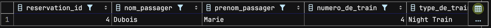
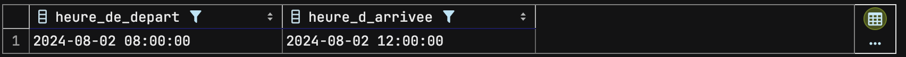

# Évaluation : Conception et développement d'une base de données pour la compagnie ferroviaire AltaExpress

## Contexte

La compagnie ferroviaire AltaExpress, qui exploite des trains entre Berlin et Vienne, vous sollicite pour concevoir une base de données relationnelle afin de gérer diverses opérations liées aux stations, aux trains, aux passagers, aux réservations de trains et aux horaires. Cette base de données doit permettre aux passagers de réserver des billets pour des voyages entre les deux villes, et chaque réservation doit être enregistrée. Il est également nécessaire de conserver une trace de toutes les informations spécifiques aux trains, y compris le numéro du train, le type de train, les heures de départ et d’arrivée.

## Objectifs

### Configuration de la base de données

- **Nom de la base de données :** `altaExpress_db`
- **Modèle de données conceptuel (MCD)**
- **Modèle Logique de Données (MLD)**
- **Script SQL pour créer des tables avec intégrité et contraintes**
- **Insérer 10 enregistrements initiaux**
- **Effectuer des requêtes SQL pour l'analyse**

### Entités et leurs attributs

- **Gares :** `Gare_ID (PK)`, `Nom_de_la_Gare`, `Adresse`, `Ville`, `État`
- **Trains :** `Numéro_de_Train (PK)`, `Type_de_Train (FK)`, `Capacité`
- **Types_de_Trains :** `Type_de_Train_ID (PK)`, `Description`
- **Horaires :** `ID (PK)`, `Numéro_de_Train (FK)`, `Gare_ID (FK)`, `Heure_de_départ`, `Heure_d'arrivée`
- **Passagers :** `Passager_ID (PK)`, `Nom`, `Prénom`, `Date_de_naissance`, `Email`, `Téléphone`
- **Réservations :** `ID (PK)`, `Passager_ID (FK)`, `Numéro_de_Train (FK)`, `Date_de_réservation`
- **Billets :** `Ticket_ID (PK)`, `Réservation_ID (FK)`, `Emplacement`, `Prix`
- **Itinéraires :** `Itinéraire_ID (PK)`, `Gare_de_Départ_ID (FK)`, `Gare_d'Arrivée_ID (FK)`, `Distance`
- **Commentaires_passagers :** `Commentaire_ID (PK)`, `Passager_ID (FK)`, `Numéro_de_Train (FK)`, `Commentaire`, `Évaluation`

## Relations

### Stations

- **Horaires :** Une gare peut avoir plusieurs horaires d'arrivée et de départ.
    - **Relation :** 1-N (Station-Horaires)
    - **Clé étrangère dans Horaires :** `Gare_ID`

### Trains

- **Horaires :** Un train peut avoir plusieurs horaires d'arrivée et de départ.
    - **Relation :** 1-N (Trains-Horaires)
    - **Clé étrangère dans Horaires :** `Numéro_de_Train`
- **Types_de_Train :** Un type de train peut être attribué à plusieurs trains.
    - **Relation :** 1-N (Types_de_Train-Trains)
    - **Clé étrangère dans Trains :** `Type_de_Train`
- **Réservations :** Un train peut avoir plusieurs réservations.
    - **Relation :** 1-N (Trains-Réservations)
    - **Clé étrangère dans Réservations :** `Numéro_de_Train`
- **Commentaires_Passagers :** Un train peut avoir plusieurs commentaires de passagers.
    - **Relation :** 1-N (Trains-Commentaires_Passagers)
    - **Clé étrangère dans Commentaires_Passagers :** `Numéro_de_Train`

### Passagers

- **Réservations :** Un passager peut faire plusieurs réservations.
    - **Relation :** 1-N (Passagers-Réservations)
    - **Clé étrangère dans Réservations :** `Passager_ID`
- **Commentaires_Passagers :** Un passager peut faire plusieurs commentaires.
    - **Relation :** 1-N (Passagers-Commentaires_Passagers)
    - **Clé étrangère dans Commentaires_Passagers :** `Passager_ID`

### Réservations

- **Billets :** Une réservation peut générer plusieurs billets.
    - **Relation :** 1-N (Réservations-Billets)
    - **Clé étrangère dans Billets :** `Réservation_ID`

### Itinéraires

- **Station :** Une gare peut être un point de départ ou d'arrivée dans plusieurs itinéraires.
    - **Relation :** 1-N (Station-Itinéraires) (deux fois)
    - **Clé étrangère dans Itinéraires :** `Gare_de_Départ_ID`, `Gare_d'Arrivée_ID`

## Insertion de 10 données initiales

Créez des scripts pour insérer 10 enregistrements fictifs dans chaque table afin de permettre des tests et des démonstrations efficaces.

## Requêtes SQL à effectuer

1. Quels sont les détails d'une réservation pour un passager spécifique ?
2. Quels sont tous les trains et leurs types ?
3. Quels sont les horaires de départ et d'arrivée pour un train spécifique ?
4. Quelles sont les informations de contact pour un passager spécifique ?
5. Quels sont les trains programmés pour partir aujourd'hui ?
6. Quelles sont les gares desservies par un train spécifique ?
7. Quels sont les tarifs disponibles pour les billets ?
8. Quelle est la moyenne des évaluations des passagers pour un train spécifique ?
9. Quels sont les trains reliant deux gares spécifiques ?

## Instructions

1. Exécutez chacune des 10 requêtes SQL dans votre environnement de base de données (par exemple, MySQL Workbench, terminal, etc.). Chaque requête doit retourner des résultats valides.
2. Prenez une capture d'écran de chaque requête et de ses résultats. Les requêtes et les résultats doivent être clairement visibles dans chaque capture d'écran.
3. Ouvrez Microsoft Word ou un autre éditeur de texte capable de créer des documents Word. Pour chaque question, ajoutez la requête et les captures du résultat en dessous. Ensuite, nommez votre document dans le format suivant : `votre_nom_eval_afci_02_08_2024.pdf`.
4. Enfin, exportez-le au format PDF et envoyez-le.


# Solutions

## Configuration de la base de données

### Création de la base de données `altaExpress_db`

```sql
CREATE DATABASE altaExpress_db;
```

### Modèle de données conceptuel (MCD)

Le modèle conceptuel des données (MCD) est une représentation graphique des entités et des relations entre elles. Il est utilisé pour définir la structure de la base de données et les relations entre les différentes entités.

Les entités et leurs attributs pour la base de données AltaExpress sont les suivants :

- **Gares :**`Gare_ID`,`Nom_de_la_Gare`,`Adresse`,`Ville`,`État`
- **Trains :**`Numéro_de_Train`,`Type_de_Train`,`Capacité`
- **Types_de_Trains :**`Type_de_Train_ID`,`Description`
- **Horaires :**`ID`,`Numéro_de_Train`,`Gare_ID`,`Heure_de_départ`,`Heure_d'arrivée`
- **Passagers :**`Passager_ID`,`Nom`,`Prénom`,`Date_de_naissance`,`Email`,`Téléphone`
- **Réservations :**`ID`,`Passager_ID`,`Numéro_de_Train`,`Date_de_réservation`
- **Billets :**`Ticket_ID`,`Réservation_ID`,`Emplacement`,`Prix`
- **Itinéraires :**`Itinéraire_ID`,`Gare_de_Départ_ID`,`Gare_d'Arrivée_ID`,`Distance`
- **Commentaires_passagers :**`Commentaire_ID`,`Passager_ID`,`Numéro_de_Train`,`Commentaire`,`Évaluation`

#### Diagramme de modèle conceptuel des données (`MCD`) :


### Modèle Logique de Données (MLD)

Le modèle logique des données (MLD) est une représentation des tables et des relations entre elles. Il est utilisé pour définir la structure de la base de données et les contraintes d'intégrité.

Les tables et les relations pour la base de données AltaExpress sont les suivantes :
On écris en minuscule sans accent.

- **gares :** `gare_id (PK)`, `nom_de_la_gare`, `adresse`, `ville`, `etat`
- **nom_de_la_gare :** `nom_de_la_gare_id (PK)`, `nom`
- **trains :** `numero_de_train (PK)`, `type_de_train`, `capacite`
- **types_de_trains :** `type_de_train_id (PK)`, `description`
- **horaires :** `id (PK)`, `numero_de_train`, `gare_id`, `heure_de_depart`, `heure_d_arrivee`
- **passagers :** `passager_id (PK)`, `nom`, `prenom`, `date_de_naissance`, `email`, `telephone`
- **reservations :** `id (PK)`, `passager_id`, `numero_de_train`, `date_de_reservation`
- **billets :** `ticket_id (PK)`, `reservation_id`, `emplacement`, `prix`
- **itineraires :** `itineraire_id (PK)`, `gare_de_depart_id`, `gare_d_arrivee_id`, `distance`
- **commentaires_passagers :** `commentaire_id (PK)`, `passager_id`, `numero_de_train`, `commentaire`, `evaluation`

#### Diagramme de modèle logique des données (`MLD`) :


### Modèle Logique de Données (MLD)

Le modèle logique des données (MLD) est une représentation des tables et des relations entre elles. Il est utilisé pour définir la structure de la base de données et les contraintes d'intégrité.

Les tables et les relations ainsi que les clés étrangères pour la base de données AltaExpress sont les suivantes :

- **gares :** `gare_id (PK)`, `nom_de_la_gare`, `adresse`, `ville`, `etat`
- **nom_de_la_gare :** `nom_de_la_gare_id (PK)`, `nom`
- **trains :** `numero_de_train (PK)`, `type_de_train`, `capacite`
- **types_de_trains :** `type_de_train_id (PK)`, `description`
- **horaires :** `id (PK)`, `numero_de_train`, `gare_id`, `heure_de_depart`, `heure_d_arrivee`
- **passagers :** `passager_id (PK)`, `nom`, `prenom`, `date_de_naissance`, `email`, `telephone`
- **reservations :** `id (PK)`, `passager_id`, `numero_de_train`, `date_de_reservation`
- **billets :** `ticket_id (PK)`, `reservation_id`, `emplacement`, `prix`
- **itineraires :** `itineraire_id (PK)`, `gare_de_depart_id`, `gare_d_arrivee_id`, `distance`
- **commentaires_passagers :** `commentaire_id (PK)`, `passager_id`, `numero_de_train`, `commentaire`, `evaluation`
- **Contraintes d'intégrité :**
    - **Clé étrangère dans horaires :** `gare_id`
    - **Clé étrangère dans horaires :** `numero_de_train`
    - **Clé étrangère dans trains :** `type_de_train`
    - **Clé étrangère dans reservations :** `numero_de_train`
    - **Clé étrangère dans reservations :** `passager_id`
    - **Clé étrangère dans billets :** `reservation_id`
    - **Clé étrangère dans itineraires :** `gare_de_depart_id`
    - **Clé étrangère dans itineraires :** `gare_d_arrivee_id`
    - **Clé étrangère dans commentaires_passagers :** `numero_de_train`
    - **Clé étrangère dans commentaires_passagers :** `passager_id`

### Diagramme de modèle logique des données (`MPD`) :
Ajoute aussi les clés étrangère dans le diagramme


### Script SQL pour créer des tables avec intégrité et contraintes

Le script SQL pour créer les tables avec les contraintes d'intégrité est le suivant :

```sql
CREATE TABLE gares (
    gare_id INT PRIMARY KEY,
    nom_de_la_gare VARCHAR(100),
    adresse VARCHAR(100),
    ville VARCHAR(100),
    etat VARCHAR(100)
);

CREATE TABLE nom_de_la_gare (
    nom_de_la_gare_id INT PRIMARY KEY,
    nom VARCHAR(100)
);

CREATE TABLE trains (
    numero_de_train INT PRIMARY KEY,
    type_de_train INT,
    capacite INT,
    FOREIGN KEY (type_de_train) REFERENCES types_de_trains(type_de_train_id)
);

CREATE TABLE types_de_trains (
    type_de_train_id INT PRIMARY KEY,
    description TEXT
);

CREATE TABLE horaires (
    id INT PRIMARY KEY,
    numero_de_train INT,
    gare_id INT,
    heure_de_depart DATETIME,
    heure_d_arrivee DATETIME,
    FOREIGN KEY (numero_de_train) REFERENCES trains(numero_de_train),
    FOREIGN KEY (gare_id) REFERENCES gares(gare_id)
);

CREATE TABLE passagers (
    passager_id INT PRIMARY KEY,
    nom VARCHAR(100),
    prenom VARCHAR(100),
    date_de_naissance DATE,
    email VARCHAR(100),
    telephone VARCHAR(100)
);

CREATE TABLE reservations (
    id INT PRIMARY KEY,
    passager_id INT,
    numero_de_train INT,
    date_de_reservation DATE,
    FOREIGN KEY (passager_id) REFERENCES passagers(passager_id),
    FOREIGN KEY (numero_de_train) REFERENCES trains(numero_de_train)
);

CREATE TABLE billets (
    ticket_id INT PRIMARY KEY,
    reservation_id INT,
    emplacement VARCHAR(100),
    prix DECIMAL,
    FOREIGN KEY (reservation_id) REFERENCES reservations(id)
);

CREATE TABLE itineraires (
    itineraire_id INT PRIMARY KEY,
    gare_de_depart_id INT,
    gare_d_arrivee_id INT,
    distance DECIMAL,
    FOREIGN KEY (gare_de_depart_id) REFERENCES gares(gare_id),
    FOREIGN KEY (gare_d_arrivee_id) REFERENCES gares(gare_id)
);

CREATE TABLE commentaires_passagers (
    commentaire_id INT PRIMARY KEY,
    passager_id INT,
    numero_de_train INT,
    commentaire VARCHAR(100),
    evaluation INT,
    FOREIGN KEY (passager_id) REFERENCES passagers(passager_id),
    FOREIGN KEY (numero_de_train) REFERENCES trains(numero_de_train)
);
```

### Insértion des 10 enregistrements initiaux dans les différentes tables:

```sql
-- Insertion pour la table gares
INSERT INTO gares (gare_id, nom_de_la_gare, adresse, ville, etat)
VALUES
  (1, 'Gare Centrale Berlin', 'Platz der Republik', 'Berlin', 'Berlin'),
  (2, 'Gare Centrale Vienne', 'Alfred-Adler-Straße 107', 'Vienne', 'Vienne'),
  (3, 'Gare Nord Berlin', 'Invalidenstraße 125', 'Berlin', 'Berlin'),
  (4, 'Gare Est Berlin', 'Am Ostbahnhof 9', 'Berlin', 'Berlin'),
  (5, 'Gare Sud Vienne', 'Sonnwendgasse 21', 'Vienne', 'Vienne'),
  (6, 'Gare Ouest Berlin', 'Wilmersdorfer Straße', 'Berlin', 'Berlin'),
  (7, 'Gare Ouest Vienne', 'Felberstraße 1', 'Vienne', 'Vienne'),
  (8, 'Gare Mitte Berlin', 'Friedrichstraße 142', 'Berlin', 'Berlin'),
  (9, 'Gare Sud Berlin', 'Yorckstraße 12', 'Berlin', 'Berlin'),
  (10, 'Gare Centrale Potsdam', 'Friedrich-Engels-Straße 4', 'Potsdam', 'Brandenburg');

-- Insertion pour la table nom_de_la_gare
INSERT INTO nom_de_la_gare (nom_de_la_gare_id, nom)
VALUES
  (1, 'Gare Centrale Berlin'),
  (2, 'Gare Centrale Vienne'),
  (3, 'Gare Nord Berlin'),
  (4, 'Gare Est Berlin'),
  (5, 'Gare Sud Vienne'),
  (6, 'Gare Ouest Berlin'),
  (7, 'Gare Ouest Vienne'),
  (8, 'Gare Mitte Berlin'),
  (9, 'Gare Sud Berlin'),
  (10, 'Gare Centrale Potsdam');

-- Insertion pour la table types_de_trains
INSERT INTO types_de_trains (type_de_train_id, description)
VALUES
  (1, 'TGV'),
  (2, 'ICE'),
  (3, 'Regional Express'),
  (4, 'Night Train'),
  (5, 'Intercity'),
  (6, 'Freight Train'),
  (7, 'High-speed Rail'),
  (8, 'Suburban Train'),
  (9, 'Metro'),
  (10, 'Express');

-- Insertion pour la table trains
INSERT INTO trains (numero_de_train, type_de_train, capacite)
VALUES
  (1, 1, 300),
  (2, 2, 250),
  (3, 3, 200),
  (4, 4, 150),
  (5, 5, 350),
  (6, 6, 100),
  (7, 7, 400),
  (8, 8, 500),
  (9, 9, 600),
  (10, 10, 450);

-- Insertion pour la table horaires
INSERT INTO horaires (id, numero_de_train, gare_id, heure_de_depart, heure_d_arrivee)
VALUES
  (1, 1, 1, '2024-08-02 08:00:00', '2024-08-02 12:00:00'),
  (2, 2, 2, '2024-08-02 09:00:00', '2024-08-02 13:00:00'),
  (3, 3, 3, '2024-08-02 10:00:00', '2024-08-02 14:00:00'),
  (4, 4, 4, '2024-08-02 11:00:00', '2024-08-02 15:00:00'),
  (5, 5, 5, '2024-08-02 12:00:00', '2024-08-02 16:00:00'),
  (6, 6, 6, '2024-08-02 13:00:00', '2024-08-02 17:00:00'),
  (7, 7, 7, '2024-08-02 14:00:00', '2024-08-02 18:00:00'),
  (8, 8, 8, '2024-08-02 15:00:00', '2024-08-02 19:00:00'),
  (9, 9, 9, '2024-08-02 16:00:00', '2024-08-02 20:00:00'),
  (10, 10, 10, '2024-08-02 17:00:00', '2024-08-02 21:00:00');

-- Insertion pour la table passagers
INSERT INTO passagers (passager_id, nom, prenom, date_de_naissance, email, telephone) 
VALUES
  (1, 'Dupont', 'Jean', '1980-01-01', 'jean.dupont@example.com', '0123456789'),
  (2, 'Martin', 'Sophie', '1990-02-02', 'sophie.martin@example.com', '0987654321'),
  (3, 'Bernard', 'Pierre', '1985-03-03', 'pierre.bernard@example.com', '1122334455'),
  (4, 'Dubois', 'Marie', '1975-04-04', 'marie.dubois@example.com', '5566778899'),
  (5, 'Thomas', 'Luc', '1988-05-05', 'luc.thomas@example.com', '6677889900'),
  (6, 'Petit', 'Emma', '1992-06-06', 'emma.petit@example.com', '7788990011'),
  (7, 'Durand', 'Paul', '1983-07-07', 'paul.durand@example.com', '8899001122'),
  (8, 'Leroy', 'Julie', '1986-08-08', 'julie.leroy@example.com', '9900112233'),
  (9, 'Moreau', 'Nicolas', '1995-09-09', 'nicolas.moreau@example.com', '0011223344'),
  (10, 'Simon', 'Laura', '1981-10-10', 'laura.simon@example.com', '1122335566');

-- Insertion pour la table reservations
INSERT INTO reservations (id, passager_id, numero_de_train, date_de_reservation)
VALUES
  (1, 1, 1, '2024-08-01'),
  (2, 2, 2, '2024-08-01'),
  (3, 3, 3, '2024-08-01'),
  (4, 4, 4, '2024-08-01'),
  (5, 5, 5, '2024-08-01'),
  (6, 6, 6, '2024-08-01'),
  (7, 7, 7, '2024-08-01'),
  (8, 8, 8, '2024-08-01'),
  (9, 9, 9, '2024-08-01'),
  (10, 10, 10, '2024-08-01');

-- Insertion pour la table billets
INSERT INTO billets (ticket_id, reservation_id, emplacement, prix)
VALUES
  (1, 1, 'A1', 100.00),
  (2, 2, 'A2', 120.00),
  (3, 3, 'A3', 90.00),
  (4, 4, 'B1', 150.00),
  (5, 5, 'B2', 130.00),
  (6, 6, 'B3', 140.00),
  (7, 7, 'C1', 160.00),
  (8, 8, 'C2', 110.00),
  (9, 9, 'C3', 125.00),
  (10, 10, 'D1', 135.00);

-- Insertion pour la table itineraires
INSERT INTO itineraires (itineraire_id, gare_de_depart_id, gare_d_arrivee_id, distance)
VALUES
  (1, 1, 2, 680.0),
  (2, 3, 4, 150.0),
  (3, 5, 6, 300.0),
  (4, 7, 8, 220.0),
  (5, 9, 10, 100.0),
  (6, 2, 3, 200.0),
  (7, 4, 5, 500.0),
  (8, 6, 7, 400.0),
  (9, 8, 9, 50.0),
  (10, 10, 1, 760.0);

-- Insertion pour la table commentaires_passagers
INSERT INTO commentaires_passagers (commentaire_id, passager_id, numero_de_train, commentaire, evaluation)
VALUES
  (1, 1, 1, 'Très bon service', 5),
  (2, 2, 2, 'Confort moyen', 3),
  (3, 3, 3, 'Ponctuel', 4),
  (4, 4, 4, 'Trop de bruit', 2),
  (5, 5, 5, 'Excellent', 5),
  (6, 6, 6, 'Bien mais peut mieux faire', 4),
  (7, 7, 7, 'Voyage agréable', 5),
  (8, 8, 8, 'Siège inconfortable', 3),
  (9, 9, 9, 'Service à bord impeccable', 5),
  (10, 10, 10, 'Bon rapport qualité/prix', 4);
```
### Requêtes SQL à effectuer

1. Quels sont les détails d'une réservation pour un passager spécifique ?

```sql
SELECT reservations.id AS reservation_id,
       passagers.nom AS nom_passager,
       passagers.prenom AS prenom_passager,
       trains.numero_de_train,
       types_de_trains.description AS type_de_train,
       reservations.date_de_reservation
FROM reservations
       JOIN passagers ON reservations.passager_id = passagers.passager_id
       JOIN trains ON reservations.numero_de_train = trains.numero_de_train
       JOIN types_de_trains ON trains.type_de_train = types_de_trains.type_de_train_id
WHERE passagers.passager_id = 4 AND passagers.passager_id = 4;
```


2. Quels sont tous les trains et leurs types ?

```sql
SELECT trains.numero_de_train, types_de_trains.description AS type_de_train
FROM trains
JOIN types_de_trains ON trains.type_de_train = types_de_trains.type_de_train_id;
```


3. Quels sont les horaires de départ et d'arrivée pour un train spécifique ?

```sql
SELECT horaires.heure_de_depart, horaires.heure_d_arrivee
FROM horaires
WHERE horaires.numero_de_train = 1
```


4. Quelles sont les informations de contact pour un passager spécifique ?

```sql
SELECT nom, prenom, email, telephone
FROM passagers
WHERE passager_id = 3;
```

5. Quels sont les trains programmés pour partir aujourd'hui ?

```sql
SELECT trains.numero_de_train, horaires.heure_de_depart, horaires.heure_d_arrivee
FROM horaires
JOIN trains ON horaires.numero_de_train = trains.numero_de_train
WHERE DATE(heure_de_depart) = CURDATE();
```
Ici, il y a une exception. A moins qu'on ne définisse la date d'aujourd'hui.


6. Quelles sont les gares desservies par un train spécifique ?

```sql
SELECT gares.nom_de_la_gare
FROM horaires
JOIN gares ON horaires.gare_id = gares.gare_id
WHERE horaires.numero_de_train = 5; 
```


7. Quels sont les tarifs disponibles pour les billets ?

```sql
SELECT billets.ticket_id, billets.emplacement, billets.prix
FROM billets;
```


8. Quelle est la moyenne des évaluations des passagers pour un train spécifique ?

```sql 
SELECT AVG(commentaires_passagers.evaluation) AS moyenne_evaluation
FROM commentaires_passagers
WHERE commentaires_passagers.numero_de_train = 1; -- Remplacer 1 par le numéro du train spécifique
```


9. Quels sont les trains reliant deux gares spécifiques ?

```sql 
SELECT itineraires.itineraire_id, trains.numero_de_train
FROM itineraires
JOIN horaires ON itineraires.gare_de_depart_id = horaires.gare_id
JOIN trains ON horaires.numero_de_train = trains.numero_de_train
WHERE itineraires.gare_de_depart_id = 1 AND itineraires.gare_d_arrivee_id = 2;
```

