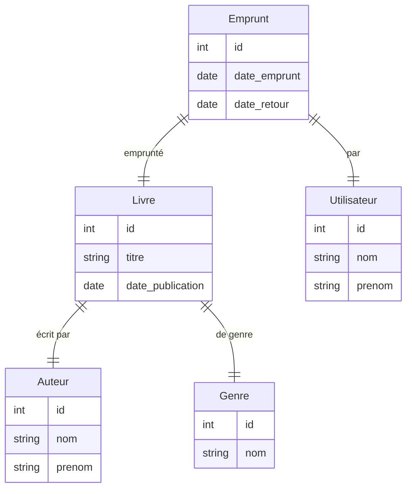
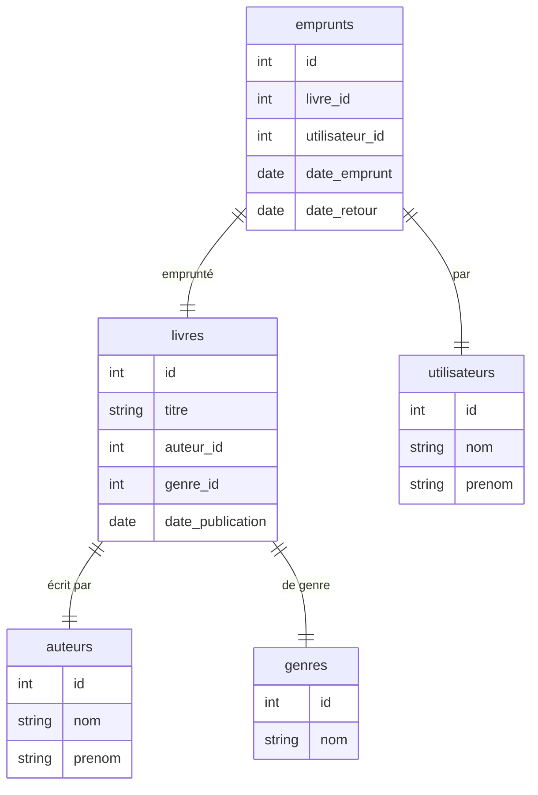
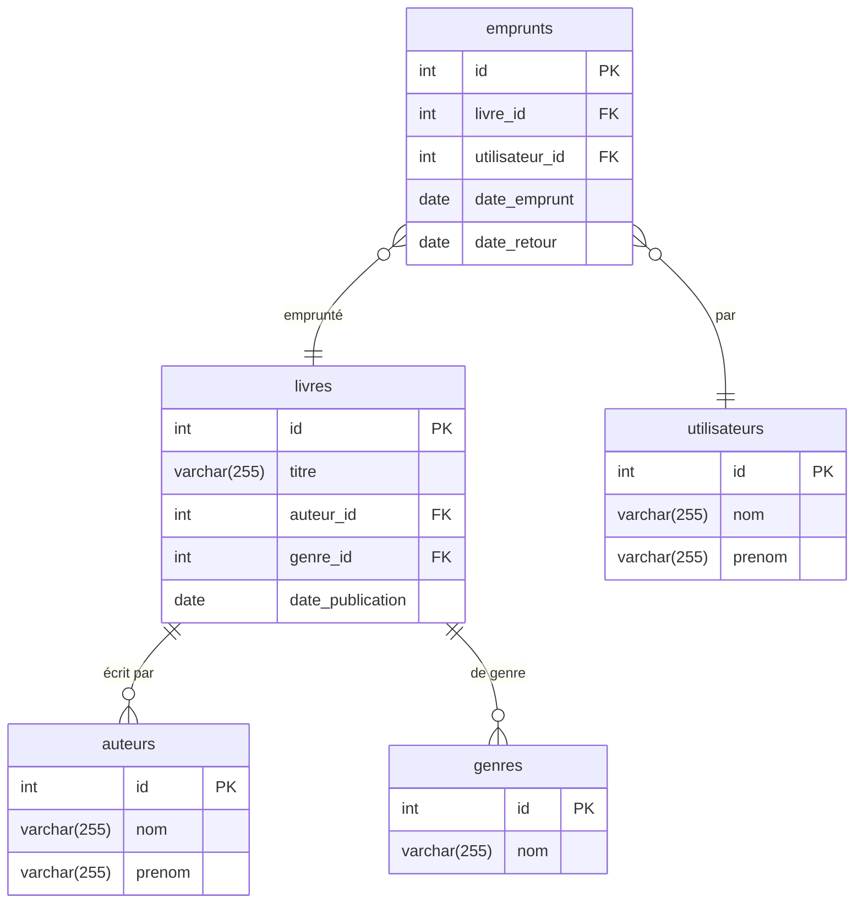

### 1. Modèle Conceptuel des Données (MCD)
Le MCD est une représentation graphique des entités et des relations entre elles. Voici les entités et leurs relations pour notre base de données de bibliothèque.

**Entités et Attributs** :

- **Livre** :
    - id (PK)
    - titre
    - date_publication
- **Auteur** :
    - id (PK)
    - nom
    - prenom
- **Genre** :
    - id (PK)
    - nom
- **Emprunt** :
    - id (PK)
    - date_emprunt
    - date_retour
- **Utilisateur** :
    - id (PK)
    - nom
    - prenom

| **Livre**                               | **Auteur**                 | **Genre**       | **Emprunt**                               | **Utilisateur**              |
|-----------------------------------------|----------------------------|-----------------|-------------------------------------------|------------------------------|
| id (PK)  titre date_publication | id (PK) nom prenom | id (PK) nom | id (PK)  date_emprunt date_retour | id (PK)  nom  prenom |

### Diagramme :

### 2. Modèle Logique des Données (MLD)

Le MLD est une représentation détaillée des entités et de leurs relations, intégrant les clés étrangères.

- **livres** : Contient des informations sur les livres.
    - `id` (INT) : Identifiant unique du livre.
    - `titre` (VARCHAR) : Titre du livre.
    - `auteur_id` (INT) : Identifiant de l'auteur du livre.
    - `genre_id` (INT) : Identifiant du genre du livre.
    - `date_publication` (DATE) : Date de publication du livre.
- **auteurs** : Contient des informations sur les auteurs.
    - `id` (INT) : Identifiant unique de l'auteur.
    - `nom` (VARCHAR) : Nom de l'auteur.
    - `prenom` (VARCHAR) : Prénom de l'auteur.
- **genres** : Contient des informations sur les genres littéraires.
    - `id` (INT) : Identifiant unique du genre.
    - `nom` (VARCHAR) : Nom du genre.
- **emprunts** : Contient des informations sur les emprunts de livres par les utilisateurs.
    - `id` (INT) : Identifiant unique de l'emprunt.
    - `livre_id` (INT) : Identifiant du livre emprunté.
    - `utilisateur_id` (INT) : Identifiant de l'utilisateur qui a emprunté le livre.
    - `date_emprunt` (DATE) : Date de l'emprunt.
    - `date_retour` (DATE) : Date de retour du livre (NULL si non retourné).
- **utilisateurs** : Contient des informations sur les utilisateurs.
    - `id` (INT) : Identifiant unique de l'utilisateur.
    - `nom` (VARCHAR) : Nom de l'utilisateur.
    - `prenom` (VARCHAR) : Prénom de l'utilisateur.

| **livres**                                                                   | **auteurs**                | **genres**      | **emprunts**                                                                         | **utilisateurs**             |
|------------------------------------------------------------------------------|----------------------------|-----------------|--------------------------------------------------------------------------------------|------------------------------|
| id (PK)  titre auteur_id (FK) genre_id (FK) date_publication | id (PK) nom prenom | id (PK) nom | id (PK)  livre_id (FK) utilisateur_id (FK)  date_emprunt date_retour | id (PK)  nom  prenom |

### Diagramme :

### 3. Modèle Physique des Données (MPD)

Le MPD est une représentation détaillée des tables, des types de données, des contraintes d'intégrité et des index.

#### Schéma de la base de données

- **livres** : Contient des informations sur les livres.
    - `id` (INT) : Identifiant unique du livre.
    - `titre` (VARCHAR) : Titre du livre.
    - `auteur_id` (INT) : Identifiant de l'auteur du livre.
    - `genre_id` (INT) : Identifiant du genre du livre.
    - `date_publication` (DATE) : Date de publication du livre.
- **auteurs** : Contient des informations sur les auteurs.
    - `id` (INT) : Identifiant unique de l'auteur.
    - `nom` (VARCHAR) : Nom de l'auteur.
    - `prenom` (VARCHAR) : Prénom de l'auteur.
- **genres** : Contient des informations sur les genres littéraires.
    - `id` (INT) : Identifiant unique du genre.
    - `nom` (VARCHAR) : Nom du genre.
- **emprunts** : Contient des informations sur les emprunts de livres par les utilisateurs.
    - `id` (INT) : Identifiant unique de l'emprunt.
    - `livre_id` (INT) : Identifiant du livre emprunté.
    - `utilisateur_id` (INT) : Identifiant de l'utilisateur qui a emprunté le livre.
    - `date_emprunt` (DATE) : Date de l'emprunt.
    - `date_retour` (DATE) : Date de retour du livre (NULL si non retourné).
- **utilisateurs** : Contient des informations sur les utilisateurs.
    - `id` (INT) : Identifiant unique de l'utilisateur.
    - `nom` (VARCHAR) : Nom de l'utilisateur.
    - `prenom` (VARCHAR) : Prénom de l'utilisateur.

### Diagramme :

