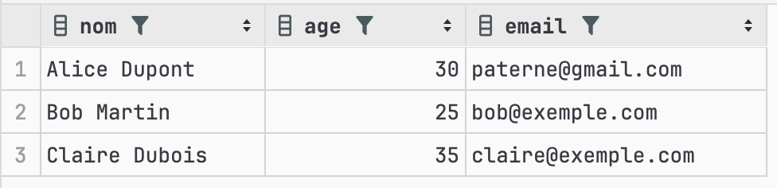

# UPDATE : Comment modifier des enregistrements existants

La commande `UPDATE` en SQL est utilisée pour modifier les enregistrements existants dans une table. Cette commande est essentielle pour mettre à jour les données sans avoir à supprimer ou recréer des enregistrements.

## Syntaxe de base

La syntaxe de base de la commande `UPDATE` est la suivante :

```sql
UPDATE nom_de_la_table
SET colonne1 = valeur1, colonne2 = valeur2, ...
WHERE condition;
```
Explication des éléments :
- `nom_de_la_table` : Le nom de la table dans laquelle vous souhaitez effectuer la mise à jour.
- `SET colonne1 = valeur1` : Spécifie la ou les colonnes à mettre à jour et les nouvelles valeurs.
-` WHERE condition` : Détermine les enregistrements qui seront mis à jour. 

**IMPORTANT** : L'absence de cette clause mettra à jour tous les enregistrements de la table !

Exemple simple :

Supposons que nous ayons une table `utilisateurs` avec les colonnes `id`, `nom`, `age` et `email`. Si nous voulons mettre à jour l'adresse e-mail d'un utilisateur spécifique, nous pouvons utiliser la commande `UPDATE` de la manière suivante :
```sql
UPDATE utilisateurs
SET email = 'paterne@gmail.com'
WHERE id = 1;
```


Dans cet exemple, nous mettons à jour l'adresse e-mail de l'utilisateur avec l'ID 1 en utilisant la clause `UPDATE`. La clause `SET` spécifie la colonne à mettre à jour et la valeur à lui attribuer. La clause `WHERE` spécifie les enregistrements à mettre à jour en fonction de certaines conditions.

La clause `UPDATE` est souvent utilisée en combinaison avec la clause `WHERE` pour spécifier les enregistrements à mettre à jour en fonction de certaines conditions.

## Mise à jour multiple

Il est possible de mettre à jour plusieurs enregistrements en une seule commande `UPDATE`. Par exemple, si nous voulons mettre à jour l'adresse e-mail de tous les utilisateurs de plus de 30 ans, nous pouvons utiliser la commande suivante :
```sql
UPDATE utilisateurs
SET nom = 'Toto', email = 'toto@gmail.com'
WHERE id = 3;
```
## Conseils pour éviter les erreurs courantes

### 1. Toujours utiliser la clause `WHERE`

Il est recommandé d'utiliser la clause `WHERE` pour spécifier les enregistrements à mettre à jour. Sinon, tous les enregistrements de la table seront mis à jour, ce qui peut entraîner des erreurs.

Ne jamais oublier la clause `WHERE`, sauf si vous avez l'intention de mettre à jour tous les enregistrements de la table. Une mise à jour sans cette clause pourrait avoir des conséquences désastreuses.

### 2. Vérifier les c2. Tester avec une clause SELECT d'abord
Avant de procéder à une mise à jour, il est souvent utile d'exécuter une requête SELECT pour vérifier les enregistrements qui seront affectés. Cela permet de s'assurer que la mise à jour se déroulera comme prévu.

### 3. Sauvegarder les données avant de mettre à jour

Il est recommandé de sauvegarder les données avant de procéder à une mise à jour importante. Cela permet de restaurer les données en cas d'erreur ou de problème.

### 4. 3. Utiliser des transactions pour des mises à jour complexes
Si vous mettez à jour plusieurs tables ou faites plusieurs mises à jour dépendantes, utilisez une transaction pour garantir que toutes les opérations se terminent correctement ou aucune.

### 5. Vérifier les effets des déclencheurs (triggers)
Assurez-vous de comprendre les déclencheurs (triggers) définis sur votre table, car une mise à jour peut entraîner des effets secondaires non désirés si des déclencheurs sont présents.

### 6. Utiliser LIMIT pour les mises à jour par lots
Pour les bases de données qui le permettent, utilisez LIMIT pour mettre à jour les enregistrements par lots, ce qui peut être utile pour éviter des mises à jour massives

### Conclusion  

La commande `UPDATE` est essentielle pour modifier les enregistrements existants dans une table. Elle permet de mettre à jour les données sans avoir à supprimer ou recréer des enregistrements. Il est important de comprendre comment utiliser correctement la commande `UPDATE` pour éviter les erreurs et les problèmes potentiels.


