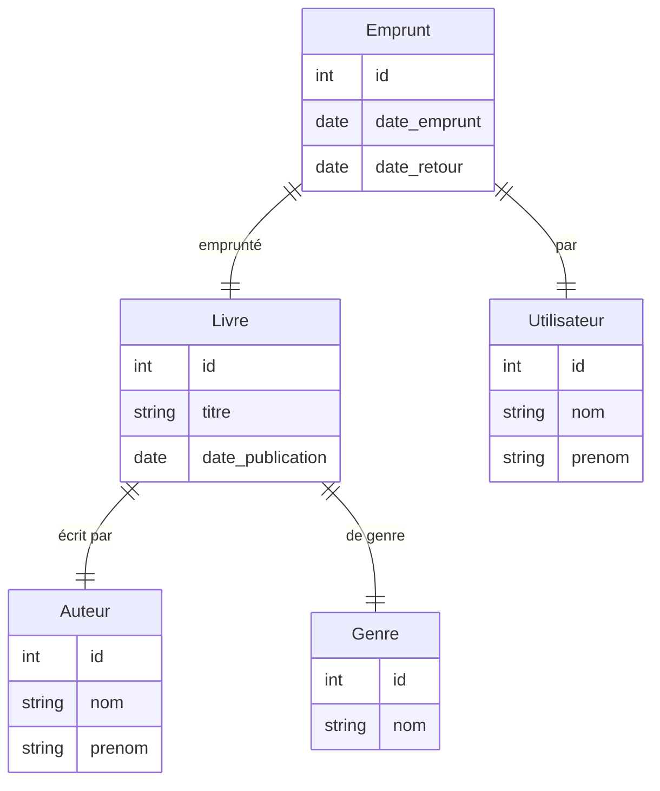
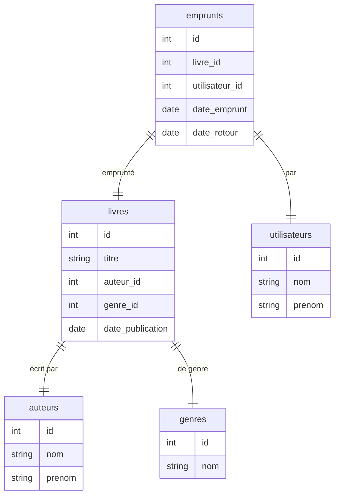
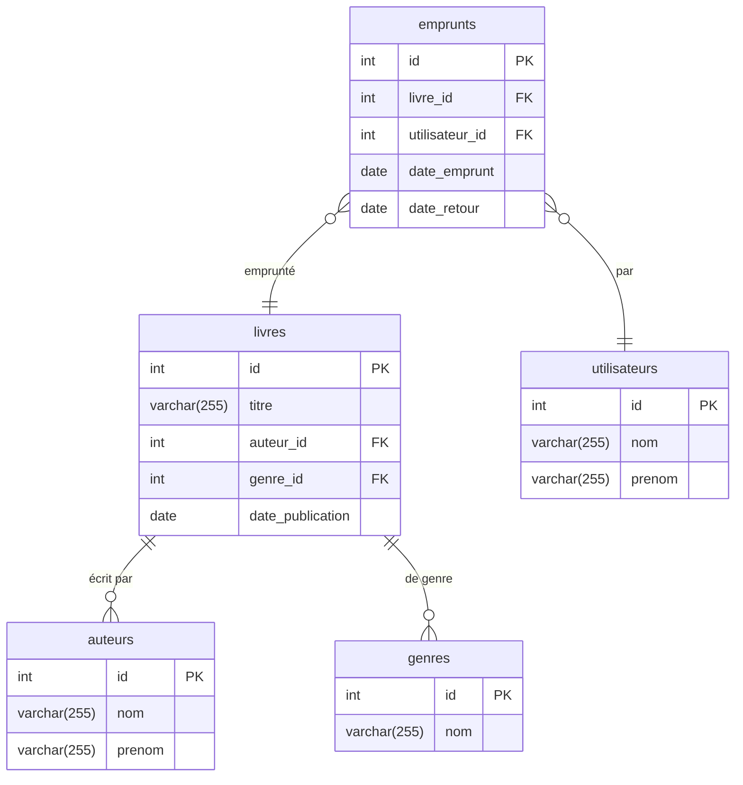

# Résultat de l'exercice exo_bibliotheque.md

1. Réalisation des diagrammes demandés :

Diagramme Entité-Relation (ER) pour le MCD : 



Diagramme Entité-Association (EA) pour le MLD :



Diagramme Relationnel (MR) pour le MPD :



2. **Liste des livres par auteur :**

 ```sql
SELECT l.titre, a.nom, a.prenom
FROM livres l
JOIN auteurs a ON l.auteur_id = a.id
ORDER BY a.nom, l.titre;
```


3. **Livres empruntés et non retournés :**

```sql
SELECT l.titre, u.nom, u.prenom
FROM emprunts e
JOIN livres l ON e.livre_id = l.id
JOIN utilisateurs u ON e.utilisateur_id = u.id
WHERE e.date_retour IS NULL;
```


4. **Top 3 des genres les plus populaires :**

```sql
SELECT g.nom, COUNT(e.id) AS nb_emprunts
FROM emprunts e
         JOIN livres l ON e.livre_id = l.id
         JOIN genres g ON l.genre_id = g.id
GROUP BY g.nom
ORDER BY nb_emprunts DESC
    LIMIT 3;
```


5. **Temps moyen d'emprunt des livres :**

```sql
SELECT AVG(DATEDIFF(e.date_retour, e.date_emprunt)) AS temps_moyen
FROM emprunts e
WHERE e.date_retour IS NOT NULL;
```


6. **Auteur le plus prolifique :**

```sql
SELECT a.nom, a.prenom, COUNT(l.id) AS nb_livres
FROM livres l
JOIN auteurs a ON l.auteur_id = a.id
GROUP BY a.nom, a.prenom
ORDER BY nb_livres DESC
LIMIT 1;
```


7. **Livres jamais empruntés :**

```sql
SELECT l.titre
FROM livres l
LEFT JOIN emprunts e ON l.id = e.livre_id
WHERE e.id IS NULL;
```
